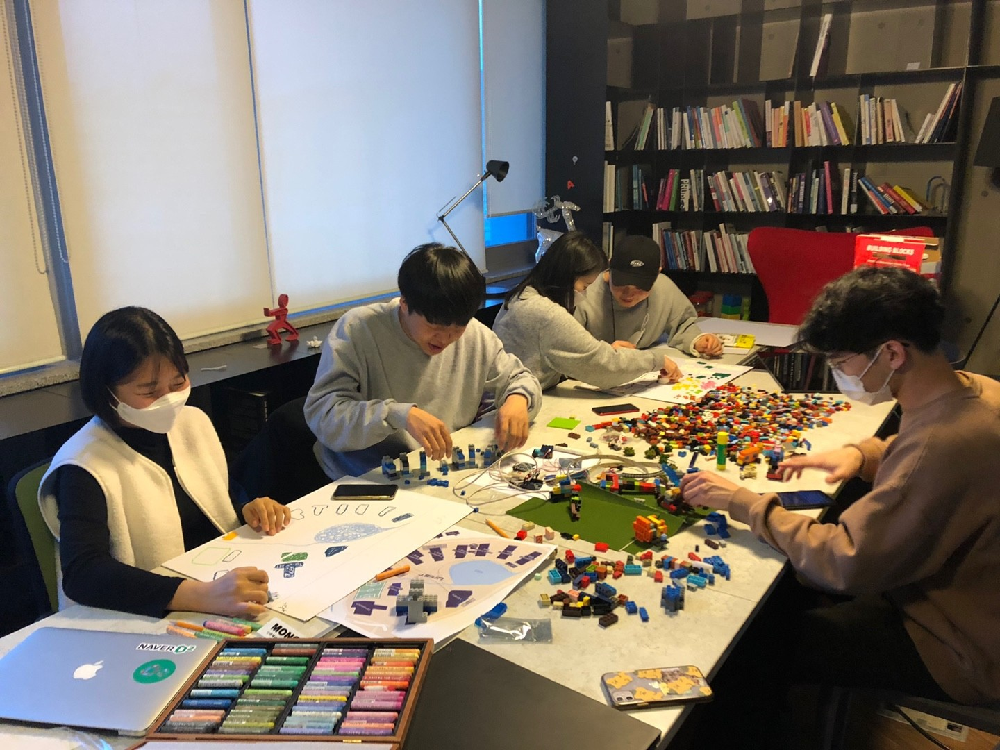
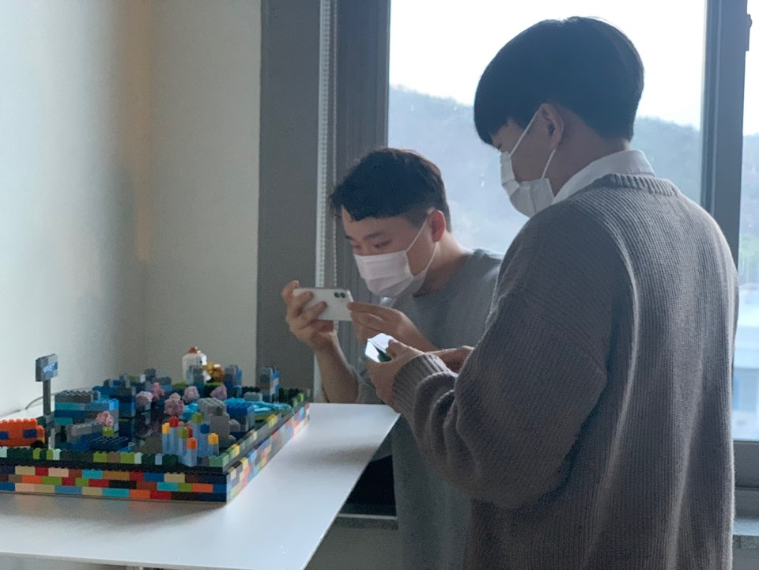
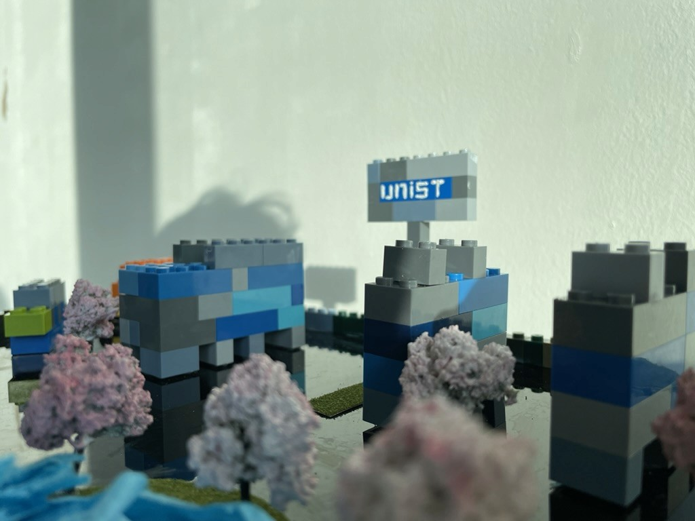
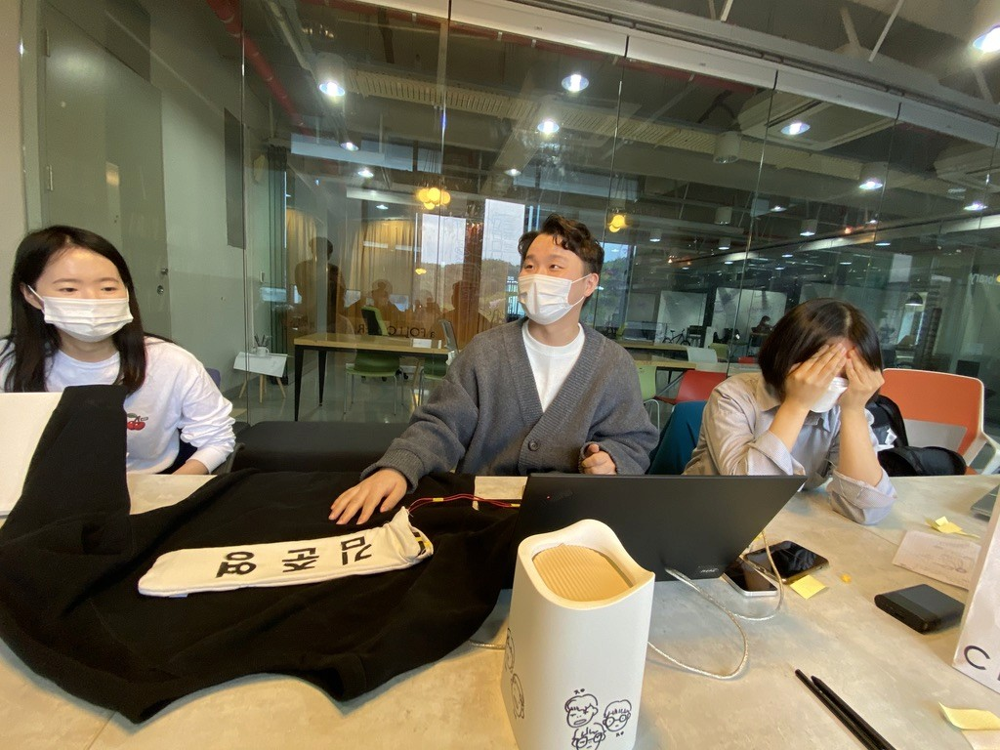
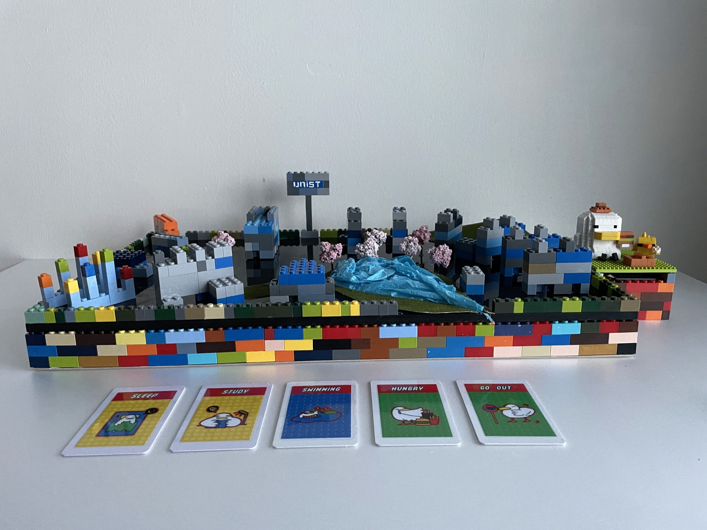

DINO는 [**UNIST**](https://www.unist.ac.kr/) 디자인학과의 메이킹 동아리로, 아두이노, 라즈베리파이 등을 활용한 프로젝트를 기획하고 진행합니다.

저는 2021년 UNIST 대학원 재학 중 DINO에 합류했습니다.

약 1년간 동아리의 메이킹 프로젝트에 참여했습니다.

  

 

<iframe src="https://www.youtube-nocookie.com/embed/RleQdT6vg3w?rel=0&modestbranding=1" title="DINO 동아리 프로젝트 영상" loading="lazy" allow="accelerometer; autoplay; clipboard-write; encrypted-media; gyroscope; picture-in-picture" allowfullscreen></iframe>

