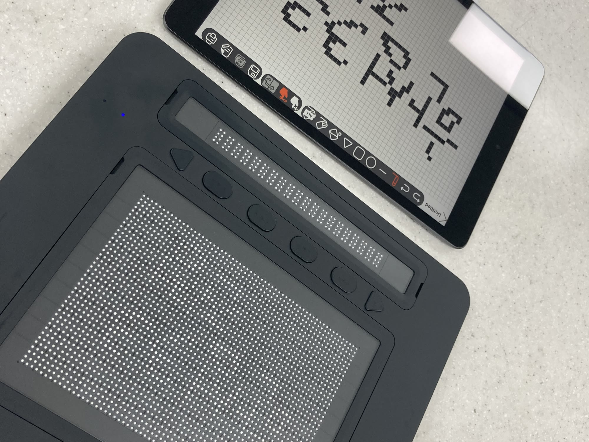

On September 9, 2024, while I was at Dot, I gave a talk to a student club at Hansung Science High School on *Dot and Accessibility for Blind People*. It started with what UX design is, then covered how blind people use smart devices through screen readers and refreshable braille displays, where those fall short, and how Dot Pad and Dot Canvas bring tactile graphics into the digital world. At the end the students tried Dot Pad with their own hands.

 
