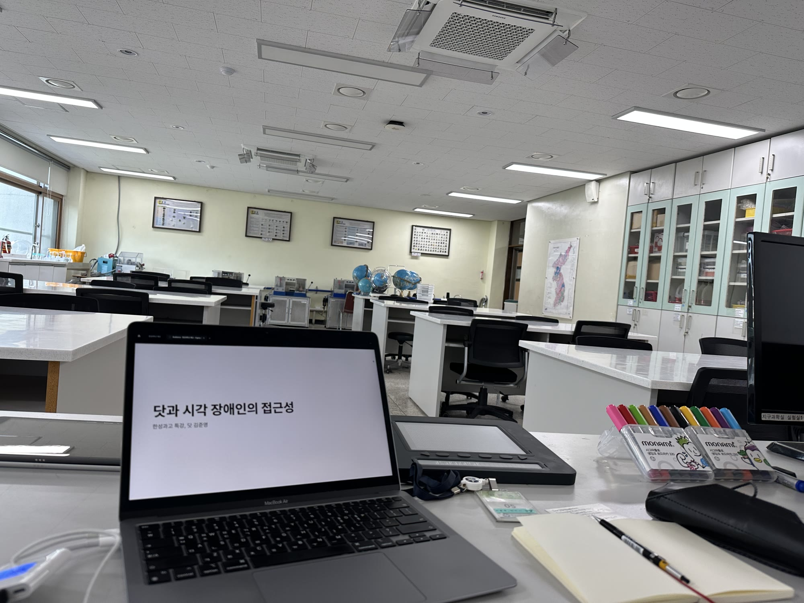
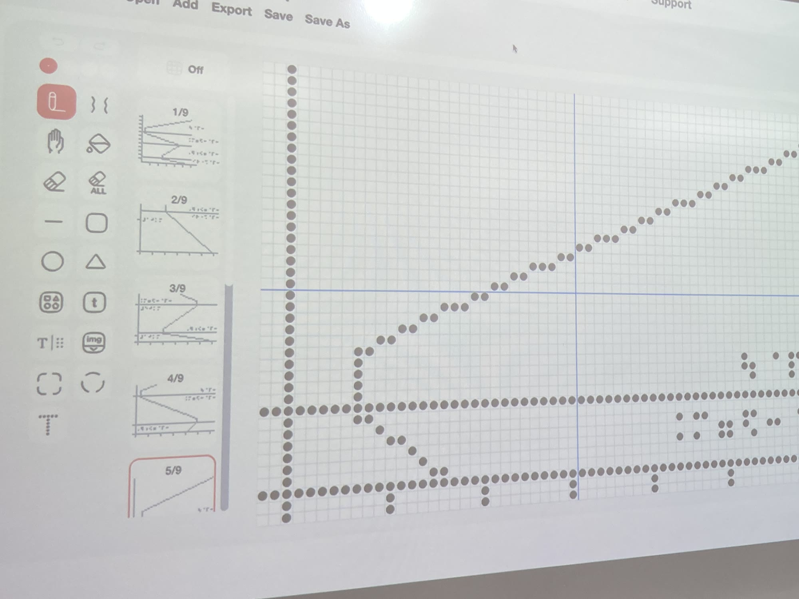
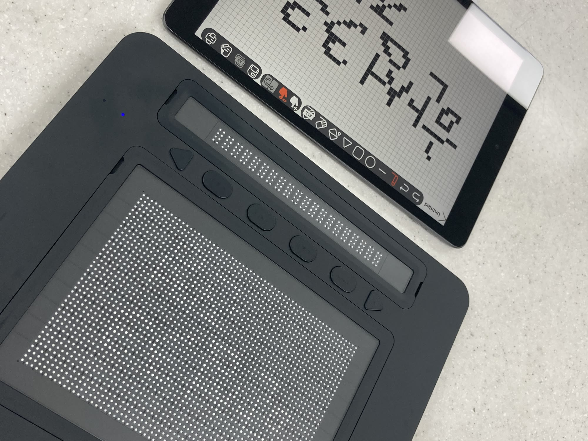
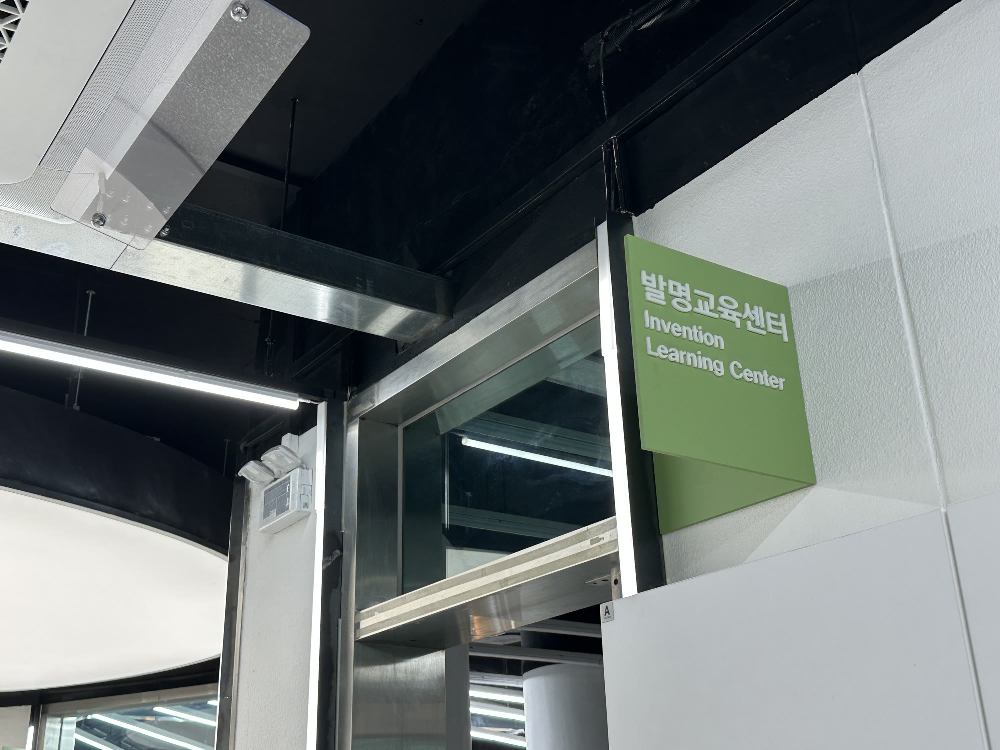
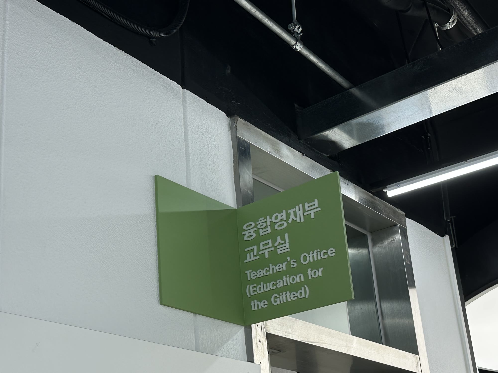
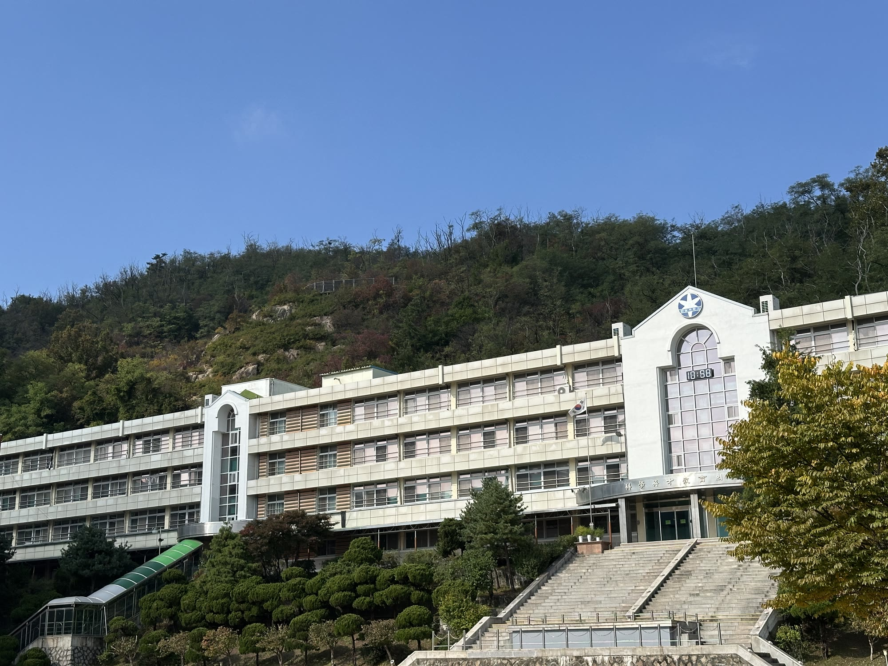

I have spoken at Hansung Science High School twice.

On September 9, 2024, while I was at Dot, I gave a talk on *Dot and Accessibility for Blind People*. It started with what UX design is, then covered how blind people use smart devices through screen readers and refreshable braille displays, where those fall short, and how Dot Pad and Dot Canvas bring tactile graphics into the digital world. At the end the students tried Dot Pad with their own hands.

A year later, on October 25, 2025, I gave a career talk to 28 middle school students at the Hansung Science High School gifted education center, titled *Making Your Own Path: From Engineering Student to UX Designer*.

It was my first time telling my story to middle schoolers. After a lot of thought, I decided to say what I would tell my younger self — the one who only studied hard. The talk had three messages.

1. Exploring a career starts with exploring yourself.
2. Wandering is not failure; it means the questions have started.
3. Trying and exploring matter more than certainty.

I went there to share my story, but on the way back I found myself checking my own choices once more. I wrote about it on [LinkedIn](https://www.linkedin.com/feed/update/urn:li:activity:7407058311487004672/).

  

  
