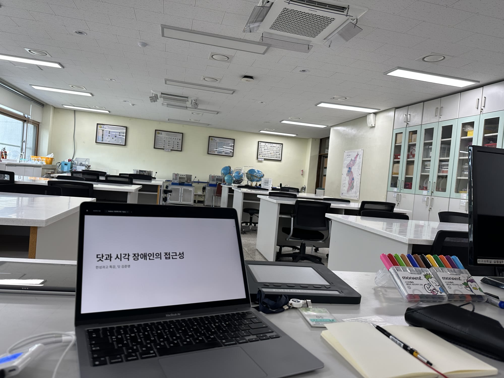
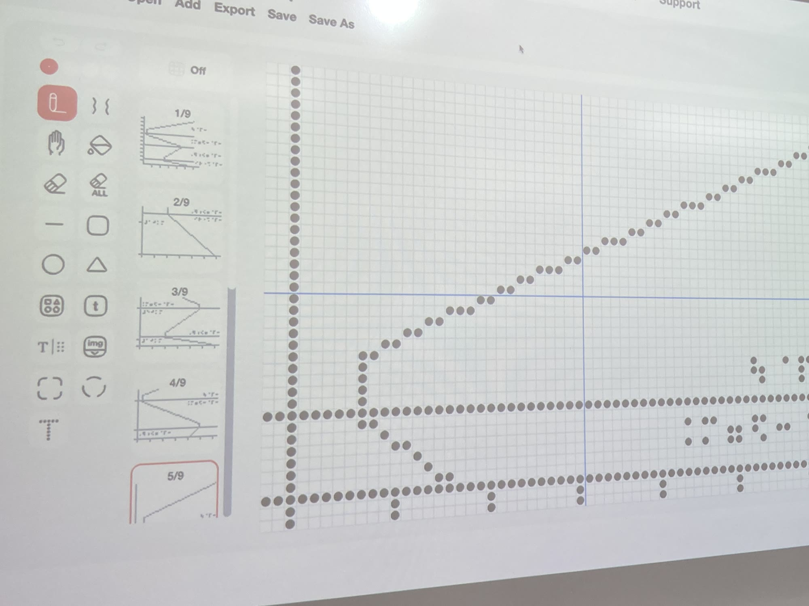

I have spoken at Hansung Science High School twice.

On September 9, 2024, while I was at Dot, I gave a talk on *Dot and Accessibility for Blind People*. It started with what UX design is, then covered how blind people use smart devices through screen readers and refreshable braille displays, where those fall short, and how Dot Pad and Dot Canvas bring tactile graphics into the digital world. At the end the students tried Dot Pad with their own hands.

A year later, on October 25, 2025, I gave a career talk to 28 middle school students at the Hansung Science High School gifted education center, titled *Making Your Own Path: From Engineering Student to UX Designer*.

It was my first time telling my story to middle schoolers. After a lot of thought, I decided to say what I would tell my younger self — the one who only studied hard. The talk had three messages.

1. Exploring a career starts with exploring yourself.
2. Wandering is not failure; it means the questions have started.
3. Trying and exploring matter more than certainty.

At the closing ceremony I received written reflections from 27 students. Here are four of them, as written.

> The talk helped more than I expected. I picked it because robot interaction designer looked the most interesting of the talks, and after hearing it, robot interaction designer seems pretty fun. I still haven't decided what I want to do, so it was a bit of a relief to hear that the speaker didn't know what he wanted to do in college either. I also thought that going abroad and gaining experience could help more than I expected.

> What stayed with me most was that taking a different path scares everyone, but with courage you can reach your dream. I was anxious because my path is different from my friends', and this was a comfort. I also learned that to reach a dream, it helps to meet people who know the field you're interested in. It was a useful time for my future.

> It struck me that knowing you're evenly good at everything is also a way of knowing yourself. I realized that just trying something first is what matters. I want to try the unmanned coffee machine myself and I'm curious what UX design went into it. I want to look at other examples of UX design and understand better what it is.

> Getting into a good high school and university, landing a good job and earning well — not just me but everyone wants this. Unfortunately that rarely happens, and most of the time the road winds around. So people work hard and study to succeed. But some people forget the most important thing: the purpose of studying. So why should we study? Before answering, it helps to have a path decided in order to succeed. What is a dream? It's hard to define in one word, but I think of it as an egg: if I break it myself, it becomes a chick; if someone else breaks it, it becomes a fried egg. In other words, a path should be chosen by your own aptitude rather than by others. The speaker said that around my age he hadn't settled on a path and only studied what adults told him to. When he got to university he felt free from studying, but felt empty because he had never thought about what he truly wanted to do. Then he explained how he solved this and became a UX professional. He said you have to try and experience many things to find out what you're interested in. Hearing that, I thought about what I should do now to choose my path and find my interests, and I realized the answer is studying.

I went there to share my story, but on the way back I found myself checking my own choices once more. I wrote about it on [LinkedIn](https://www.linkedin.com/feed/update/urn:li:activity:7407058311487004672/).

  

  
