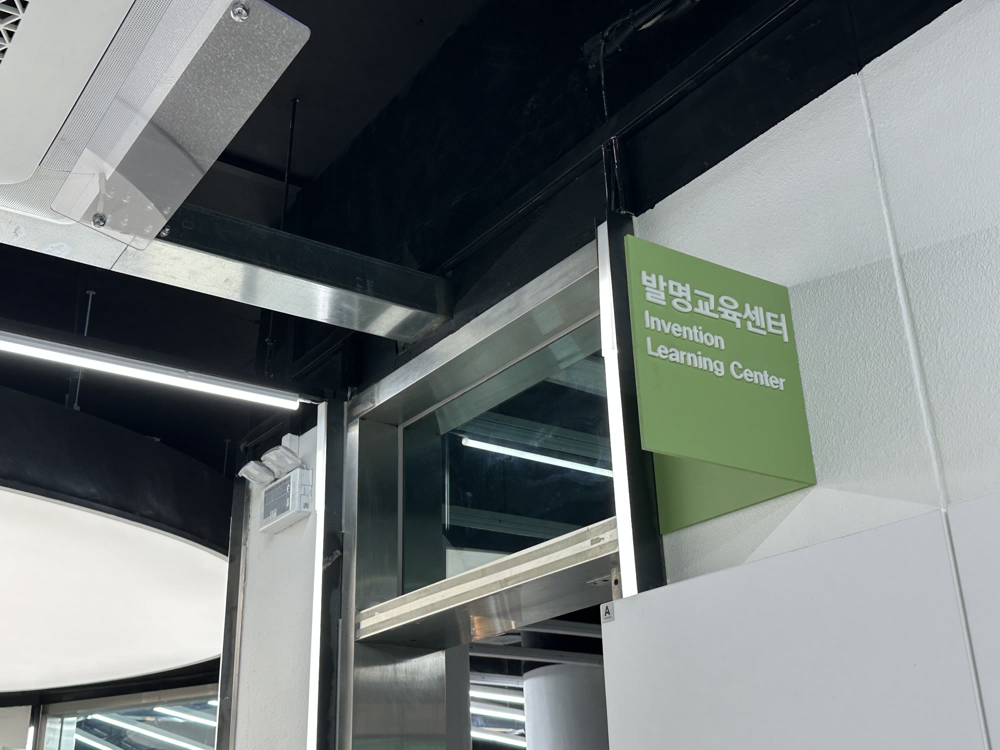
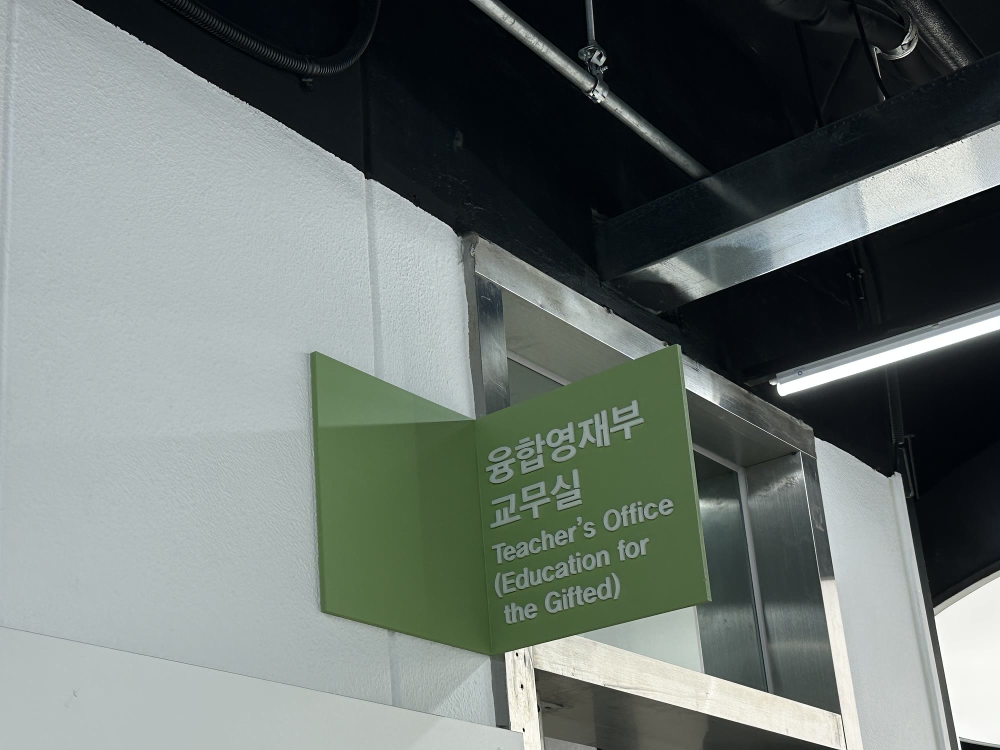
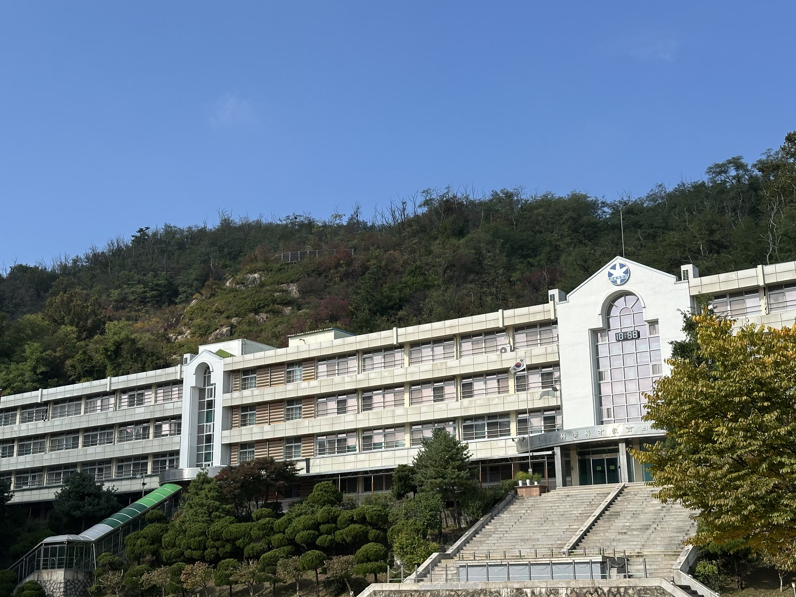

2025년 10월 25일, 한성과학고 영재교육원 중학생 28명에게 <나만의 길을 만드는 방법, 공대생에서 UX디자이너가 되기까지>라는 제목으로 진로 특강을 했습니다.

중학생 앞에서 제 이야기를 꺼낸 건 처음이었습니다. 한참을 고민하다가, 공부만 열심히 했던 그 시절의 저에게 지금 해주고 싶은 이야기를 하기로 했습니다. 주요 메시지는 세 가지였습니다.

1. 진로 탐색은 곧 '나'를 탐구하는 일이다
2. 방황은 실패가 아니라, 질문이 시작됐다는 신호이다
3. 확신보다 중요한 건, 시도와 탐색이다

수료식 때 학생 27명이 쓴 소감문을 받았습니다. 그중 네 개를 그대로 옮깁니다.

> 특강이 생각보다 도움이 됐다. 특강 중에 로봇 인터렉션 디자이너가 가장 흥미로워보여서 선택했는데 특강을 듣고 나니 로봇 인터렉션 디자이너가 꽤 재밌을것 같다. 나는 아직 하고 싶은 일을 정하지 못 했는데 이번에 특강 해주신 김준영 디자이너 님께서도 대학에 가서 하고 싶은 걸 몰랐다는 말을 듣고 조금 안심이 됬던것 같다. 그리고 외국에 가서 경험을 쌓는게 생각보다 도움이 될 것 같다는 생각이 들었다.

> 남들과 다른 길을 가는 것은 누구나 두렵지만 용기를 내면 꿈을 이룰 수 있다는 말이 가장 인상깊었다. 학교 친구들과 다른 진로를 가지고 있어 불안했는데 이 말을 듣고 위로가 되었다. 그리고 꿈을 이루기 위해 내가 관심 있는 분야에 대해 잘 아는 사람과 만나보는 게 도움이 된다는 것을 알게 되었다. 내 진로에 도움이 되는 시간이었다.

> 모든 것을 골고루 잘한다는 것을 안다는 것도 나에 대해 아는 것이라는 말이 인상적이었다. 일단 시도해 본다는 것이 중요하다는 것을 깨달았다.. 무인커피머신을 직접 사용해보고 싶고, 어떤 UX디자인이 작용되었는지 궁금하다. UX디자인이 적용된 다른 예시들을 보며 UX디자인이 무엇인지 더 잘 이해하고 싶다

> 좋은 고등학교와 대학교에 입학하고, 좋은 곳에 취직하고 돈을 잘 버는 것, 이것은 나뿐만이 아니라 모든 사람들이 바라는 것이다. 하지만 불행하게도 이러한 경우는 거의 드물고, 보통 돌고도는 것이 대부분의 경우이다. 그래서 사람들은 성공하기 위해 열심히 노력하고 공부한다. 그러나 몇몇 사람들은 가장 중요한 것을 잊고 있다. 바로 공부의 목적이다. 그렇다면 우리는 공부를 왜 해야할까? 우선 이 질문에 대답하기 앞서 성공하기 위해서는 진로가 정해져있는 것이 좋다. 꿈은 무엇인가. 꿈을 한 단어로 정의하기엔 어렵지만, 나는 삶은 계란이라 생각한다. 내가 계란을 까면 병아리가 되고, 남이 깨면 후라이가 되기 때문이다. 꿈, 즉 진로는 남들이 정하는 것보다 자신의 적성에 맞게 정하는 것이 더 옳다라는 것이다. 강사님은 내 나이 쯤, 진로를 확실하게 정하지 못하고 어른들이 하라고 하는 공부만 했다고 말씀하셨다. 그렇게 대학생이 될 때, 자신은 공부에서 해방감을 느꼈지만, 정작 자신이 진정하게 하고 싶은 것이 무엇인지 고민해 보적이 없기 때문에 허무감을 느끼셨다고 하셨다. 그렇게 강사님은 어떻게 자신이 이 문제를 해결하고 UX전문가가 되셨는지 설명하셨다. 강사님은 여러가지를 경험해보고 체험해봐야 자신의 관심사가 무엇인지 알 수 있다고 말씀하셨다. 이 말을 듣고 나는 지금 내가 진로를 정확하게 정하기 위해, 그리고 나의 관심사가 무엇인지 알기 위해 무엇을 해야할까 고민을 하다가 그 답은 공부라는 것을 알게되었다.

이야기를 전하러 갔지만, 돌아오는 길에는 제 선택과 고민을 한 번 더 점검하게 되었습니다. 후기는 [링크드인](https://www.linkedin.com/feed/update/urn:li:activity:7407058311487004672/)에 적었습니다.

  
