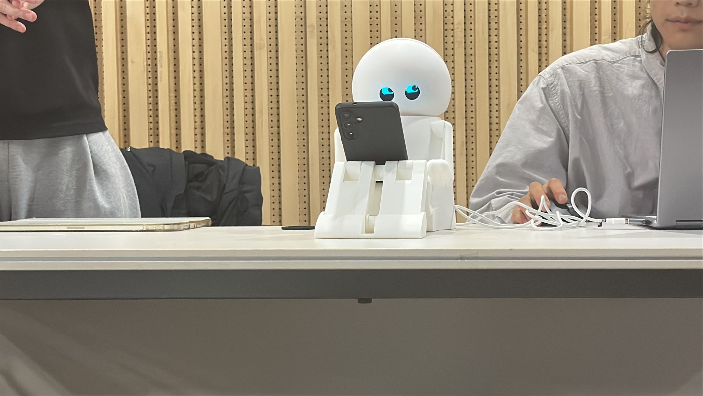
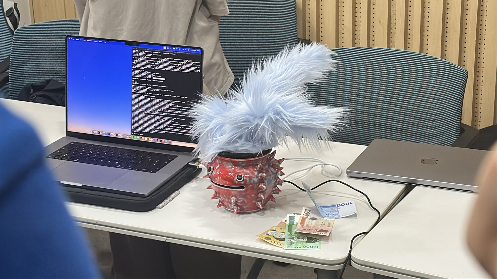
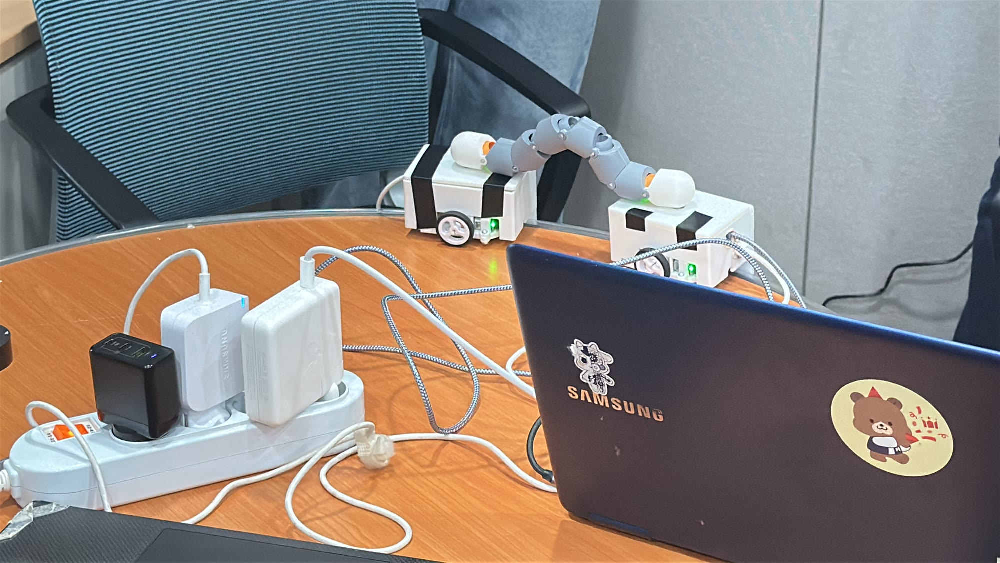

On June 19, 2026, I went back to Hongik University's Design Engineering program — as an industry juror for the final presentations of its HRI (Human-Robot Interaction) class, and as an alumnus at the program's information session the same day.

This program is where I, a mechanical engineering student, first found UX. I had wished I could take the HRI class ever since it opened, and now, working as a UX designer at a robotics company, I got to review the students' robots in person.

Each team saw robots differently, and that view carried all the way into interaction details — movement, sound, light. Beyond demoing features, you could see them asking why a robot should respond the way it does. I learned as much as I gave.

  

<iframe src="https://www.youtube-nocookie.com/embed/KmozbRRTfqA?rel=0&modestbranding=1" title="Hongik Design Engineering HRI class projects video" loading="lazy" allow="accelerometer; autoplay; clipboard-write; encrypted-media; gyroscope; picture-in-picture" allowfullscreen></iframe>

