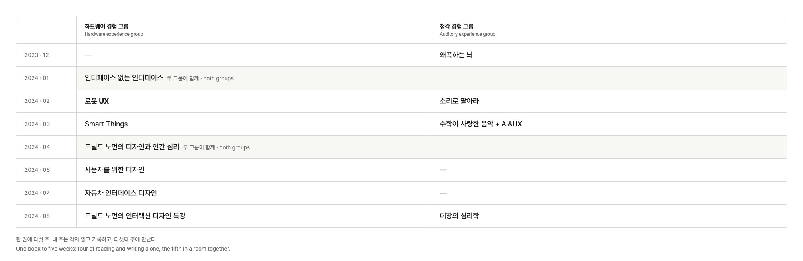
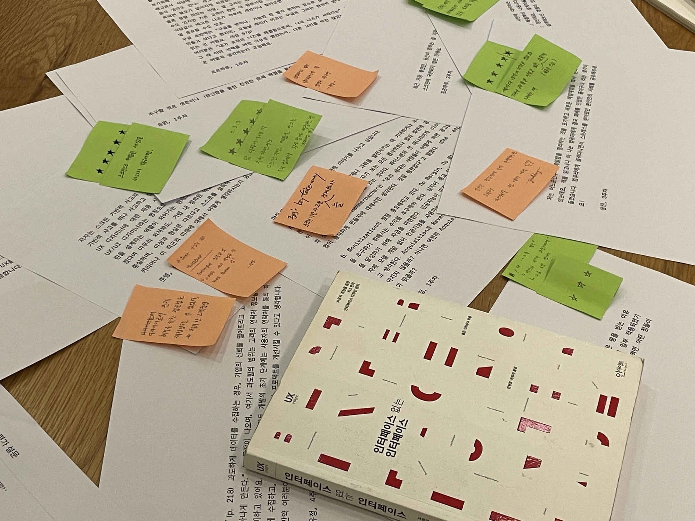
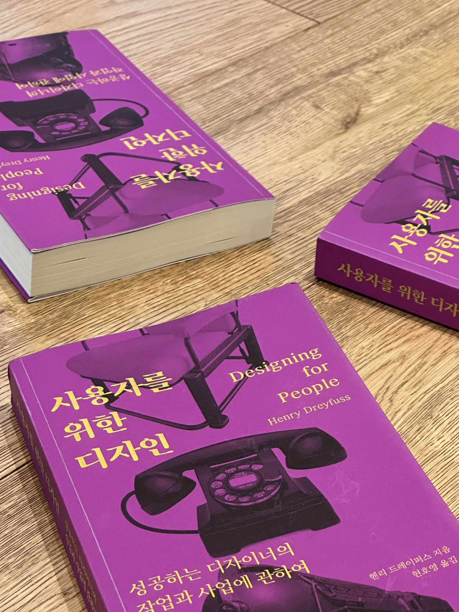
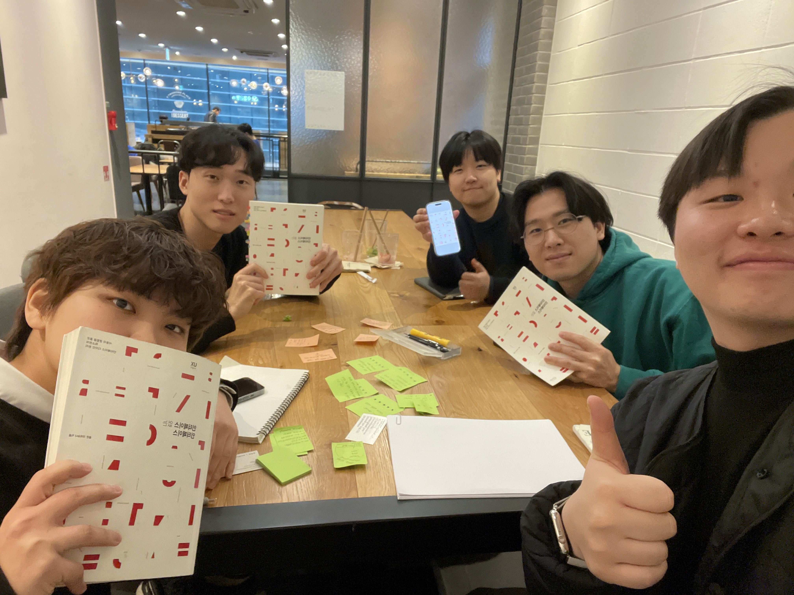

[**Seolgyejadeul**](https://uxdesigners.notion.site/2962d67da32c4f218fbea5944f612e60) is a community for practitioners working on hardware and auditory experience, started together with the co-organizers of [UXeed](/en/activities/uxeed). I co-founded and ran the hardware experience group, which drew about 20 practitioners and researchers.

The book study was the centre of it. One book takes five weeks: four spent reading alone, the fifth in a room together. Each week had its assigned pages and its deadline, and every member kept a log with three things in it. A passage that struck them and what they made of it, three things the week gave them, and one question for the others.

One rule shaped the rest. **You write your question first, and it opens the following week.** In week two everyone's questions unlock at once, and from there the answering happens in chapter-by-chapter discussion rooms. Read other people's questions first and the conversation converges, and anyone who skipped the reading can coast. Reversing the order left us with questions that each began where that person had actually been reading. Every week we published a summary of what the others had underlined.

Between December 2023 and August 2024 the two groups read a book a month.

What the hardware group read overlaps with what I do now. February 2024 was Robot UX, and this is what I wrote in my log that month.

> A product is constantly delivering some message to its user. That message can be a screen, but it can just as easily be a vibration, an LED, or a change of form.

In the final week I left this question.

> I realised I had been defining the word robot far too narrowly. Maybe the socially smart, interactive product I want to make was a robot all along.

Eighteen months later I moved to a robot company, where I work on telling a robot's state through its face, its light, and its sound.

  
