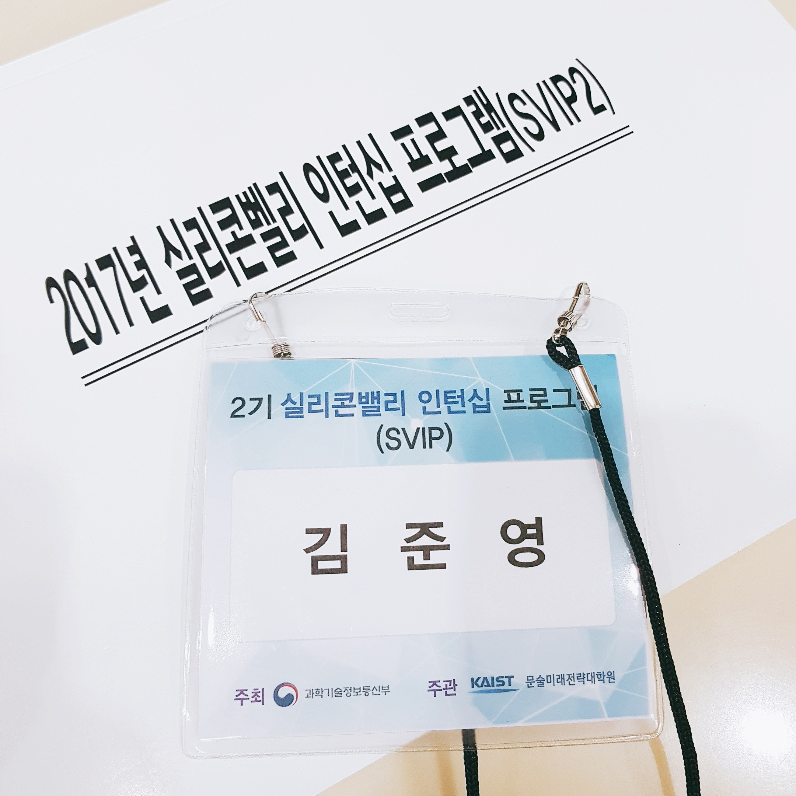
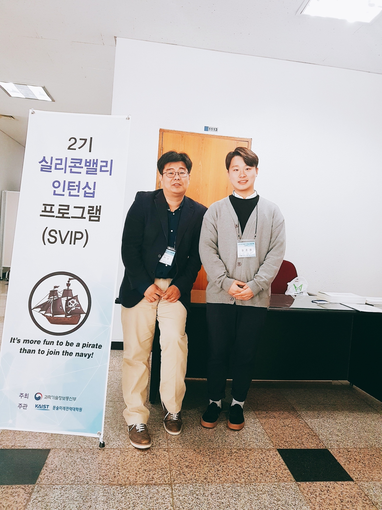
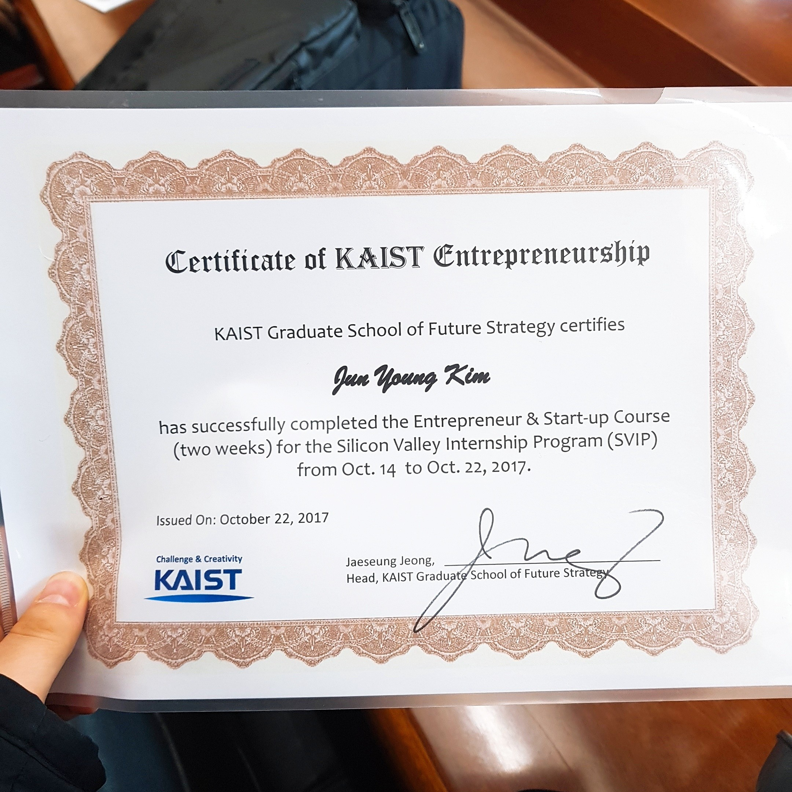
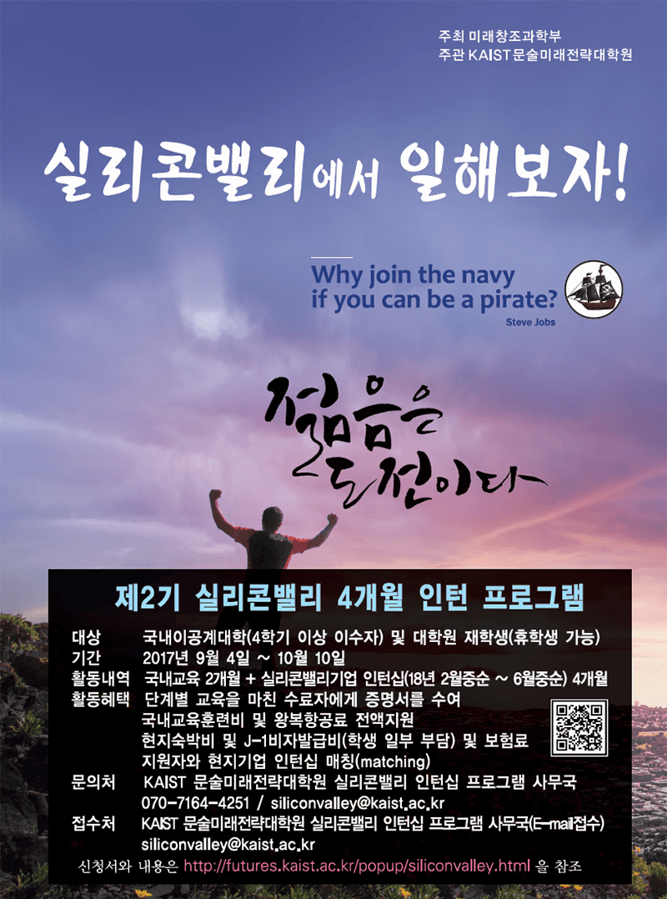
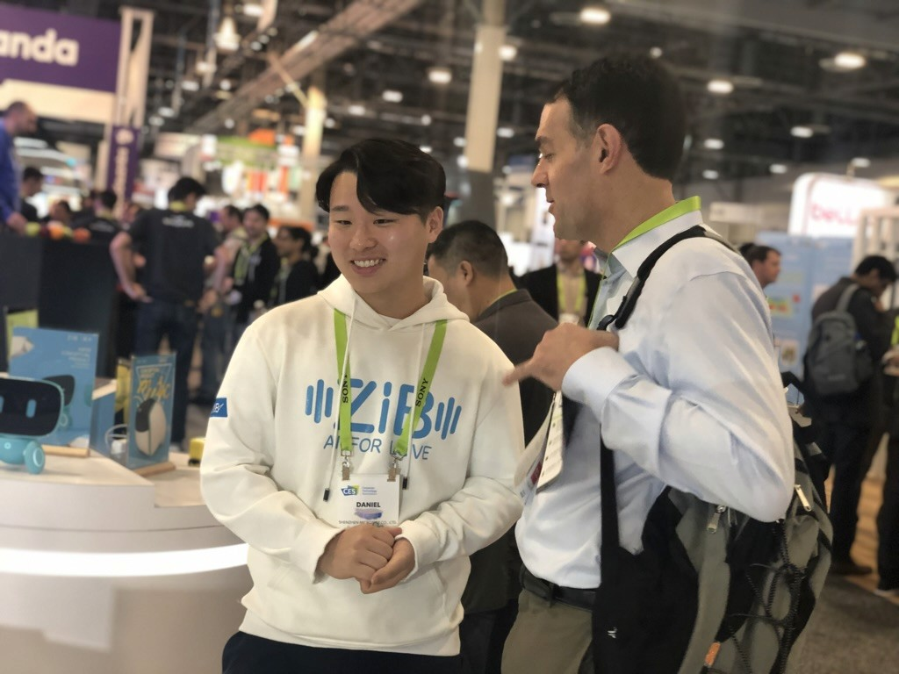

  

 

2017년 미래 창조 과학부와 카이스트 미래문술대학원에서 추진한 실리콘 인턴십 프로그램에 참여하였습니다. 2개월 간의 창업 교육 및 선발 과정을 거친 끝에 12인 중 하나로 선발되어 **ZIBOT**에서 인턴십을 진행했습니다. 인턴십은 18년도 1년 간 진행했으며, 당시 해당 인턴십 경험을 **블로그** <https://silinsta.wordpress.com/>에 정리하기도 했습니다.
