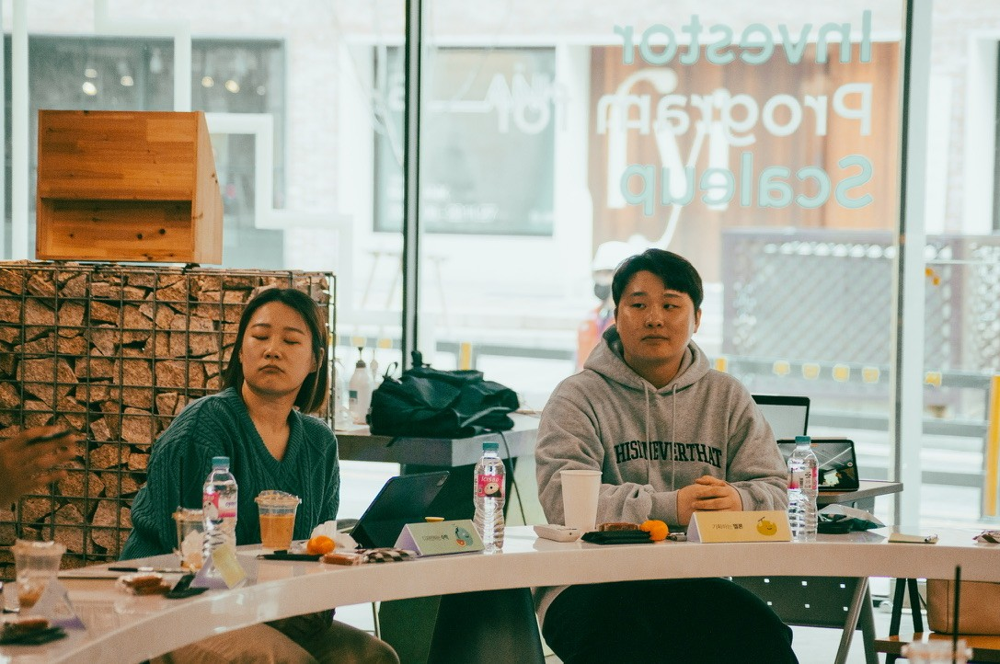
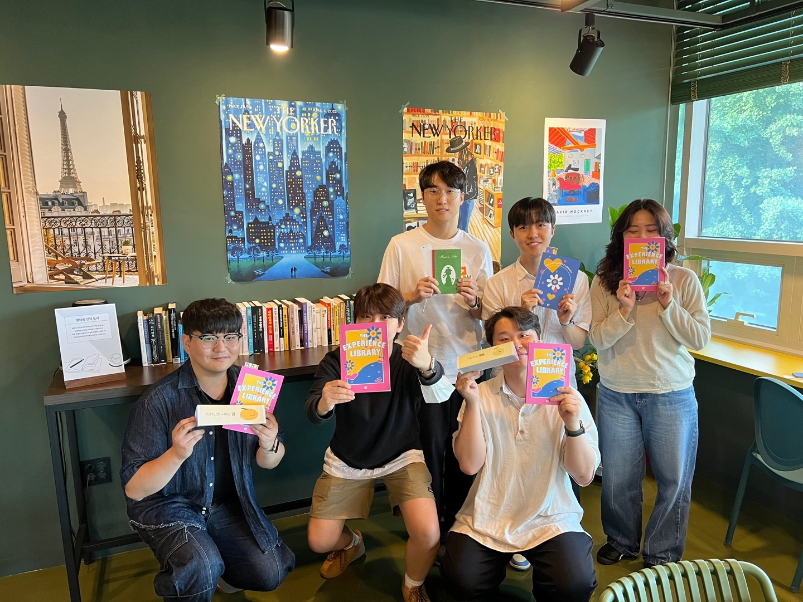

UXeed는 'UX + Seed'의 줄임말로, 학생과 실무자가 자발적으로 모여 시작한 UX 스터디 그룹입니다.

저는 2년간 리드 매니저를 맡아 온라인 북스터디를 운영하고 비정기 북토크·네트워킹 행사를 열었습니다. 수식어와 과일·채소를 결합한 닉네임과 자체 제작한 아바타로 반익명 운영 방식을 만들고, 노션·디스코드 기반 커뮤니티 시스템을 직접 설계했습니다.

초기 멤버는 대부분 학생이었고, 지금은 여러 회사에서 실무자로 일하고 있습니다. 이후 다른 분야의 실무자들도 합류했고, 이관 뒤로는 후속 운영진이 네트워킹 목적으로 이어가고 있습니다.

  
