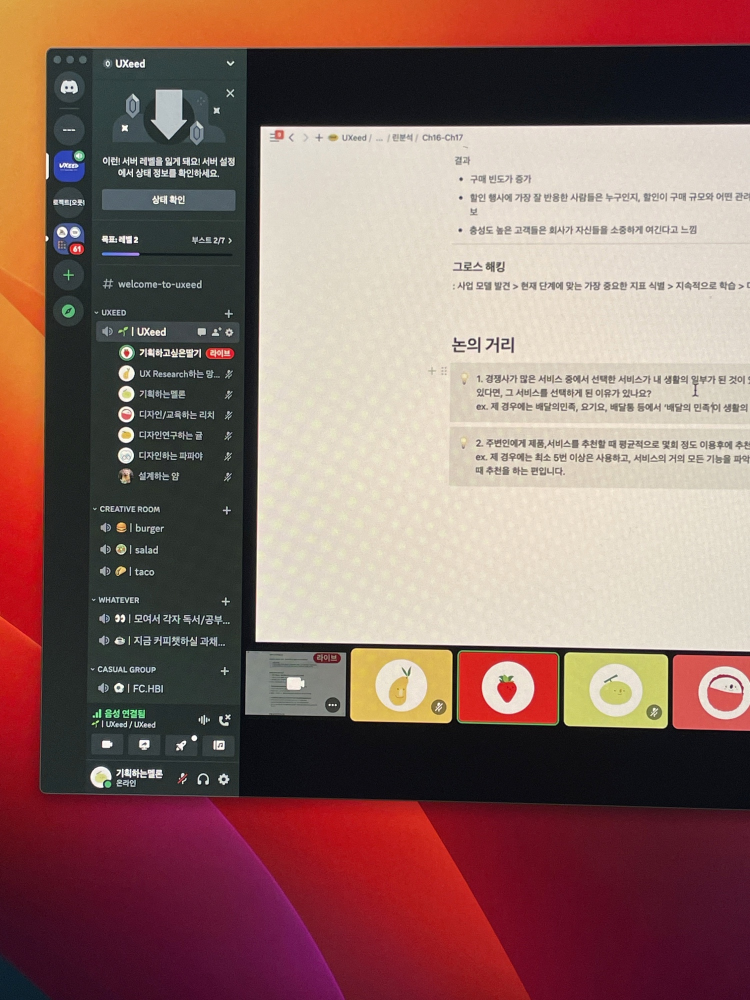
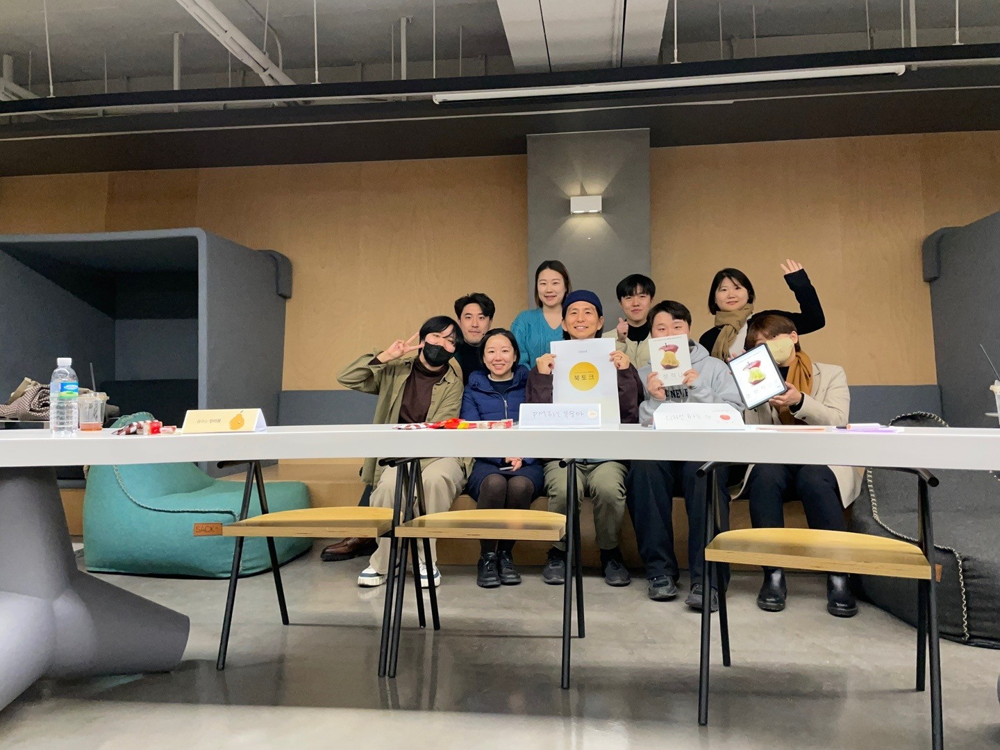

UXeed는 'UX + Seed'의 줄임말로, 2021년부터 학생과 실무자들이 자발적으로 모여 시작한 UX 스터디 그룹입니다. 2021년부터 2023년까지 3년간 꾸준히 온라인 북스터디를 운영했으며, 비정기적인 북토크·네트워킹 행사를 개최했습니다. 수식어와 과일·채소를 결합한 닉네임과 자체 제작한 아바타를 활용해 반익명 성격으로 운영한 것이 특징입니다.

초기 멤버 대부분이 학생이었으나, 이 스터디를 함께하며 학생 멤버들은 대부분 대기업·스타트업 등에 취직 및 이직에 성공했습니다. 현재는 다양한 출신의 실무자들이 추가로 합류해 UX 전문가 네트워크를 형성하고 있습니다.

이 모임에서 저는 2년간 리드 매니저로 운영하며, 과일·채소 컨셉의 아바타·닉네임 시스템과 노션·디스코드 기반 커뮤니티 시스템을 직접 설계했습니다. 이관 이후로는 네트워킹 목적으로 후속 운영진이 이어가고 있습니다.

  

 
