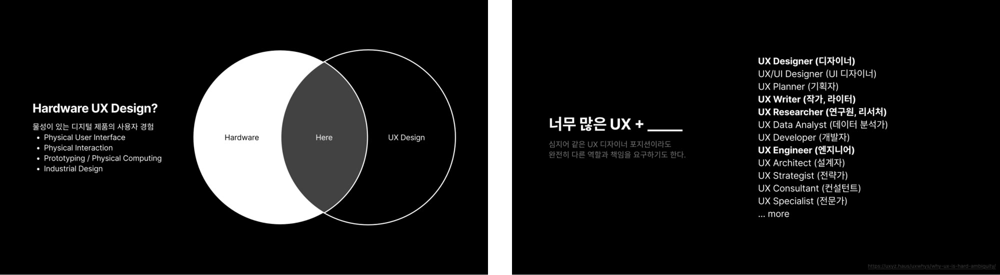
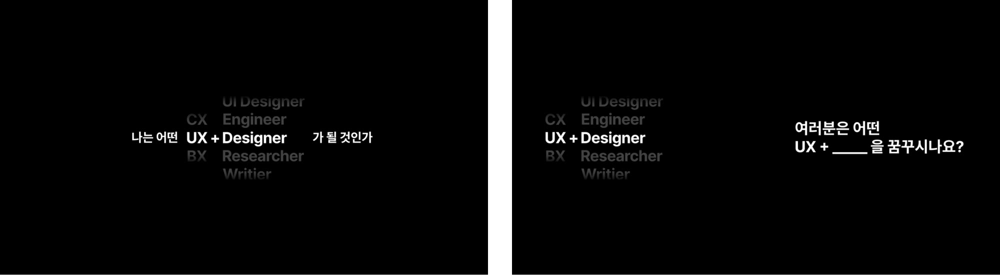

2025년 7월 9일, 원티드 온라인 UX 컨퍼런스에서 <모호한 UX 경계에서 나만의 커리어 설계하기>라는 제목으로 발표했습니다.

기계공학도로서 UX에 본격적으로 관심을 가졌던 2017년부터 이어져 온 고민을 꺼냈습니다. 무엇이 UX 디자인이고 무엇이 그 영역이 아닌지, 나는 어떤 UXer가 될 것인지. 연사 제안을 받았을 때는 자격이 되나 의심이 들었는데, 담당자분이 연락을 준 계기가 바로 그 고민이었습니다. 같은 고민을 하는 사람들이 공감할 이야기를 나눠 달라는 것이었습니다.

발표에서 정리한 문장은 단순했습니다.

> [UX + ______]
>
> UX는 태도이자 관점이고, ______는 내가 경험에 기여할 수 있는 경쟁력이자 스킬이다.

제 빈칸은 하드웨어입니다. 발표 소식은 [이 글](https://www.linkedin.com/feed/update/urn:li:activity:7339094879760748544/)에, 슬라이드는 [발표 후기](https://www.linkedin.com/feed/update/urn:li:activity:7352888194117357568/)에 공유했습니다.

