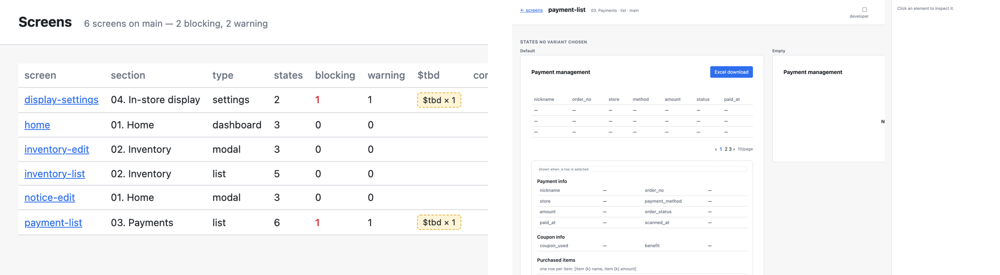

제품의 화면 하나하나를 짧은 텍스트 파일로 둡니다. 화면에 무엇이 있는지, 비었을 때·불러올 때·깨졌을 때 어떻게 보이는지, 버튼이 어디로 가는지, 어느 기획서에서 왔는지. 이 파일은 AI 에이전트가 쓰고, 사람은 그려진 결과를 보고 "이 열 빼 줘"처럼 말로 고칩니다. 캔버스도 드래그도 없고, 코드에서 멀어지는 디자인 파일도 없습니다.

상태는 화면 전체를 반복하지 않고 달라진 부분만 적습니다. 리뷰하는 사람이 알고 싶은 것도 그것입니다. 아직 정하지 않은 값은 `$tbd`로 적고, 누가 정해야 하는지까지 남깁니다. 문구만 바뀌면 바로 반영하고, 구조가 바뀌면 사람이 승인해야 반영합니다.

화면을 만들어 내는 도구와 경쟁하지 않고, 그 결과를 받아 지키는 쪽을 맡습니다. 검수 규칙은 [fig](/playground/fig-pm/)에서 가져왔습니다. 지금은 엔진과 로컬 뷰어까지 있고, 이름은 임시입니다.

