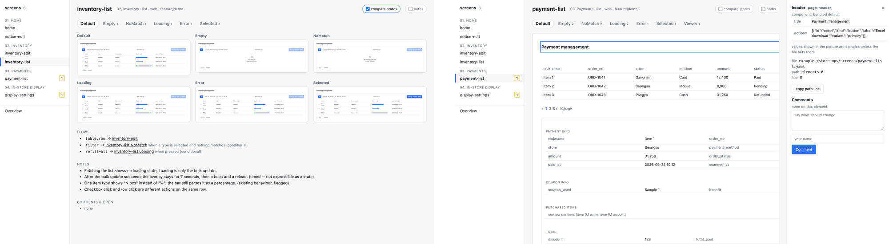
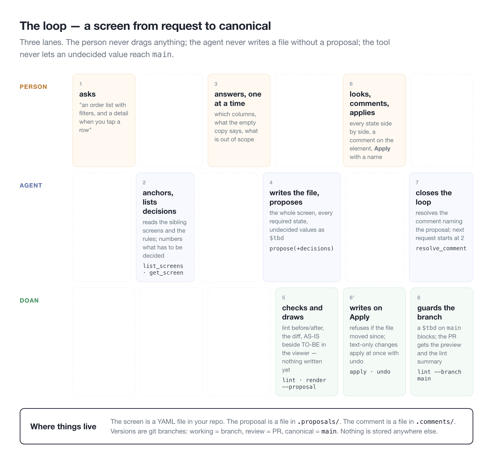
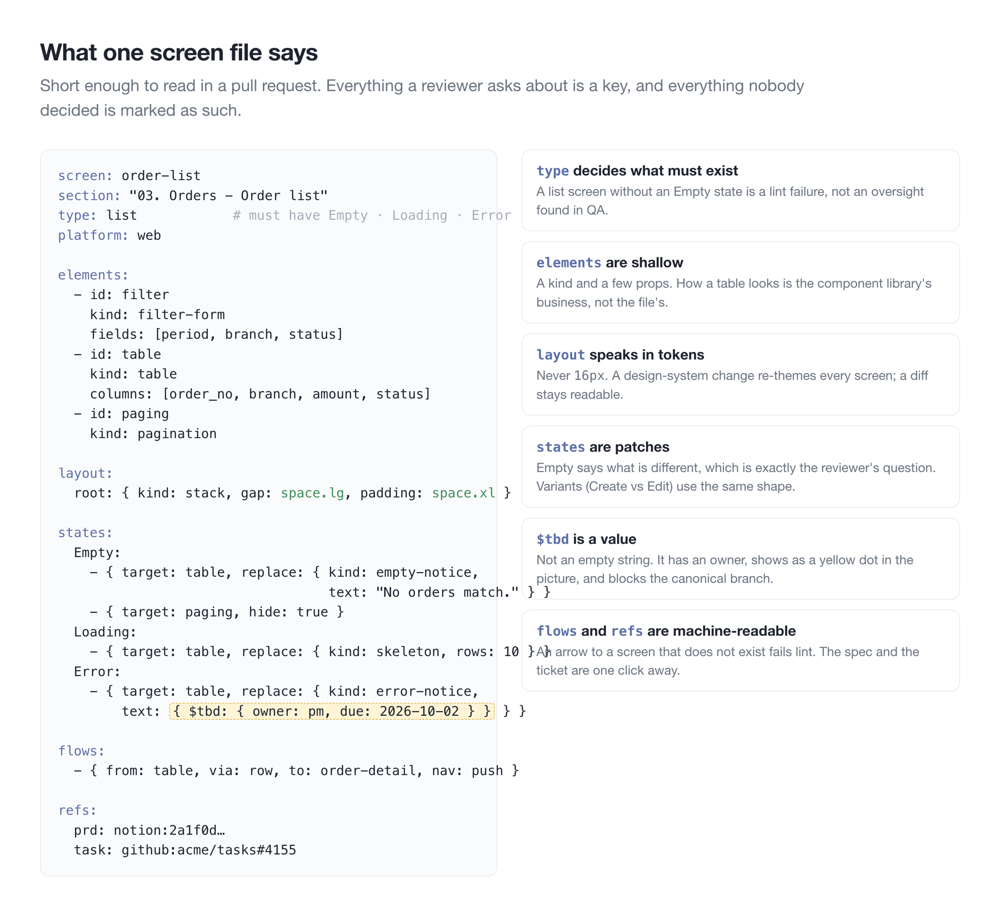
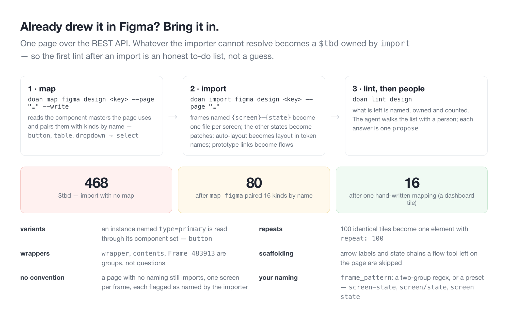

*Doan* (도안) is Korean for the drawing a thing is made from. Every screen of a product is a short text file: what is on it, how it looks when empty, loading, or broken, where each button goes, and which spec it came from. An AI agent writes those files. You open the screen in a browser, point at something, and say "drop that column." The agent can only propose a new version; a person presses apply. The aim is to replace Figma for product screens — web, app, and kiosk.

It targets the places design files break once many people, agents, and months of history pile up: screens nobody drew, values nobody decided, design drifting from code, agents editing quietly. So states record only what differs instead of repeating the screen, and undecided values stay as `$tbd` with an owner attached. Fifteen checks point to missing states and open values by file and line, and nothing unresolved gets into main.

In the viewer you scan screens by section and flip through states as tabs or compare them side by side. Click an element to see which file and line it came from, and leave a comment right there. An agent's proposal arrives as a page that draws each state as-is next to to-be; you sign your name and apply or reject.

Teams that already drew in Figma bring it in with `import figma`. Mapping component names first cuts unresolved values from 468 to 80, and what remains becomes the first check's to-do list. Set each screen to iOS, Android, tablet, kiosk, or web and it draws at that device's width and frame — with antd, MUI, or the team's own components.

It runs with `npx @junyoung735/doan`, no install, and plugs into Claude Code, Cursor, or Codex over MCP. The lint rules come from [fig](/en/play/fig-pm/).

