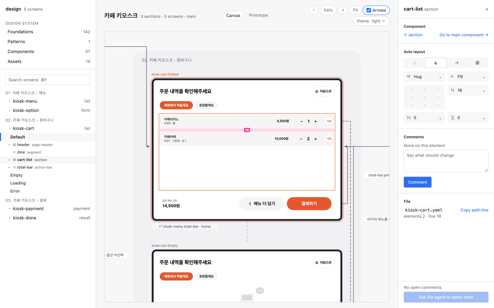
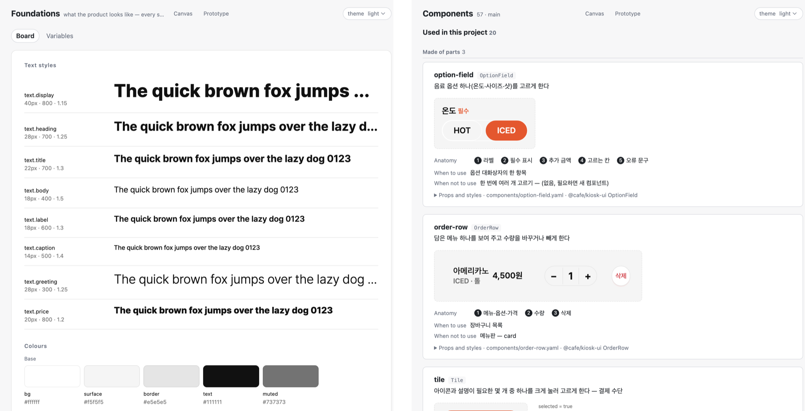
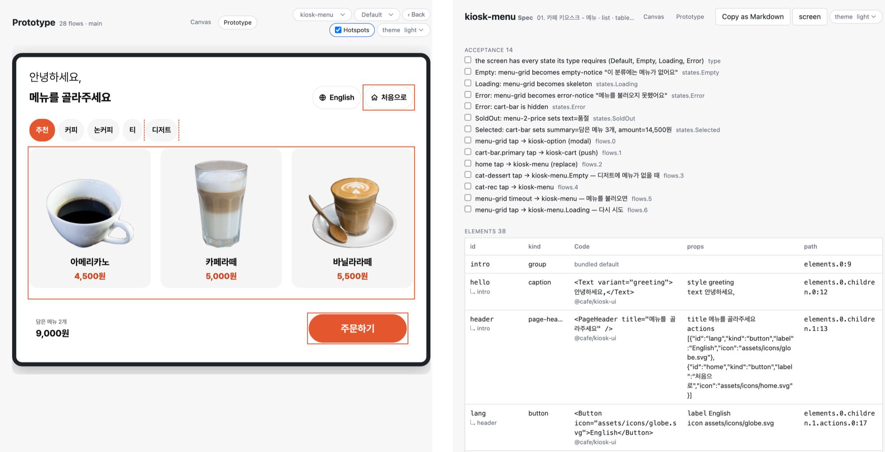
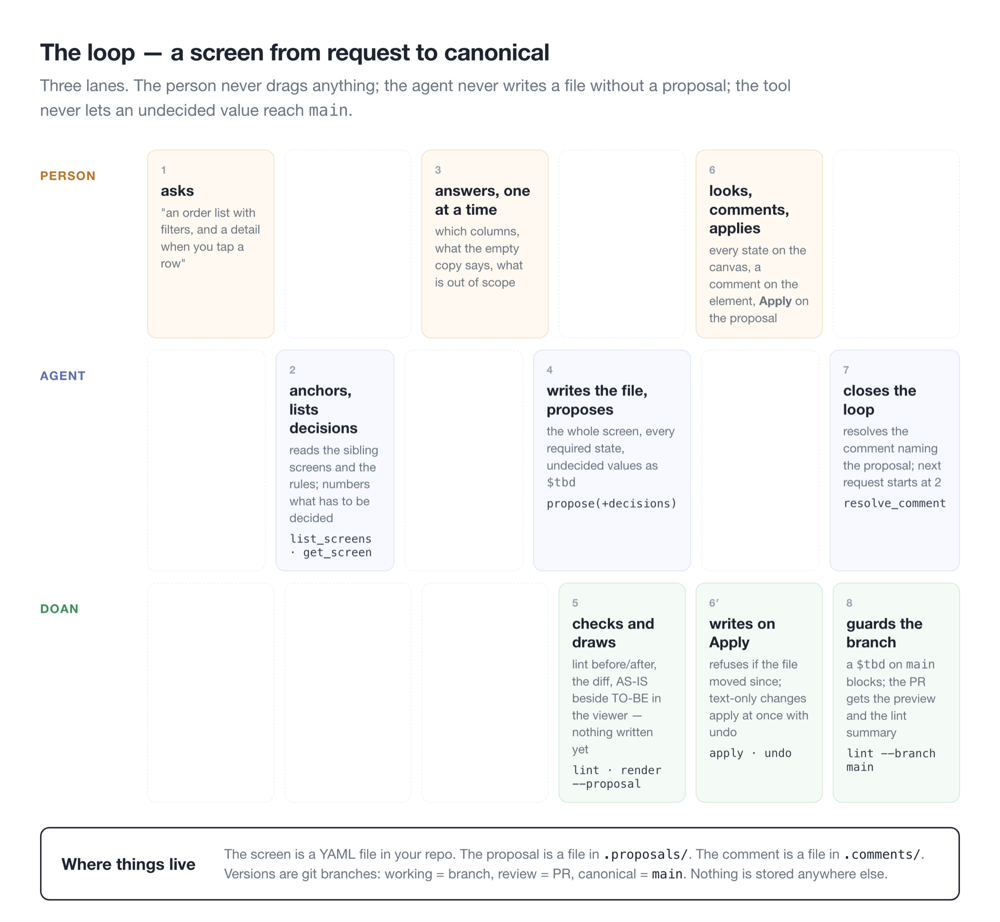
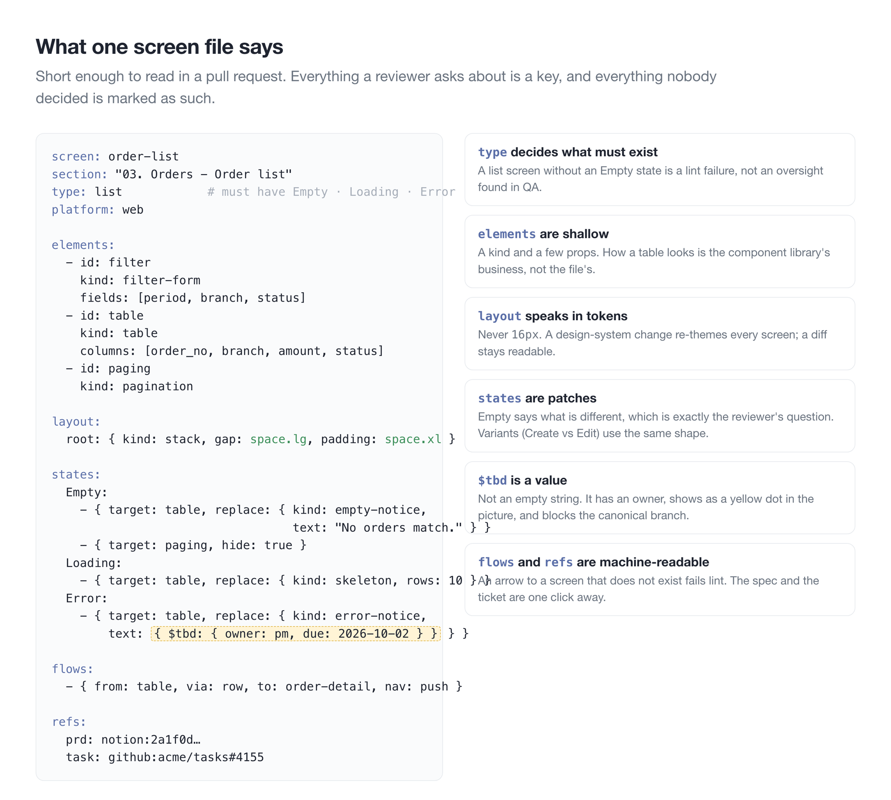
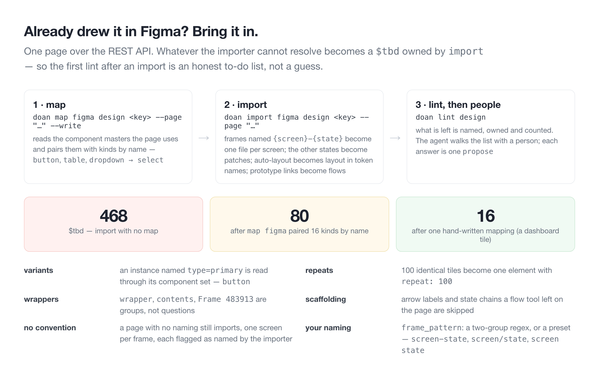

*Doan* (도안) is Korean for the drawing a thing is made from. Every screen of a product is a short text file: what is on it, how it looks when empty, loading, or broken, where each button goes, and which spec it came from. An AI agent writes those files. You open the screen in a browser, point at something, and say "drop that column." The agent can only propose a new version; a person presses apply. The aim is to replace Figma for product screens — web and app.

It targets the places design files break once many people, agents, and months of history pile up: screens nobody drew, values nobody decided, design drifting from code, agents editing quietly. So states record only what differs instead of repeating the screen, and undecided values stay as `$tbd` with an owner attached. Lint rules point to missing states and open values by file and line, and nothing unresolved gets into main.

The viewer lays out every state on a canvas by section, as Figma does, with the flows as arrows. Click an element and the layer tree and the right panel show its component, layout, and file location; leave a comment right there. An agent's proposal is looked at on the canvas, flipping between how it would look and how it looks now, then applied or rejected.

The ground under the screens is files too: colours, text styles, and surfaces as DTCG tokens; components as contracts that bind props to tokens; the way parts are arranged as patterns — each with its own page in the viewer. Flows can be clicked through as a prototype, and engineering gets one spec with acceptance criteria, code mapping, and the tokens used. Comments left in the viewer go to the agent with one button.

Teams that already drew in Figma bring it in with `import figma`. Mapping component names first cuts unresolved values from 468 to 80, and what remains becomes the first check's to-do list. Set each screen to iOS, Android, tablet, or web and it draws at that device's width and frame — with antd, MUI, or the team's own components.

It runs with `npx @junyoung735/doan`, no install, and plugs into Claude Code, Cursor, or Codex over MCP. The lint rules come from [fig](/en/play/fig-pm/).

