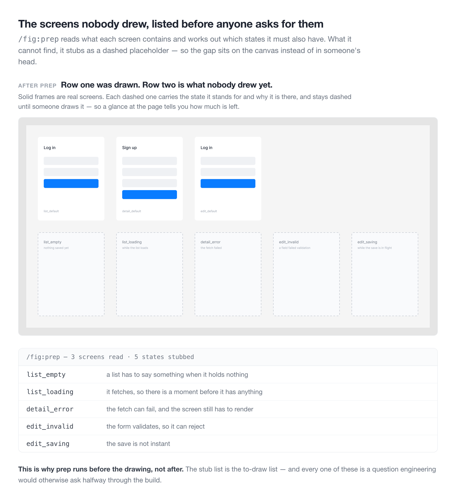
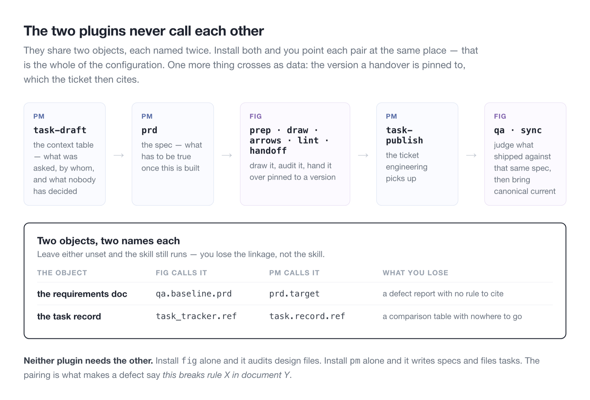

Most Claude Code plugins aim at the codebase. fig and pm aim at the work beside it — the Figma file you draw in, and the spec you write next to it.

fig covers before and after drawing a screen: the to-draw list first, then the audit and sync. It catches settings carried over when a screen is duplicated, a canonical page left stale, broken arrows, and screens nobody drew. pm writes and verifies specs, then drafts, files, and reconciles the tasks.

A few principles hold it together. Only `/fig:lint` decides right from wrong. Team conventions are observed from the file, not asked, and anything uncertain stays empty. fig never writes to Figma; pm writes only after a preview and an explicit go.

I built these one at a time for my own work. I use them every day, and so does my UX team.

