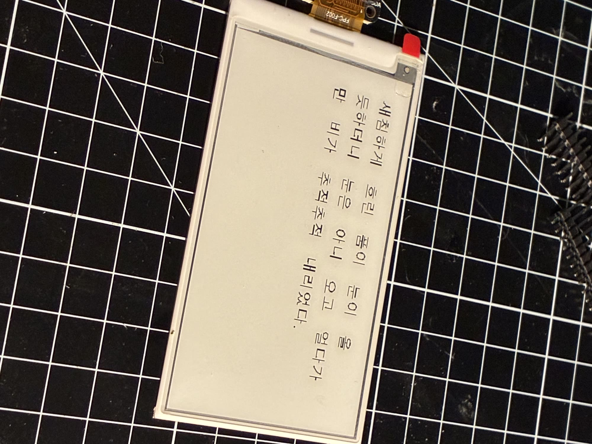
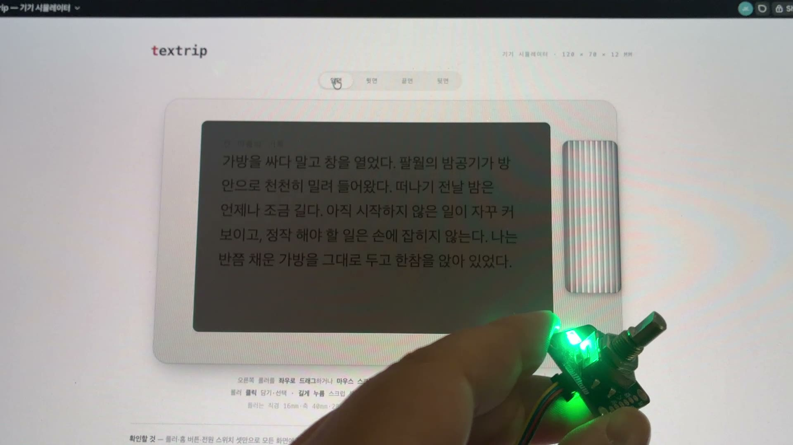
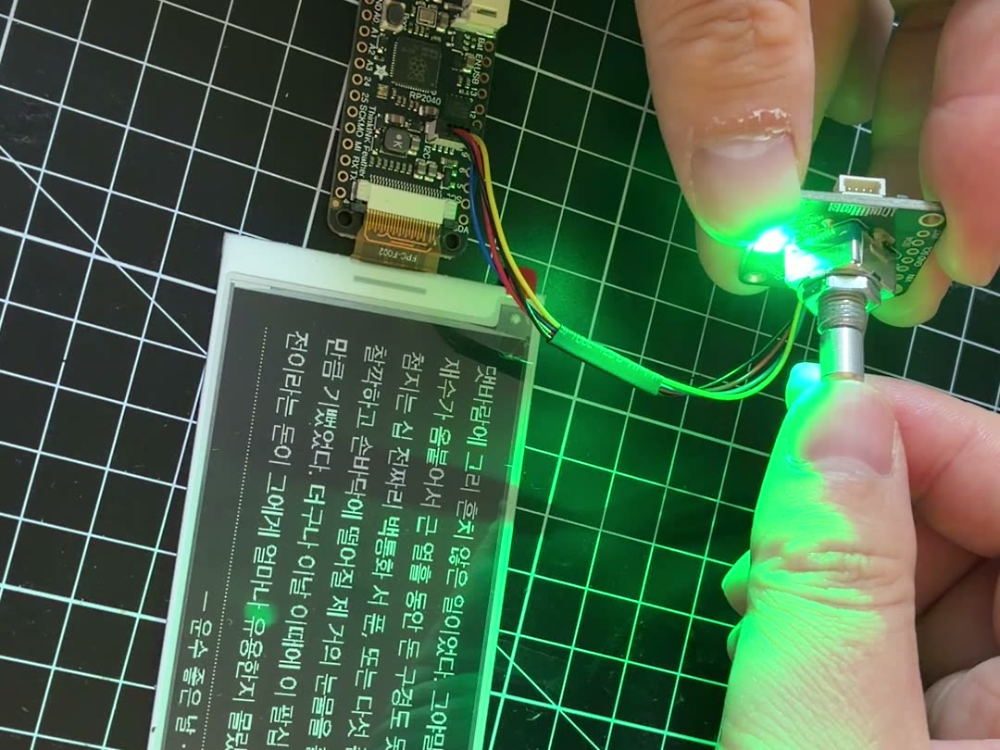

An e-reader you hold and roll. Reading follows proven conventions; the difference starts where your hand touches it.

There is no reason, and no way, to beat the Kindle on reading features. So textrip competes as **the object in your hand while you read**. The software follows convention, and everything left over goes into material, machining, and touch. After weighing twelve form factors, I settled on a slim landscape bar (120 × 70 × 12 mm) — the width worked back from the screen, the length from the controls.

Pages turn with a 16 mm roller on the side: 20 detents per turn, 2.51 mm apart, the same spacing as a mouse wheel. Roll slowly and it clicks; roll fast and it spins free.

A solderless prototype showed a 0.70 s e-ink refresh and about one second per page turn in real use. Next come soldering and an aluminium prototype.

<video src="/media/playground/textrip/roll.mp4" aria-label="Prototype video: turning the roller flips the page on a real e-ink screen" autoplay muted loop playsinline></video>

 

  
