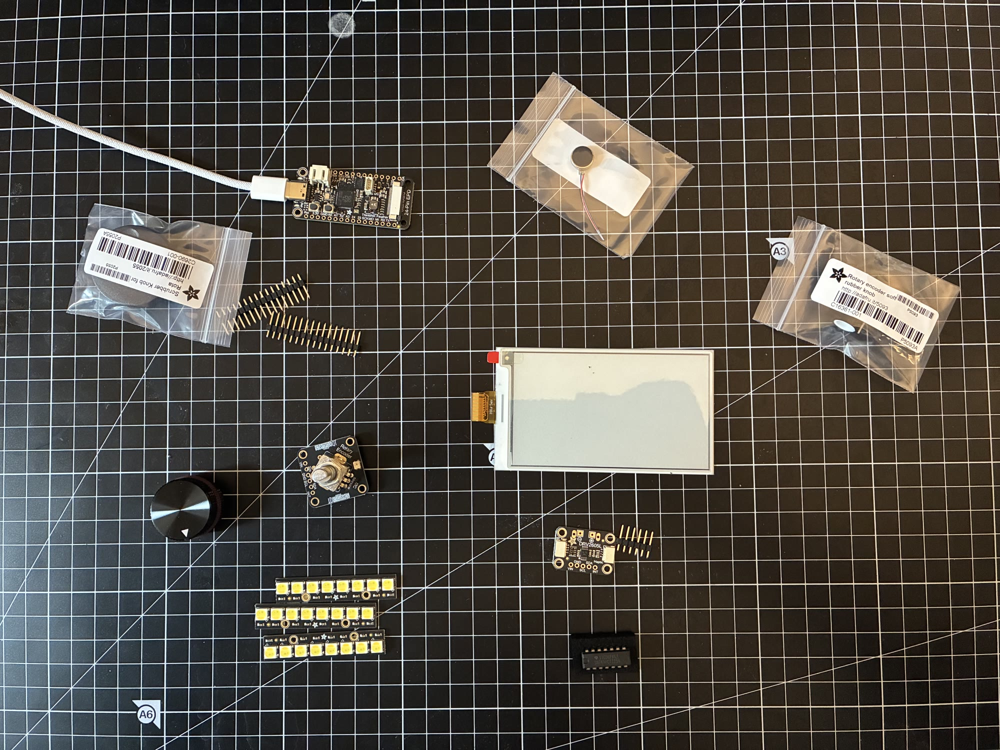
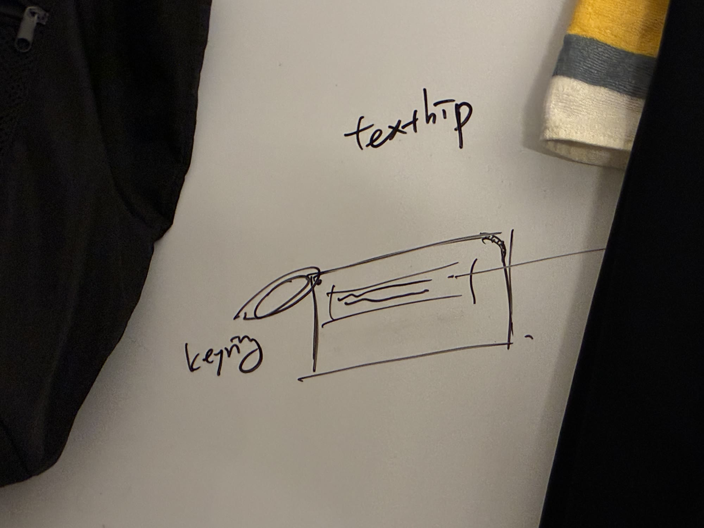

쥐고 굴리는 전자책 리더입니다. 읽기는 검증된 관례를 따르고, 차이는 손에 닿는 순간부터 만듭니다.

읽기 기능으로 킨들을 이길 이유도 방법도 없습니다. 그래서 기능이 아니라 **읽는 동안 손에 쥐고 있는 물건**으로 경쟁하기로 했습니다. 소프트웨어는 관례를 따르고, 남는 힘을 재질·가공·촉감에 씁니다. 형태는 열두 가지를 검토한 끝에 가로로 드는 슬림 바(120 × 70 × 12mm)로 정했습니다. 폭은 화면 크기에서, 길이는 조작계에서 거꾸로 계산했습니다.

페이지는 옆면의 16mm 롤러로 넘깁니다. 한 바퀴에 20칸, 한 칸이 2.51mm라 마우스 휠과 같은 간격입니다. 천천히 굴리면 딸깍이고, 빠르게 굴리면 걸림 없이 돌아갑니다.

납땜 없이 조립한 프로토에서 e-ink 화면 갱신 0.70초, 실사용 한 페이지 넘김 약 1초를 확인했습니다. 다음은 납땜과 알루미늄 시제품입니다.

<video src="/media/playground/textrip/roll.mp4" aria-label="롤러를 돌리면 실물 e-ink 화면의 페이지가 넘어가는 프로토 영상" autoplay muted loop playsinline></video>

 
