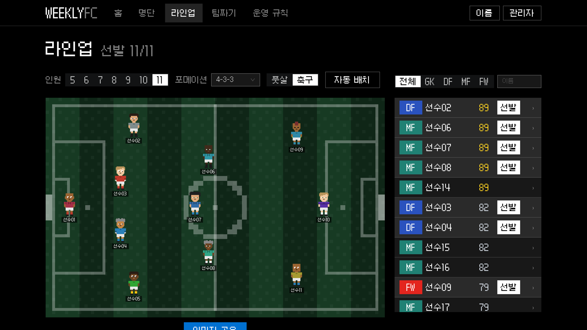
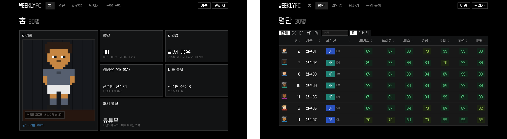

매주 토요일 모이는 풋살 팀의 포털입니다. 명단, 라인업, 팀 나누기, 운영 규칙을 한곳에 모았습니다.

가입과 로그인은 없습니다. 명단에서 자기 이름을 고르면 되고, 관리자는 PIN으로 들어옵니다. 참석 인원은 카카오톡 투표 결과를 붙여 넣으면 읽어 들입니다. 팀 링크가 카톡으로 오가다 보니 카톡 인앱 브라우저에서 잘 열리는 게 중요했습니다.

처음 만든 버전을 두고 내린 결론은 "게임이 아니라 관리자 대시보드 같다"였습니다. 그래서 FM, EA FC, eFootball 같은 축구 게임 화면을 참고해 다시 짰습니다. 선수는 실제 사진을 넣었다가 하루 만에 빼고, 24 × 32 픽셀로 직접 그린 전신 캐릭터로 바꿨습니다.

> 화면 속 선수 이름은 가명으로 바꿔 캡처했습니다.
