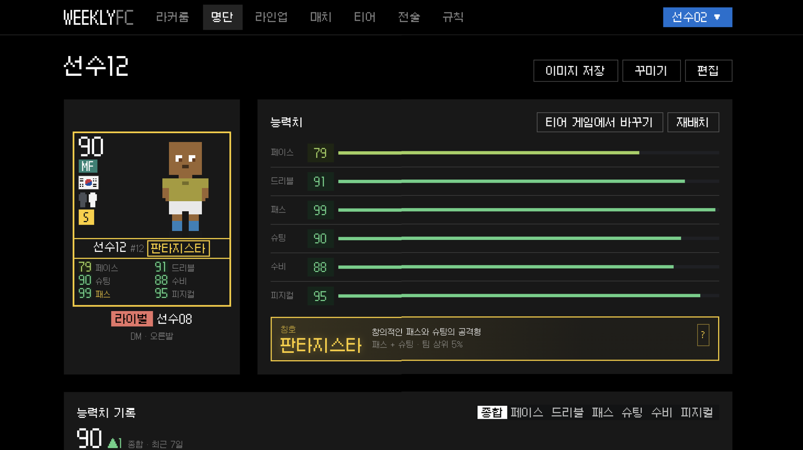
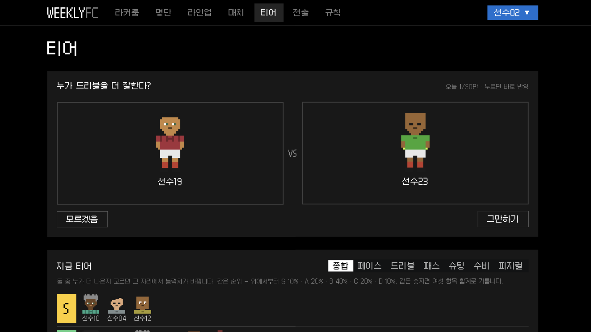
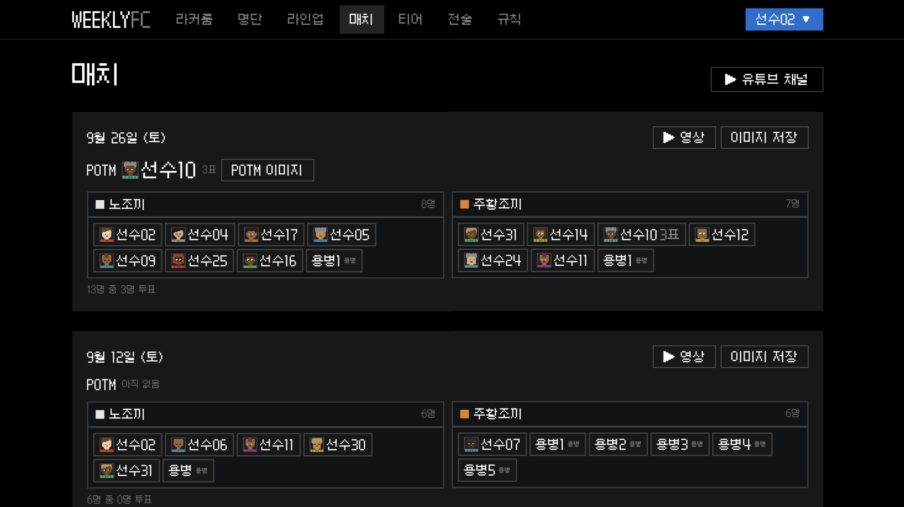

매주 토요일 모이는 풋살 팀의 포털입니다. 명단, 라인업, 매치 기록, 전술, 운영 규칙을 한곳에 모았습니다.

처음 만든 버전을 두고 내린 결론은 "게임이 아니라 관리자 대시보드 같다"였습니다. 그래서 FM, EA FC, eFootball 같은 축구 게임 화면을 참고해 다시 짰습니다. 선수는 실제 사진을 넣었다가 하루 만에 빼고, 24 × 32 픽셀로 직접 그린 전신 캐릭터로 바꿨습니다. 사실 도트 컨셉으로 바꾸고 나서부터 만드는 저도 훨씬 재밌어졌습니다.

능력치는 제가 정하지 않고 팀원들이 정하는데요. 티어 게임에서 "누가 더 빠르다?"처럼 둘 중 한 명을 고르면 그 자리에서 숫자가 옮겨 가고, 순위대로 S부터 D까지 티어가 나뉩니다. 선수 카드는 피파 카드 모양으로 만들었고, 한 능력치가 팀에서 눈에 띄게 높으면 윙어나 골잡이 같은 칭호가 붙습니다.

매치는 하루에 하나씩 남기고, 그날 뛴 사람들끼리 경기 당일에 POTM을 뽑습니다. 1위는 다음 날 능력치가 1씩 올라갑니다. 경기 영상은 유튜브에 올리면 그날 매치에 알아서 걸리게 해 뒀습니다.

반가운 건 팀원들이 실제로 쓰고 있다는 점입니다. 티어 게임을 연 9월 24일부터 6일 동안 361판이 쌓였고, 능력치는 987번 움직였습니다. 처음에 제가 어림으로 넣어 둔 숫자가 일주일도 안 돼서 팀원들 손으로 다시 줄 세워진 셈인데요. 첫날부터 하루 40~90판씩 매일 이어졌고, 경기가 있는 토요일에만 멈췄습니다. 물론 아직은 6명이 대부분을 하고 있고, 그중 한 명이 150판을 했습니다. 몇 사람이 몰아서 하는 구조라 참여를 넓히는 게 다음 숙제인 것 같습니다. 지금은 31명 중 9명이 계정을 붙였습니다.

팀 링크가 거의 카톡으로 오가다 보니 카톡 인앱 브라우저에서 잘 열리는 게 중요했습니다. 로그인은 이메일로 받은 코드 하나로 하고, 명단에서 자기 이름을 골라 계정에 붙이면 됩니다.

> 화면 속 선수 이름은 가명으로 바꿔 캡처했습니다.
