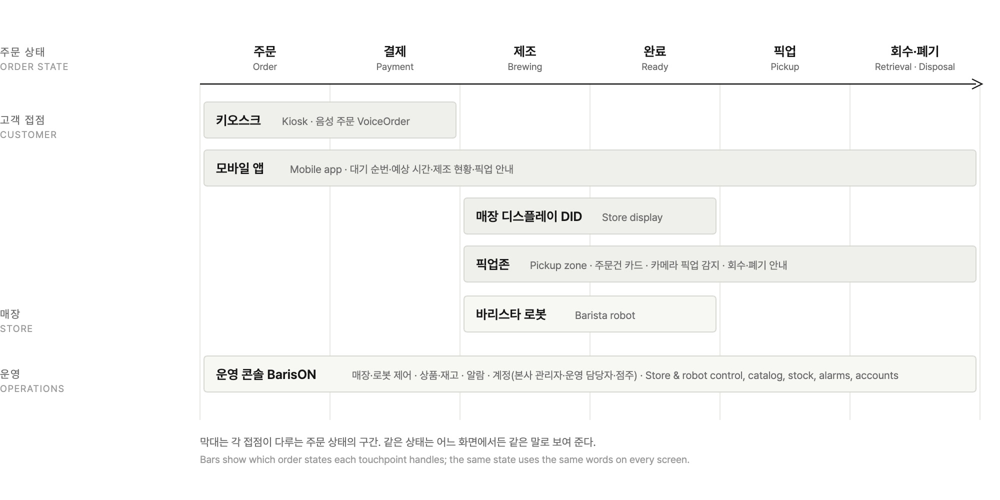
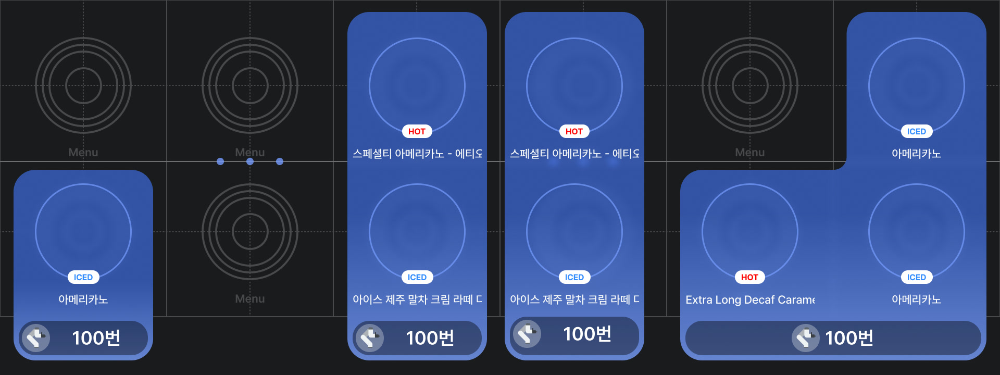

<iframe src="https://www.youtube-nocookie.com/embed/9Q0Kv-1m2nQ?rel=0&modestbranding=1" title="YouTube video" loading="lazy" allow="accelerometer; autoplay; clipboard-write; encrypted-media; gyroscope; picture-in-picture" allowfullscreen></iframe>

## PROBLEM

At Baris Brew, a barista robot café, a single order passes through five screens. Customers order at a kiosk or in the app, follow the brewing status on the store display (DID), and collect their drink at the pickup zone. Operators run the store remotely from the back office, BarisON. Each screen had been built at a different time by a different team, so the same state went by different names and an order never read as one flow.

The problems found on site were concrete. Coupons were hard to find, and the coupon confirmation covered the pay button. When orders queued up, order numbers rotated on screen and customers could not judge their wait. In the back office, screen drafts and development had run ahead of planning, leaving the information architecture and permission model undefined.

 

## APPROACH

I joined in August 2025 to tie the customer channels and the operations console together as one system UX. I worked as one team with two designers, one on the app and one on the web, and my part as planner and UX lead was to keep the flows and policies consistent across the products. We worked from three principles.

**Field first.** I gathered problems from a trade show operations debrief and an interview with the retail operations lead. In the summer of 2026 I ran field observations across stores and mapped usage patterns by store.

**One order, one flow.** I defined the states of an order first, from ordering and payment through brewing, pickup, and retrieval, then aligned the kiosk, app, and displays to show the same state in the same words.

**The document is the source of truth.** Each product got a PRD whose features and policies map one-to-one to the Figma screen pages. When a screen and a rule disagree, the document is fixed first.

Put the order states on one axis and it becomes clear which stretch each of the five touchpoints, the robot, and the operations console covers.

## SOLUTION

The five products were split across the UX team and built together. What follows is the structure and the policies we settled on.

### Kiosk

We organized the flow from the start screen through menu browsing, item detail, order review, and payment. Coupons are applied on the order review screen by scanning a QR code or entering a code, and payment finishes in two screens: choosing a method and following the terminal guidance. To meet the accessibility standard for unattended terminals, the kiosk gained a physical keypad, voice guidance, high contrast, and magnification, and the start screen carries the entry point for voice ordering.

### Mobile app

Customers order before they arrive and see their queue position and expected completion time in the app. The brewing status screen uses one structure for the waiting, brewing, done, and error states, and guides them to pickup when the drink is ready. The [expected wait time](https://www.venturesquare.net/1102926) follows a single rule and is shown the same way on the kiosk and in the app.

### Store display, DID

In a store with no staff, the display does the calling. It splits orders being brewed from orders waiting for pickup, by order number, and announces completion on screen.

<video src="/media/works/barisbrew/did.mp4" autoplay muted loop playsinline></video>

### Pickup zone

The pickup zone shows each order on a display beneath the spot where the cup is placed. It is a tangible interaction: instead of touching a screen, picking up the drink is the input. A camera detects the pickup and clears the card, and exceptions such as retrieval and disposal are worded the same way in the app and on the display. People stand here only for a moment, so the UI elements on that display had to work within that brief dwell time while still conveying exactly which drink it is. That was the UX point I enjoyed most in this project.

### Operations console, BarisON

BarisON is the console from which headquarters runs unmanned stores remotely. We planned store and robot control (power, status, cameras), unified management of the headquarters master catalog and each store's products and stock, an alarm system organized by operational severity, and a three-tier account model for headquarters admins, operations staff, and store owners. We also set common policies such as input form validation and button label conventions.

### Voice ordering, VoiceOrder

With the engineering team, I designed the prompts and conversation flow for LLM-based voice ordering: a prompt defining personality, environment, tone, goals, guardrails, and tools; the wake word ("Baris"); barge-in; and the session-end rules and completion screen. The conversation was validated against twelve scenarios, from a basic order to multi-item commands, small-talk interruptions, and budget-based recommendations, and the TTS voice was chosen by listening to the candidates side by side. The kiosk carries the entry point and distinguishes the listening, thinking, responding, and error states with an animation along the screen edge. It was [first demonstrated](https://www.linkedin.com/posts/xyzcorporation_ai-robotcafe-agenticai-activity-7378711064454205440-h9Wl) at the Seoul AI Robot Show in September 2025, [unveiled at RoboWorld 2025](https://www.mt.co.kr/future/2025/11/03/2025110314103736602) in November, and then went into a store pilot; store noise, microphone pickup, and wake word recognition problems were fixed as the logs revealed them. The clip below, from the Lounge'X 24h store film, runs from the greeting and a menu question through an order, its confirmation, and pickup.

<video src="/media/works/barisbrew/voice.mp4" autoplay muted loop playsinline></video>

## IMPLEMENTATION

**Documents and handoff.** PRDs for the kiosk, app, DID, pickup zone, and BarisON link every feature and policy to its Figma screen and keep a change log. Work goes to development in phases, and I chair the BarisON project meetings to set priorities.

**Validation.** We validated the designs with a store pilot checklist, barrier-free kiosk QA, and analysis of voice order logs. The logs showed people using it like a voice assistant, which we reframed as a UI problem rather than an AI capability problem.

## IMPACT

These are the team's results. The system runs in stores of many kinds, including public cultural spaces, apartment community centers, corporate retreats, and unmanned laundromats, and voice ordering went into a store pilot three months after its first demo.

<iframe src="https://www.youtube-nocookie.com/embed/tAH6xt0qpqk?rel=0&modestbranding=1" title="YouTube video" loading="lazy" allow="accelerometer; autoplay; clipboard-write; encrypted-media; gyroscope; picture-in-picture" allowfullscreen></iframe>

## REFLECTION

**A robot service in live operation has to be designed as a system, not as screens.**

Baris Brew runs in real stores, so feedback from the field went straight back into the design. I came to plan and design at the level of the system rather than a single screen, and every change had to be weighed against its effect on operations. The users had different stakes: administrators, café operators, and café customers. I split the work with two designers, one on the app and one on the web, and learned to lead while moving as one team.

VoiceOrder was one technical issue after another. Store noise, microphone pickup, and wake word recognition only showed their problems once the feature was in operation, and early on we collected logs, monitored, and fixed things often. What was fun was that people treated the feature as entertainment, asking it to speak in dialect. If I did it again, I would cut features. I joined after version 1.0 was largely done, and there were too many features; I would keep the core, then put its usability and stability first.

Robots often stop at development, never reach users, or never make money. This project mattered because there was a robot café in real operation, so I could design the user experience of a robot service directly and get feedback on it. Along the way I grew by taking on the roles of PM, planner, and UX lead.
