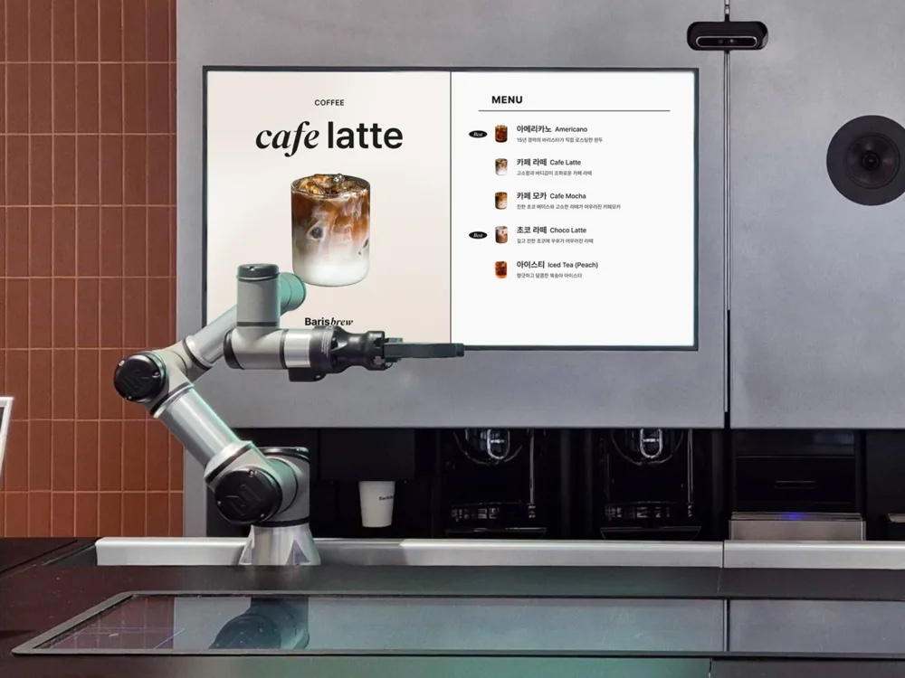
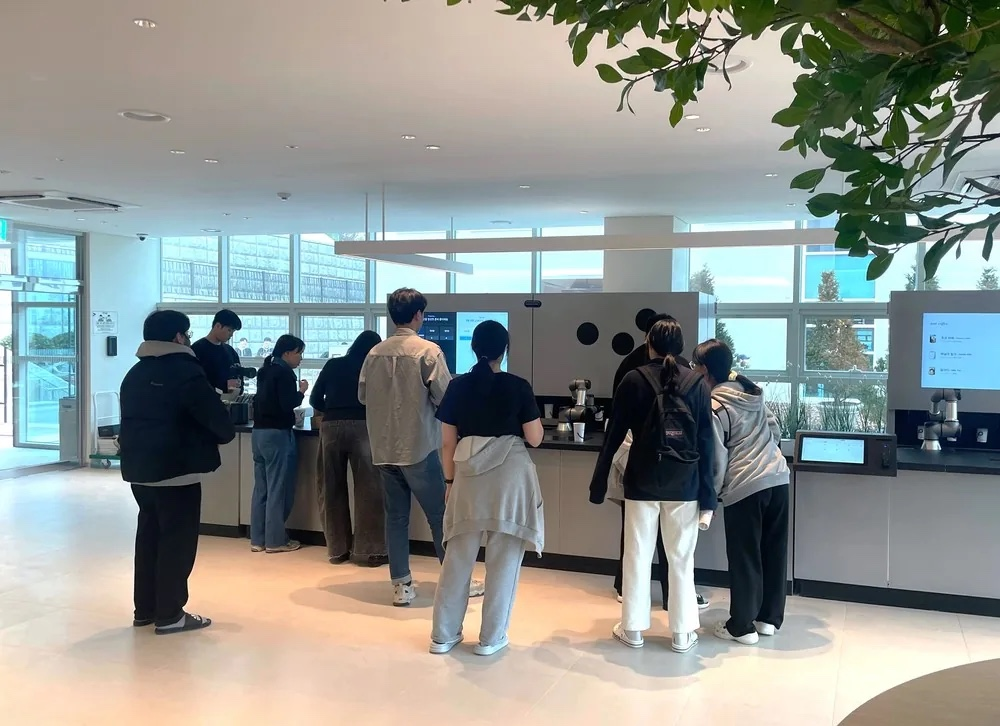
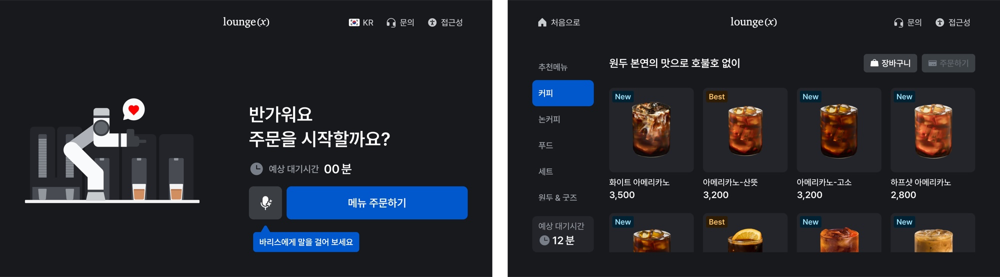
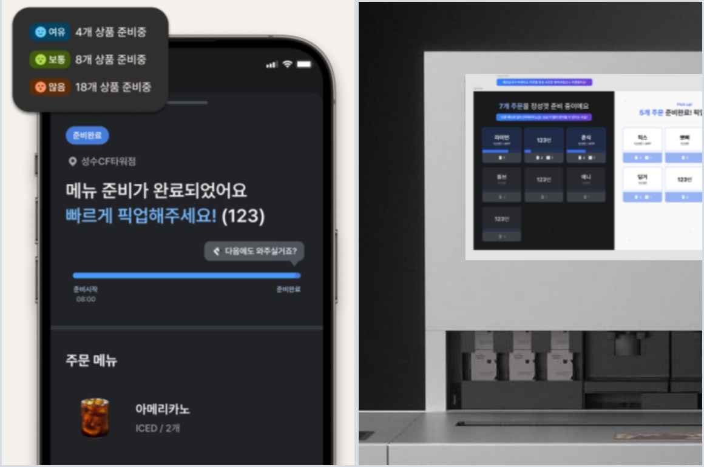
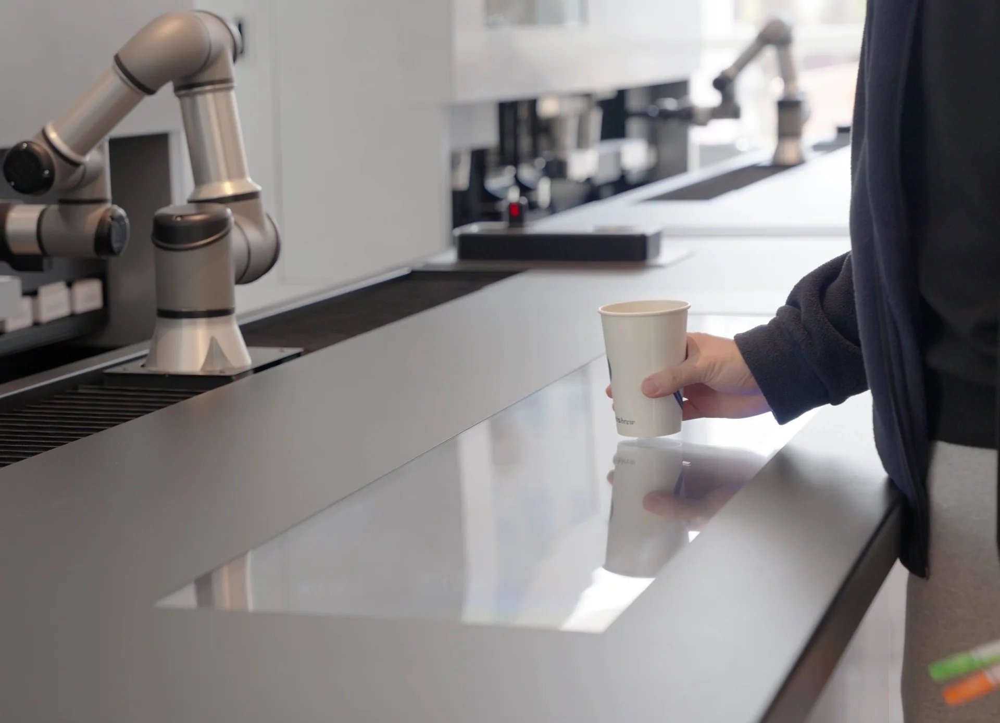
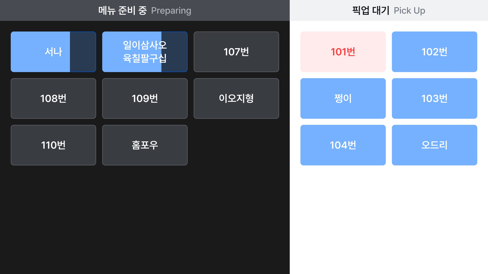
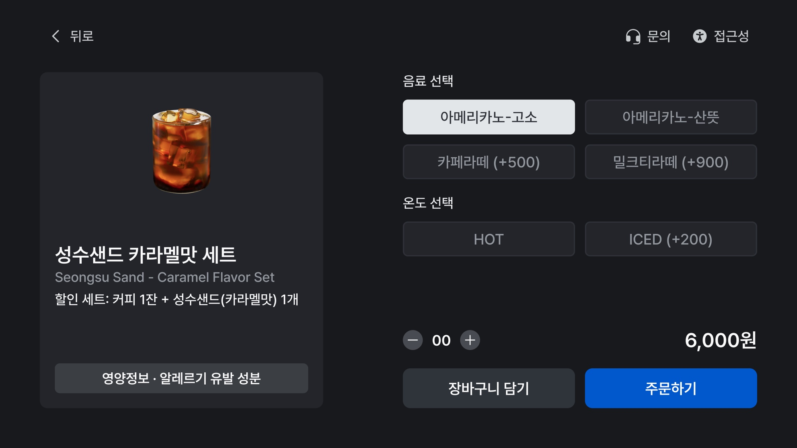

<iframe src="https://www.youtube-nocookie.com/embed/9Q0Kv-1m2nQ?rel=0&modestbranding=1" title="YouTube video" loading="lazy" allow="accelerometer; autoplay; clipboard-write; encrypted-media; gyroscope; picture-in-picture" allowfullscreen></iframe>

## PROBLEM

바리스타 로봇 카페 Baris Brew에서 한 잔의 주문은 다섯 개의 화면을 지납니다. 키오스크나 앱에서 주문하고, 매장 디스플레이(DID)에서 제조 현황을 확인하고, 픽업존에서 음료를 받습니다. 운영자는 백오피스 BarisON에서 매장을 원격으로 관리합니다. 화면마다 만든 시점과 팀이 달라 같은 상태를 다른 말로 불렀고, 주문은 하나의 흐름으로 읽히지 않았습니다.

현장에서 확인한 문제는 구체적이었습니다. 쿠폰을 찾기 어렵고, 쿠폰 적용 안내가 결제 버튼을 가렸습니다. 대기 주문이 많아지면 주문번호가 돌아가며 표시돼 대기 시간을 가늠하기 어려웠습니다. 백오피스는 화면 초안과 개발이 기획보다 앞서 나가, 정보 구조와 권한 체계가 비어 있었습니다.

 

## APPROACH

2025년 8월 합류해 고객 채널과 운영 콘솔을 하나의 시스템 UX로 묶는 일을 맡았습니다. 세 가지를 원칙으로 삼았습니다.

**현장이 먼저.** 박람회 운영 디브리프와 운영 담당자 인터뷰로 문제를 모았습니다. 2026년 여름에는 매장 현장 관찰 리서치를 진행해, 매장별 사용 패턴을 보고서로 정리해 전사에 공유했습니다.

**한 주문, 한 흐름.** 주문·결제·제조·픽업·회수까지 주문의 상태를 먼저 정의하고, 키오스크·앱·디스플레이가 같은 상태를 같은 말로 보여 주도록 맞췄습니다.

**문서가 정본.** 제품마다 PRD를 세우고 기능·정책을 Figma의 화면 페이지와 1:1로 대응시켰습니다. 화면과 규칙이 어긋나면 문서를 먼저 고칩니다.

## SOLUTION

### 키오스크

시작 화면, 메뉴 탐색, 상세, 주문 확인, 결제로 이어지는 흐름을 정리했습니다. 쿠폰은 QR 스캔이나 코드 입력으로 주문 확인 화면에서 바로 적용하고, 결제는 수단 선택과 단말 사용 안내 두 화면으로 끝납니다. 무인단말기 접근성 기준에 맞춰 물리 키패드·음성 안내·고대비·확대를 더했고, 시작 화면에는 음성 주문 진입점을 두었습니다.

### 모바일 앱

매장에 도착하기 전에 주문하고, 대기 순번과 예상 완성 시간을 앱에서 봅니다. 제조 현황은 대기·제조 중·완료·오류 상태를 같은 화면 구조로 보여 주고, 완료되면 픽업을 안내합니다. [예상 대기 시간](https://www.venturesquare.net/1102926)은 기준을 하나로 정해 키오스크와 앱에 같은 방식으로 표시합니다.

### 매장 디스플레이와 픽업존

직원이 없는 매장에서 디스플레이가 호출을 대신합니다. 제조 중인 주문과 픽업 대기 주문을 주문번호 단위로 나눠 보여 주고, 완료되면 화면으로 알립니다. 픽업존은 주문을 주문건 단위 카드로 보여 주고, 카메라로 픽업을 감지해 카드를 정리합니다. 회수·폐기 상황의 문구도 앱과 디스플레이에서 맞췄습니다.

<video src="/media/works/barisbrew/did.mp4" autoplay muted loop playsinline></video>

### 운영 콘솔 BarisON

본사가 무인 매장을 원격으로 운영하는 콘솔입니다. 매장·로봇 제어(전원·상태·카메라), 본사 마스터와 지점 판매 상품·재고의 일원 관리, 운영 관점의 중요도로 정리한 알람 체계, 본사 관리자·운영 담당자·매장 점주의 3단계 계정을 기획했습니다. 입력 폼 검증과 버튼 라벨 표기 기준 같은 공통 정책도 세웠습니다.

### 음성 주문 VoiceOrder

LLM 기반 음성 주문의 프롬프트와 대화 흐름을 설계했습니다. 성격·환경·말투·목표·가드레일·도구를 정의한 프롬프트, 호출어("바리스"), 말 끼어들기, 세션 종료 규칙과 완료 화면까지 다뤘습니다. 기본 주문부터 다중 명령, 잡담 끼어들기, 예산 기반 추천까지 12개 시나리오로 대화를 검증하고, TTS 음성은 후보를 비교 청취해 골랐습니다. 키오스크에는 음성 주문 진입점을 두고, 듣는 중·생각 중·응답·오류 상태를 화면 가장자리 애니메이션으로 구분합니다. 2025년 9월 서울 AI 로봇쇼에서 [첫 데모를 시연](https://www.linkedin.com/posts/xyzcorporation_ai-robotcafe-agenticai-activity-7378711064454205440-h9Wl)하고 11월 [로보월드 2025에서 공개](https://www.mt.co.kr/future/2025/11/03/2025110314103736602)한 뒤 매장 시범 운영에 들어갔고, 로그에서 나온 문제(TTS 소리가 마이크로 되돌아가는 현상 등)는 체크리스트로 관리하며 업데이트했습니다. 아래 장면은 라운지엑스 24h 매장 영상의 시연으로, 인사와 메뉴 질문에서 주문·확인·픽업까지 이어집니다.

<video src="/media/works/barisbrew/voice.mp4" autoplay muted loop playsinline></video>

## IMPLEMENTATION

**문서와 핸드오프.** 키오스크·앱·DID·픽업존·BarisON의 PRD를 세우고, 기능·정책마다 Figma 화면을 연결해 변경 이력을 남깁니다. 단계별 핸드오프로 개발에 넘기고, BarisON 프로젝트 회의를 주최해 우선순위를 조율합니다.

**검증.** 매장 시범 운영 체크리스트, 배리어프리 키오스크 QA, 음성 주문 로그 분석으로 설계를 검증했습니다. 로그에서 음성 비서처럼 쓰는 패턴을 발견해, AI 성능이 아니라 UI 문제로 되짚어 보기도 했습니다.

## IMPACT

- 모바일 앱 업데이트를 신규 매장 오픈 일정에 맞춰 배포했습니다.
- VoiceOrder MVP를 2025년 12월 매장 시범 운영에 적용하고, 호출어 인식과 TTS를 개선한 업데이트를 냈습니다.
- BarisON의 재고·결제 관리 개선을 적용했고, 배리어프리 키오스크 스펙을 확정했습니다.
- 매장 현장 관찰 리서치 결과를 전사에 공유했습니다.
- 설계한 시스템은 공공문화공간, 아파트 커뮤니티, 휴양시설, 무인 빨래방 등 여러 유형의 매장에서 운영 중입니다.

<iframe src="https://www.youtube-nocookie.com/embed/tAH6xt0qpqk?rel=0&modestbranding=1" title="YouTube video" loading="lazy" allow="accelerometer; autoplay; clipboard-write; encrypted-media; gyroscope; picture-in-picture" allowfullscreen></iframe>

