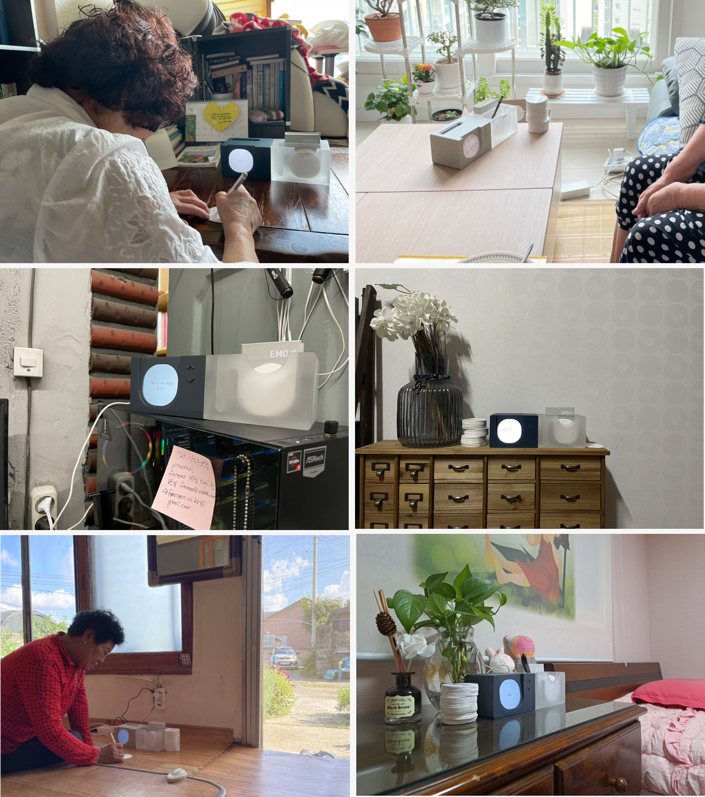
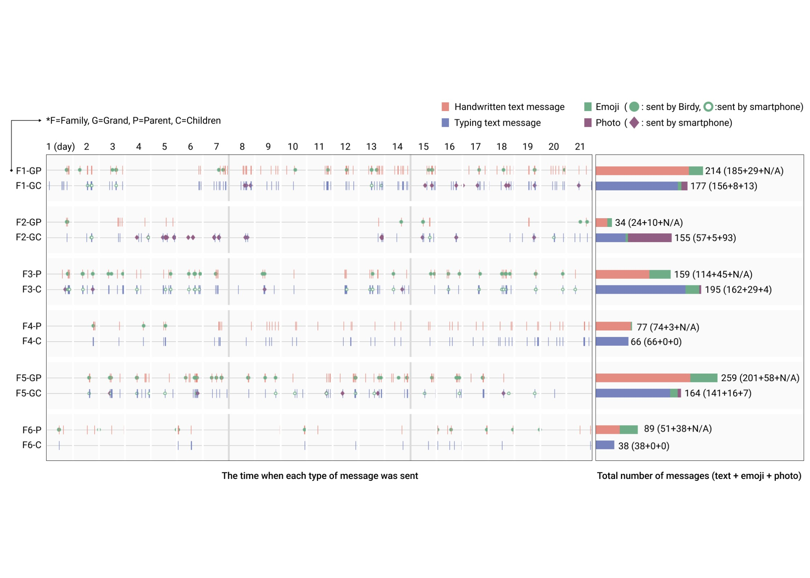
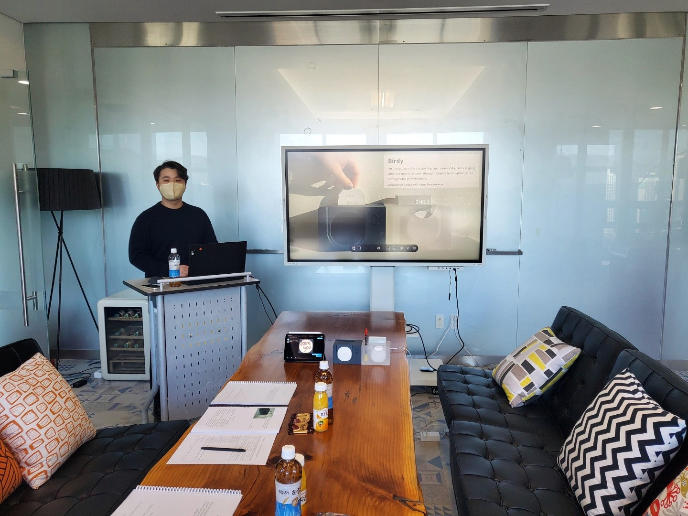

## PROBLEM

Digital messengers have become an everyday way to stay in touch. For people who are not used to digital environments, though, that convenience turns into an obstacle.

Older adults, low-income households, and people with disabilities — those left on the far side of the digital divide — have a hard time with messengers because of complex UI layouts, small buttons, and multi-level menu navigation. As a result, contact with family and society is cut off, or access to essential information is limited.

## APPROACH

To make messaging services easier for users with low digital literacy, the project team designed Birdy, a dedicated device separate from the smartphone. Birdy is a physical medium shaped around the range of traits and needs its users have, and it aimed to give everyone an environment where communication feels intuitive. Development went through the following steps.

1. **User research**: To understand the difficulties of users with low digital literacy, we ran a literature review, task analysis, and user interviews. From these we identified the main obstacles and user needs.
1. **Product design and prototyping**: Building on the research, we worked out a design that brought together analog elements and physical interaction, and visualized the early concept so that it reflected what users actually needed.
1. **Prototype build and testing**: We built three working mockups and ran a three-week field test with six family pairs to evaluate the experience in a real setting.
1. **Quantitative and qualitative analysis**: Using the qualitative and quantitative data the study collected, we analyzed user behavior and experience, assessed what Birdy changed, and drew out insights.

 

  

<iframe src="https://www.youtube-nocookie.com/embed/YvDX9E_5jvk?rel=0&modestbranding=1" title="YouTube video" loading="lazy" allow="accelerometer; autoplay; clipboard-write; encrypted-media; gyroscope; picture-in-picture" allowfullscreen></iframe>

### BIRDY : A handwriting-based digital messaging device

Birdy is a desktop messaging device designed so that older users can approach it naturally. It works from handwritten input on paper with a pen, turning digital communication across generations into something more intuitive and familiar.

**An intuitive interface that lowers cognitive load :** Display size, button layout, and the LED feedback system were tuned around how older adults take in information. A message-only display keeps information from piling up, and diffused LED light through the translucent acrylic body shows when a message has arrived or been sent.

**Handwriting turned digital without losing the analog feel :** A user writes a message by hand on a 66mm paper card, then sends it through Birdy, which converts it to digital. The texture and character of the handwriting are preserved alongside the convenience of digital messaging, and 20 emoji cards come with the device to make feelings easier to express.

**Simple controls, natural use :** Birdy uses physical buttons for navigation and a simple interface, so anyone can operate it. Received messages appear large on the display, and LED feedback makes the current state easy to read, so users accustomed to analog tools adapt quickly.

  

 

## IMPLEMENTATION

Birdy was built by integrating three areas — hardware, software, and product design.

**Hardware and physical interaction** : Birdy is made up of a display, a scanner, a microcontroller, LED lighting, an IR sensor, a micro linear motor, and a wide-angle camera. The user sends a message by inserting a paper card into the 66mm round-cornered slot, and browses the conversation history with physical buttons. The integrated storage box, made of translucent acrylic, holds paper, pen, and the emoji book, and works with the LED lighting to give visual feedback in a range of colors. The IR sensor and linear motor detect an inserted card and align it automatically, and the wide-angle camera with a ring LED captures a clear image even in a narrow, dark space.

**Software and digital conversion** : Birdy's software is built from modules covering message sending and receiving, image processing, and display control. Messages travel through the Telegram API, and scanned images are post-processed with OpenCV. Google Teachable Machine recognizes handwriting and emoji and converts them into digital text, which is then shown on the display in an optimized form.

**Product design and mockup fabrication** : Each part was modeled in Autodesk Fusion 360, and the final structure came out of repeated prototyping. The main parts were 3D printed, and the exterior was CNC machined for a high-quality finish. The whole design is modular, for easier maintenance and more efficient fabrication.

## IMPACT

Through handwriting and paper-based interaction, Birdy noticeably increased how much older adults took part in digital communication.

**About a threefold increase in digital communication :** Over the three-week test, the older adults among the six family pairs exchanged an average of 21.5 messages a week — about three times as often as before Birdy. In the F1-GP case, one or two phone calls a week grew into 35 messages a week, and daily contact settled into a habit.

**Asynchronous messaging widened what they talked about :** Asynchronous messaging removed the constraints of time and place, and conversation moved from simple greetings to everyday stories, health, and family news. In the F3-P case, exchanges went from "Have you eaten?" to a grandchild's exam results and hobbies.

**Handwritten messages carried more expression :** Handwriting worked well for conveying emotion and nuance. 70% of participants said handwriting helped them express feelings, and F2-GP added flower drawings and changes in letter size to say more.

**Paper strengthened emotional connection :** Paper messages lowered the psychological barrier to a digital communication environment and gave users a familiar experience. 83% of participants kept their paper messages, and F5-GP held on to a grandchild's notes in a drawer, keeping the bond going.

**A possible new model for communication :** Working through paper and physical interaction, Birdy proposed a way of communicating that is more intuitive and familiar than existing smartphone messengers. For older adults unused to digital environments, it offered a way in with a lower barrier.

## REFLECTION

**Can a hardware product be more than a device — a tool that connects feelings?**

Birdy was the first time I went through every stage of getting a hardware product into a user's hands. From product design to prototyping, user training, and feedback collection, the challenge was securing the stability of an IoT device and the user experience at the same time. Through repeated prototype tests and firmware tuning, I came to understand just how much the integration of hardware and software matters.

The moment that stayed with me was the result of the three-week test: older users sent three times as many messages per week on average. Handwriting and asynchronous messaging made conversations richer, and 70% of participants said they could express emotion better.

Going through the full design process taught me why user-centered design matters and how to look for a balance between technology and feeling. Birdy was the first project that made me think about what it means to design a solution to a social problem with technology.
