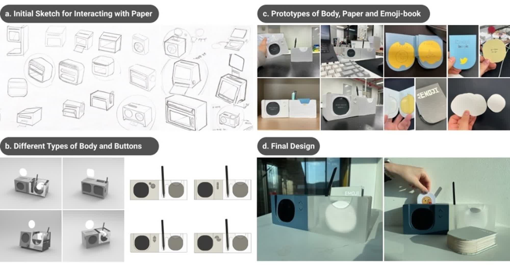
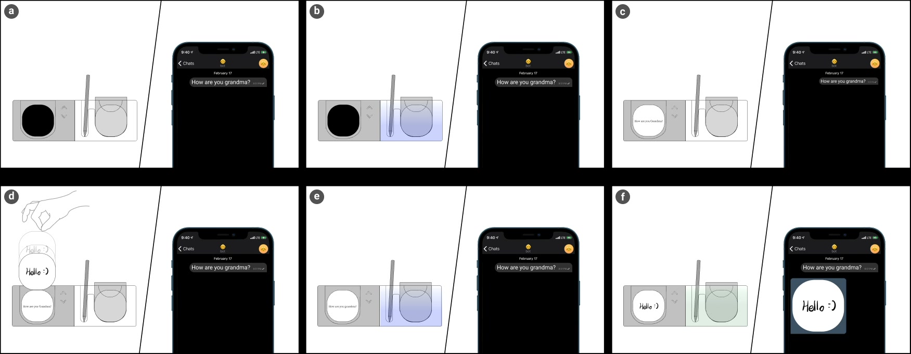
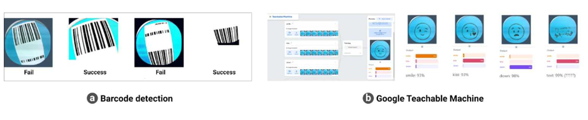

## PROBLEM

노년층을 비롯해 디지털 리터러시가 낮은 사용자는 복잡한 UI, 작은 버튼, 여러 단계의 메뉴 탐색 때문에 메신저를 쓰기 어렵습니다. 그래서 가족·사회와의 소통이 끊기거나 꼭 필요한 정보에 닿지 못합니다.

## APPROACH

스마트폰 대신 쓰는 전용 디바이스 Birdy를 설계했습니다. 리드 연구원으로서 보조 연구원 둘과 함께 다음 과정을 밟았습니다.

1. **유저 리서치:** 문헌 리뷰, 과업 분석, 사용자 인터뷰로 디지털 리터러시가 낮은 사용자가 겪는 장애물과 요구를 도출했습니다.
1. **제품 디자인:** 리서치 결과를 바탕으로 아날로그 요소와 물리적 인터랙션을 결합한 디자인을 구체화하고 초기 컨셉을 시각화했습니다.
1. **프로토타입 제작 및 테스트:** 워킹 목업 3대를 만들고, 6쌍의 가족 사용자와 3주간 필드 테스트를 진행했습니다.
1. **데이터 분석:** 수집한 정성·정량 데이터로 사용자의 행동과 경험을 분석해 Birdy의 효과를 평가했습니다.

세 가지 형태를 놓고 시작했습니다. 스탠드형은 부모 세대가 어릴 때 쓰던 우편함에 가까운 경험을 줄 수 있었지만 집에서 매일 쓰기 불편해 접었습니다. 벽걸이형은 화면을 크게 쓸 수 있는 대신 메시지를 쓸 자리가 없어 접었습니다. 남은 것이 탁상형입니다. 종이와 펜과 같은 자리를 나눠 쓰고, 옮기기도 쉬웠습니다.

메시지를 보여 주는 방법으로는 감열 프린터도 검토했습니다. 종이로 받는 쪽이 아날로그 경험에 더 가까웠지만 디스플레이를 골랐습니다. 짧은 메시지가 빠르게 오가는 대화에서는 순서와 맥락을 훑기에 화면이 낫고, 용지를 갈아 끼우는 일이 노년층에게 또 하나의 장벽이 될 수 있었기 때문입니다.

종이 자체도 고민거리였습니다. 둥근 종이는 기기에 넣기 쉽지만 쓸 자리가 좁고, 각진 종이는 그 반대였습니다. 그래서 모서리만 둥근 사각형으로 정하고, 크기는 포스트잇보다 조금 작은 66mm로 잡아 메시지가 저절로 짧아지게 했습니다.

## SOLUTION

  

  

<iframe src="https://www.youtube-nocookie.com/embed/YvDX9E_5jvk?rel=0&modestbranding=1" title="Birdy 사용 시나리오를 담은 영상" loading="lazy" allow="accelerometer; autoplay; clipboard-write; encrypted-media; gyroscope; picture-in-picture" allowfullscreen></iframe>

Birdy는 노년층을 위한 탁상형 메시징 디바이스입니다. 종이와 펜으로 쓴 손글씨가 입력이 되고, 그 손글씨가 그대로 가족에게 갑니다. 설계의 축은 셋이었습니다.

**화면은 메시지 하나에만 씁니다.** 노년층의 인지 특성에 맞춰 디스플레이 크기와 버튼 배치를 정했고, 정보가 쌓이지 않도록 메시지 전용 디스플레이를 두었습니다. 수신·발송 상태는 반투명 아크릴 본체를 통해 퍼지는 LED 빛으로 알립니다.

**손글씨는 그대로 남깁니다.** 66mm 종이 카드에 쓴 메시지를 Birdy가 디지털로 바꿔 보내되, 글씨의 질감과 개성은 그대로 전합니다. 함께 주는 20종의 이모지 카드로 감정을 붙입니다.

**조작은 버튼 몇 개로 끝납니다.** 탐색용 물리 버튼과 단순한 인터페이스로 조작 단계를 줄였고, 받은 메시지는 화면에 크게 뜹니다.

## IMPLEMENTATION

하드웨어, 소프트웨어, 제품 디자인 세 갈래로 개발했습니다. 두 보드로 역할을 나눴는데요. 아두이노 나노는 IR 센서·리니어 스텝 모터·링 LED와 이전·다음 버튼을, 라즈베리파이는 카메라·디스플레이·텔레그램을 맡습니다. 카드가 들어오면 링 LED를 단 광각 카메라가 좁고 어두운 내부에서 카드를 찍고, 라즈베리파이가 밝기와 선명도를 올린 뒤 카드 모양의 둥근 사각 마스크를 씌워 텔레그램으로 보냅니다. 답장은 별도 흐름이 텔레그램을 계속 확인하다가 받아서, 글자는 이미지로 바꿔 화면에 띄웁니다.

이모지 카드는 처음엔 바코드로 구분하려 했지만, 광각 카메라의 왜곡 때문에 잘 읽히지 않았습니다. 그래서 Google Teachable Machine으로 이모지 카드 20종을 학습시키고, 90% 넘게 확신할 때만 이모지로 보고 텔레그램 스티커로 보냈습니다. 손글씨는 글자로 인식하지 않고 사진 그대로 보냅니다.

상태는 빛으로 나눴습니다. 새 메시지가 오면 파란빛이 깜빡이고, 보내는 동안에는 파란빛이 숨 쉬듯 밝아졌다 어두워지며, 전송이 끝나면 초록빛으로 바뀝니다. 목록 끝에서 더 넘기면 화면에 '첫 메시지입니다', '마지막 메시지입니다'가 잠깐 뜹니다.

## PROTOTYPING

 

 

초기 목업은 폼보드로 만들었습니다. 그 뒤로 부품을 Fusion 360으로 모델링해 3D 프린팅으로 뽑고, 외관은 CNC로 깎았습니다. 필드 테스트에는 색만 다른 워킹 목업 3대를 썼습니다.

카메라 화각의 중심과 카드의 중심이 정확히 맞아야 해서 모든 구조를 볼트와 너트로 조립했습니다. 카드는 두껍고 무게감 있는 종이로 골랐고, 투입구는 비스듬히 기울이고 색을 넣어 넣을 자리가 바로 보이게 했습니다. 본체는 전자 부품이 든 쪽과 종이·펜·이모지 북을 담는 쪽이 반씩 차지합니다. 새 기기를 낯설어할 노년층을 생각해 정한 비율입니다.

코드는 Meemo 레포에서 시작했습니다. 2021년 2월부터 7월까지 날짜를 붙여 저장한 버전이 37개 남아 있습니다.

## IMPACT

  

  

3주 필드 테스트에서 노년층 참가자의 메시지 사용량과 대화 주제가 달라졌습니다.

**소통 빈도 약 3배.** 6쌍의 가족 중 노년층은 주당 평균 21.5개의 메시지를 주고받아, Birdy 이전보다 약 3배 늘었습니다. 한 조부모는 주 1~2회 전화에서 주당 35개 메시지로 바뀌었습니다.

**넓어진 대화 주제.** 시간과 장소의 제약이 사라지자, 안부에 머물던 대화가 일상과 건강, 가족 소식으로 넓어졌습니다. "밥 먹었니?"가 손자의 시험 결과와 취미 이야기로 옮겨 갔습니다.

**손글씨와 종이가 담은 것.** 참가자의 70%가 손글씨가 감정 표현에 도움이 됐다고 답했고, 꽃을 그리거나 글씨 크기를 바꿔 마음을 전한 참가자도 있었습니다. 83%는 받은 종이 메시지를 보관하고 있었습니다. 손자의 메시지를 서랍에 간직한 조부모도 있었습니다.

## REFLECTION

**하드웨어 제품이 단순한 기기가 아니라 감성을 잇는 도구가 될 수 있을까?**

Birdy는 하드웨어 제품이 사용자에게 닿기까지의 모든 단계를 처음 경험한 프로젝트였습니다. 설계와 프로토타이핑, 사용자 교육, 피드백 수집까지, IoT 기기의 안정성과 사용자 경험을 동시에 확보해야 했습니다. 프로토타입 테스트와 펌웨어 최적화를 거듭하며 하드웨어와 소프트웨어를 함께 설계하는 일의 중요성을 확인했습니다. 기술로 사회적 문제를 푸는 디자인이 무엇인지 처음으로 고민하게 된 프로젝트이기도 합니다.
