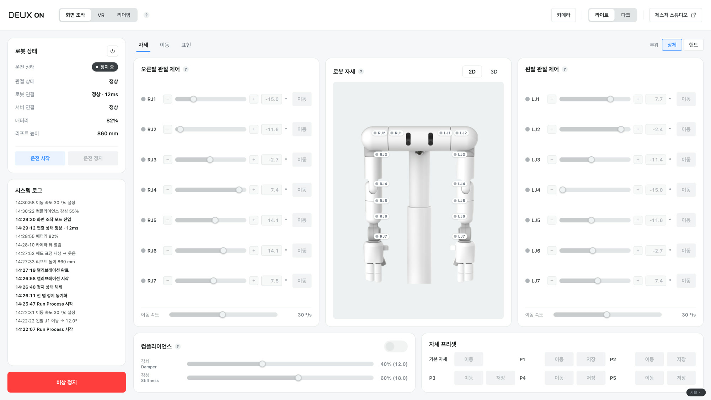
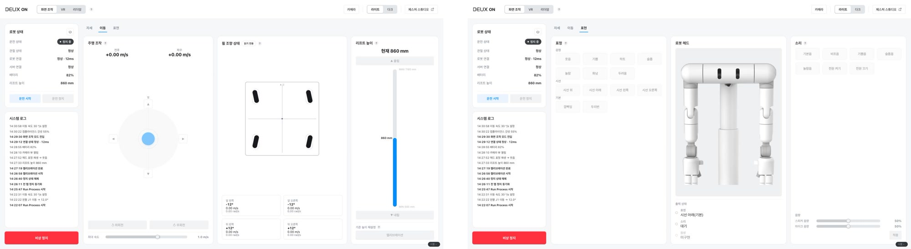

<iframe src="https://www.youtube-nocookie.com/embed/tqhQTiX0NPw?rel=0&modestbranding=1" title="The DEUX product film" loading="lazy" allow="accelerometer; autoplay; clipboard-write; encrypted-media; gyroscope; picture-in-picture" allowfullscreen></iframe>

## PROBLEM

DEUX is a dual-arm humanoid that works next to people in stores. It has no human face. The two cameras between its arms are its eyes and its expression display. With only those two eyes, sound, and a voice it has to convey what it is looking at and what it is about to do, so that people give it room and talk to it. At the start, nobody had decided which faces and sounds it needed, or in what units they would be defined and loaded onto the robot.

There was a problem on the operating side too. The screen that controls the fourteen arm joints, the hands, the drive base, and the lift was a developer tool built by engineering, with no document defining it; the code was the only source of truth. It had to become a product screen that on-site operators and remote pilots could use as well.

## APPROACH

**Vocabulary first.** I split the channels into face, sound, voice, and gesture, and defined each channel's vocabulary in one database. Each row holds the name engineering calls as a trigger, when it is used, and which file it is. The principle was single: emotion and intent are carried by the eyes and the voice, and sound is reserved for system and state signals that are awkward to say in words.

**DEUX ON, from document to code.** I wrote the PRD that would serve as the screen's baseline, laid out the screen as an HTML prototype, then ported it to React and built it myself. The control team owns the backend; the UX part manages the front-end repository. I used AI coding tools for the implementation.

The Robot Design team shaped the robot, the Robot Intelligence team put the faces on the robot and prepared the demos, and the Robot Automation team owned control and the backend. My part, in between, was defining the interaction and the operations screen.

## SOLUTION

### Faces

Every face is made from the position, size, motion, and color of two eyes alone. I defined twenty: emotions such as happiness, laughing, heart, sparkle, surprise, fear, sadness, and anger; four gaze directions for following a person; blinking and looking around; and state faces for booting, loading, sleep, charging, and error. Booting was designed as one sequence of eye motion, sound, and movement.

<video src="/media/works/deux/faces.mp4" aria-label="DEUX's eight emotion faces and its blink, playing together in a 3x3 grid" autoplay muted loop playsinline></video>

### Sound and voice

Sound is kept to short cues at moments of transition, such as power on, power off, and alerts; the eyes carry the emotion. For demos I made a mapping table so that one button plays a face and its sound in sequence. We went as far as a standard for six system earcons built from one timbre family, then stopped short of producing them; what is on the device today is the set of representative sounds made for demos. The standard stays on file for when that work resumes. The rule that emotion is never made into sound also has one exception: three emotion sounds, joy, sadness, and surprise, are in use for filming and demos, to be revisited once the conversational voice runs in earnest. The voice was chosen by listening to candidates read the same lines, and I wrote a persona brief for a bright, curious tone that sets it apart from Barisbrew's calm one. Each demo line got a matching face.

### DEUX ON

DEUX ON is the operations console that handles the robot's posture, movement, and expression on one screen. Its users are the engineers bringing the robot up, on-site operators, and remote pilots. Run state, connections, battery, lift height, the system log, and the emergency stop stay visible on the left, and three control modes are chosen at the top: on-screen, VR, and leader arm. The posture tab moves the fourteen arm joints and the hands with sliders, holds compliance settings and pose presets, and shows the robot's pose in 2D and 3D. The drive tab covers the joystick, wheel steering, and lift height; the expression tab covers faces, sounds, and volume.

A few rules were set in moving it from a developer tool to a product screen. While VR or the leader arm has the robot, on-screen control is locked, but stop and mode switching stay open at all times: this screen must never lose its way to stop the robot. The lock is announced by the robot status badge in the left panel, and the button that clears it sits there too. An in-body notice banner was tried twice and removed twice, because every time a lock engaged it pushed the tabs and the whole screen down. Color carries safety meaning: red is reserved for the emergency stop alone, faults and input errors are orange, normal is green. The developer screen's own color coding was deliberately not followed. Start and stop apply to the whole robot, not to the tab in view.

## IMPLEMENTATION

**Handoff and application.** The twenty faces were produced as GIF and MP4 and handed over together with the vocabulary database; the robot's display plays them as MP4. The Robot Intelligence team wired the face-and-sound mapping and the demo voice lines to controller buttons.

**Building DEUX ON.** It is written in React and TypeScript, and the 3D pose view renders the robot's URDF model with three.js. It deploys to the robot's isolated on-site network without internet, with the backend address set in a single config file. The PRD's change log is the screen's history, and the repository keeps a session-by-session record of changes.

## IMPACT

In the July 2026 product film and the August Robot Building Solution demos and press interviews, DEUX greeted people with these faces, sounds, and voice. The control screen that began as a developer tool is now a product screen managed by the UX part. Where code had been the only definition there is now a document baseline, and with it a working arrangement where the UX part commits to the front-end repository and takes review.
