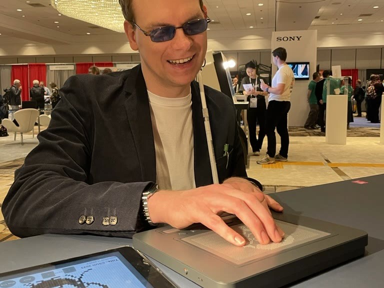

## PROBLEM

시각장애 학생은 그래픽 정보를 눈으로 확인할 수 없어, 점자 교과서의 촉각 그래픽이나 별도의 촉각 교구로 학습합니다. 그러나 지금의 교육 환경에서는 이런 촉각 자료가 부족합니다.

점자 교과서의 촉각 그래픽은 제작과 관리가 어렵고, 원본 교과서의 그래픽을 모두 담지 못해 일부만 제공되는 경우가 많습니다. 촉각 교구는 대부분 교사가 직접 만들어야 해 시간과 비용이 많이 들고, 내구성 문제로 유지 관리도 어렵습니다.

이 제약은 시각장애 학생의 학습 기회를 제한하고 교사에게도 부담이 됩니다. 촉각 자료를 만드는 다른 방법이 필요합니다.

  

## APPROACH

닷패드와 연동되는 저작 도구 '닷 캔버스'의 UX를 맡았습니다. 닷 캔버스는 웹과 모바일 앱 기반의 플랫폼으로, 비전문가도 촉각 그래픽을 만들고 공유할 수 있도록 설계했습니다.

웹 플랫폼에서는 촉각 그래픽을 만들고 클라우드에 저장·공유할 수 있습니다. 모바일 앱은 아이패드의 터치 조작과 애플 펜슬을 활용합니다. 보이스 오버와 라이브 드로잉을 지원해 시각장애인 사용자도 촉각 그래픽을 직접 만들 수 있습니다.

닷 캔버스는 이런 기능으로 촉각 자료 제작의 진입 장벽을 낮추고, 지속 가능한 촉각 교육 환경을 만드는 것을 목표로 했습니다.

<iframe src="https://www.youtube-nocookie.com/embed/N_L3hR81nik?rel=0&modestbranding=1" title="YouTube video" loading="lazy" allow="accelerometer; autoplay; clipboard-write; encrypted-media; gyroscope; picture-in-picture" allowfullscreen></iframe>

## SOLUTION

### Web

**웹 기반 촉각 그래픽 제작 도구:** 비전문가도 촉각 그래픽을 만들 수 있는 웹 최적화 도구입니다. 편집 기능과 함께 PDF·이미지 삽입 등의 제작 옵션을 제공합니다.

**클라우드 저장 및 공유:** 닷 클라우드에 촉각 그래픽을 저장해 언제 어디서나 접근하고, 공용 드라이브로 서로 만든 콘텐츠를 공유합니다.

**다수의 닷패드와 실시간 출력:** 최대 10대의 닷패드에 같은 콘텐츠를 동시에 출력해, 미리 만든 촉각 그래픽을 여러 사용자가 함께 만지며 이야기할 수 있습니다.

### App

**터치와 애플 펜슬로 제작:** 아이패드에 최적화한 촉각 그래픽 제작 도구입니다. 터치 조작과 애플 펜슬로 그래픽을 그리고, 만든 파일은 닷 클라우드로 웹과 공유합니다.

**시각장애인을 위한 접근성 기능:** 애플의 보이스 오버와 라이브 드로잉을 지원해, 시각장애인도 직접 촉각 그래픽을 만들고 그린 그림을 만져볼 수 있습니다.

## IMPLEMENTATION

**Figma를 활용한 화면 설계 및 GUI 디자인:** 사용자 리서치 결과를 바탕으로 닷 캔버스 웹과 앱의 화면 설계와 GUI 디자인을 진행했습니다. UI 구조를 정리하고 기능을 배치해 교사와 시각장애 학생이 함께 쓰는 인터페이스를 만들었습니다.

**여러 방법론을 활용한 사용자 연구:** 국내에서는 특수학교 교사와 시각장애 학생을 대상으로 필드 스터디를, 해외 사용자는 설문과 다이어리 스터디를 진행해 사용 환경과 페인포인트를 조사했습니다. 수집한 데이터는 초기 캔버스 버전의 문제점을 파악하고 개선 방향을 세우는 근거가 됐습니다.

**개발자 협업 및 문서화:** 화면 설계서와 기능 명세서를 문서화하고 JIRA로 프로젝트 이슈를 관리했습니다. 개발팀과 소통하며 기술적 변경사항을 반영하고 기능 개선과 출시 일정을 맞췄습니다.

 

 

## IMPACT

<iframe src="https://www.youtube-nocookie.com/embed/AHK3VnjvA5Y?rel=0&modestbranding=1" title="YouTube video" loading="lazy" allow="accelerometer; autoplay; clipboard-write; encrypted-media; gyroscope; picture-in-picture" allowfullscreen></iframe>

닷 캔버스로 CES 2024 Innovation Award를 수상하고, CSUN 2024에 출품했습니다.

 

## REFLECTION

**빠른 실행과 장기적 완성도의 균형을 고민하다**

닷 캔버스는 짧은 기간 안에 웹과 앱의 데모 버전을 내야 하는 프로젝트였습니다. 팀에 관련 경험이 있는 인력이 부족한 상황에서 3개월 안에 쓸 수 있는 결과물을 만들어야 했고, 팀원들과 빠르게 프로토타입을 만들며 실행 중심으로 진행했습니다. 이 과정에서 UX 설계뿐 아니라 개발팀과의 협업, 일정 관리 같은 실무를 함께 다뤘습니다.

빠른 실행의 한계도 분명했습니다. 단기 목표는 달성했지만 확장성을 고려하지 못한 설계 탓에 이후 유지보수에서 수정이 많았고, 완성도가 부족한 부분도 있었습니다. 사용자 스터디로 직접 피드백을 받으며 속도와 완성도 사이에서 균형을 맞추는 일이 UX 설계에서 얼마나 중요한지 확인했습니다.
