## PROBLEM

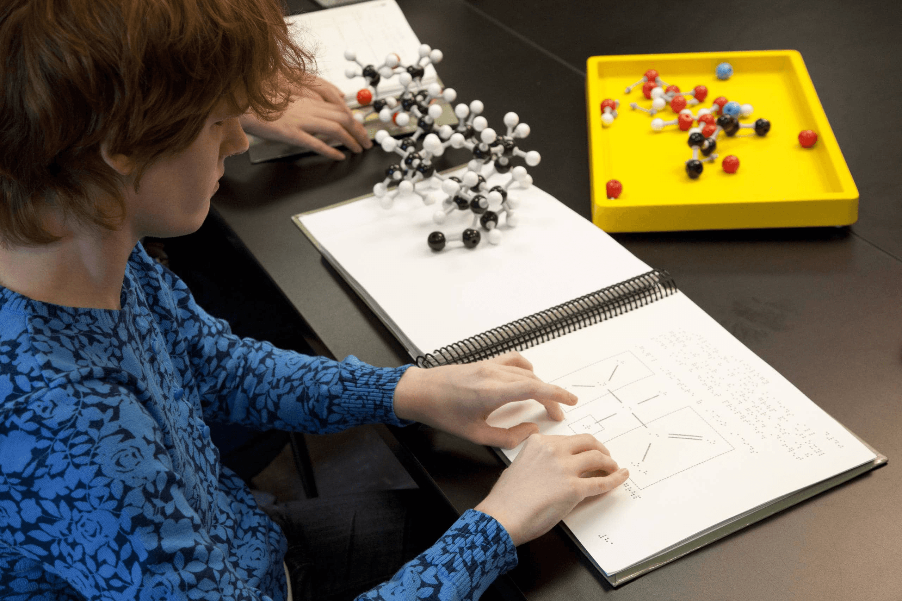

시각장애 학생들은 그래픽 정보를 직접 시각적으로 인지할 수 없어, 점자 교과서의 촉각 그래픽이나 별도의 촉각 교구를 활용하여 학습합니다. 그러나 현재 교육 환경에서는 이러한 촉각 자료가 절대적으로 부족한 상황입니다.

점자 교과서의 촉각 그래픽은 제작과 관리가 어렵고, 원본 교과서의 모든 그래픽을 포괄하지 못해 일부만 제공되는 경우가 많습니다. 촉각 교구의 경우, 대부분 교사가 직접 제작해야 하며, 이 과정은 시간과 비용이 과다하게 소요되고 내구성 문제로 인해 지속적인 유지 관리도 어렵습니다.

이러한 제약은 시각장애 학생들의 학습 기회를 심각하게 제한하고 있으며, 교사들에게도 큰 부담을 안기고 있습니다. 이에 효율적이고 접근성 높은 촉각 자료 제작 방안이 필요합니다.

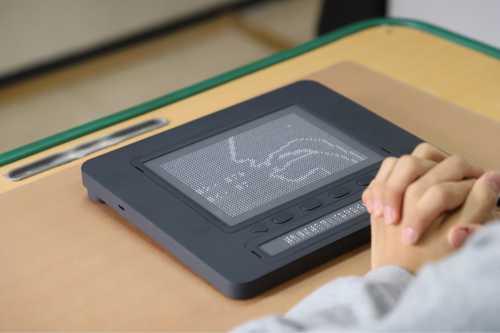

## APPROACH

이러한 문제를 해결하기 위해, Dot Inc.는 자사의 촉각 디스플레이 제품인 닷패드(Dot Pad)와 연동 가능한 저작 도구 ’닷 캔버스(Dot Canvas)’를 개발했습니다. 닷 캔버스는 웹과 모바일 앱 기반의 플랫폼으로, 비전문가도 쉽게 촉각 그래픽을 제작하고 공유할 수 있도록 설계되었습니다.

웹 플랫폼에서는 누구나 직관적으로 촉각 그래픽을 생성하고, 클라우드를 통해 자료를 저장 및 공유할 수 있습니다. 모바일 앱은 아이패드의 터치 조작과 애플 펜슬을 활용하여 더욱 직관적인 제작 경험을 제공합니다. 또한, 보이스 오버와 라이브 드로잉 기능을 지원해, 시각장애인 사용자 역시 촉각 그래픽을 직접 제작할 수 있는 접근성을 확보했습니다.

닷 캔버스는 이와 같은 기능을 통해 촉각 자료 제작의 진입 장벽을 낮추고, 보다 지속 가능하고 포괄적인 촉각 교육 환경을 구축하는 것을 목표로 합니다.

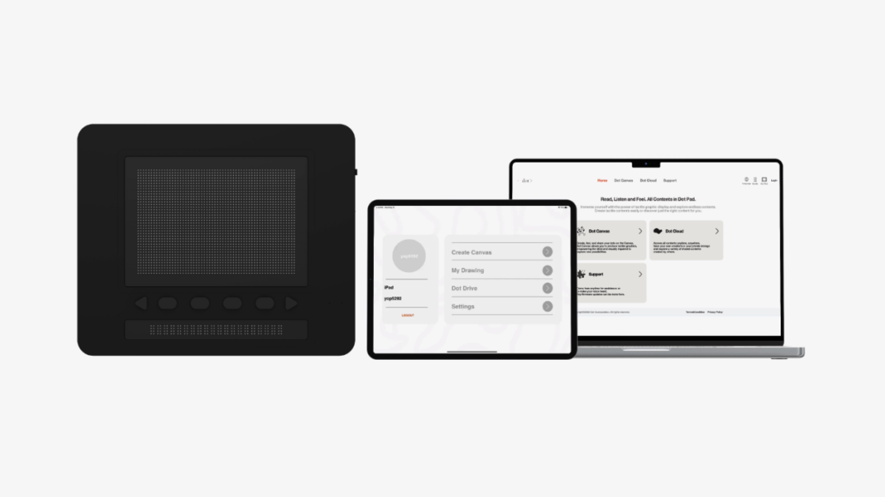

<iframe src="https://www.youtube-nocookie.com/embed/N_L3hR81nik?rel=0&modestbranding=1" title="YouTube video" loading="lazy" allow="accelerometer; autoplay; clipboard-write; encrypted-media; gyroscope; picture-in-picture" allowfullscreen></iframe>

## DOT CANVAS WEB

**쉽고 강력한 웹 기반 촉각 그래픽 제작 도구 :** 닷 캔버스 웹은 비전문가도 간편하게 촉각 그래픽을 제작할 수 있는 웹 최적화 툴입니다. 다양한 편집 기능과 고급 제작 옵션(PDF, 이미지 삽입 등)을 제공하여 더욱 정교한 콘텐츠 제작이 가능합니다.

**클라우드 기반의 촉각 그래픽 저장 및 공유 :** 닷 클라우드를 통해 촉각 그래픽을 저장하고 언제 어디서나 접근할 수 있습니다. 공용 드라이브 기능을 활용하면 서로 만든 콘텐츠를 공유하며 지속 가능한 촉각 그래픽 자료를 관리할 수 있습니다.

**다수의 닷패드와 실시간 그래픽 소통 :** 최대 10대의 닷패드와 연결하여 동일한 콘텐츠를 동시에 출력할 수 있습니다. 이를 통해 사전 제작한 촉각 그래픽을 다수의 사용자가 실시간으로 경험하며 소통할 수 있습니다.

## DOT CANVAS APP

**터치와 애플 펜슬로 직관적인 촉각 그래픽 제작 :** 닷 캔버스 앱은 아이패드에 최적화된 터치 기반 촉각 그래픽 제작 도구입니다. 터치 조작과 애플 펜슬을 활용하여 더욱 직관적으로 그래픽을 만들 수 있습니다.

**클라우드 연동으로 콘텐츠 관리 및 공유 :** 닷 클라우드를 활용해 촉각 그래픽을 저장하고 언제든 접근할 수 있습니다. 공용 드라이브를 통해 여러 사용자가 함께 콘텐츠를 공유하며 촉각 자료를 축적할 수 있습니다.

**시각 장애인을 위한 접근성 기능 :** 애플의 보이스 오버와 라이브 드로잉 기능을 지원하여, 시각 장애인도 직접 촉각 그래픽을 제작할 수 있습니다. 그림을 그리고 만지며 촉각적 감각을 키울 수 있는 새로운 경험을 제공합니다.

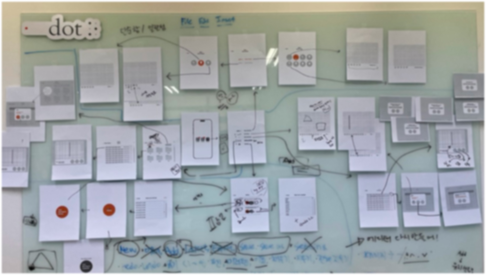

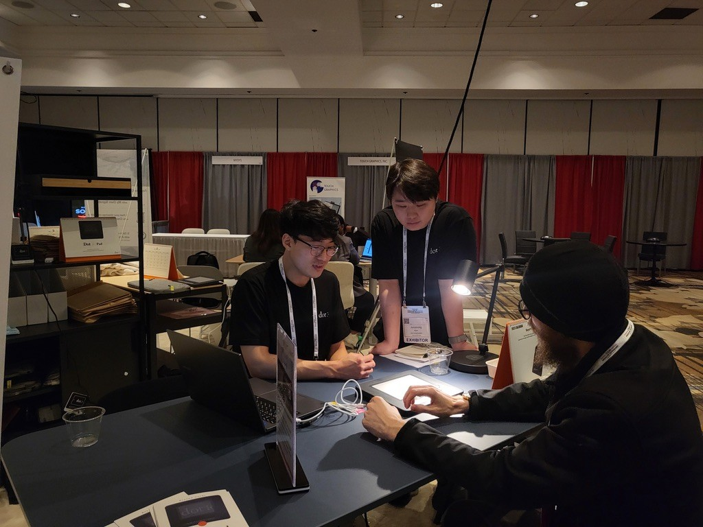 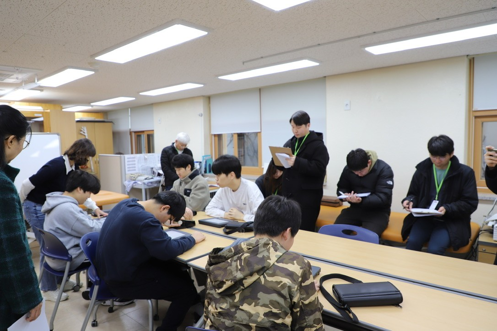 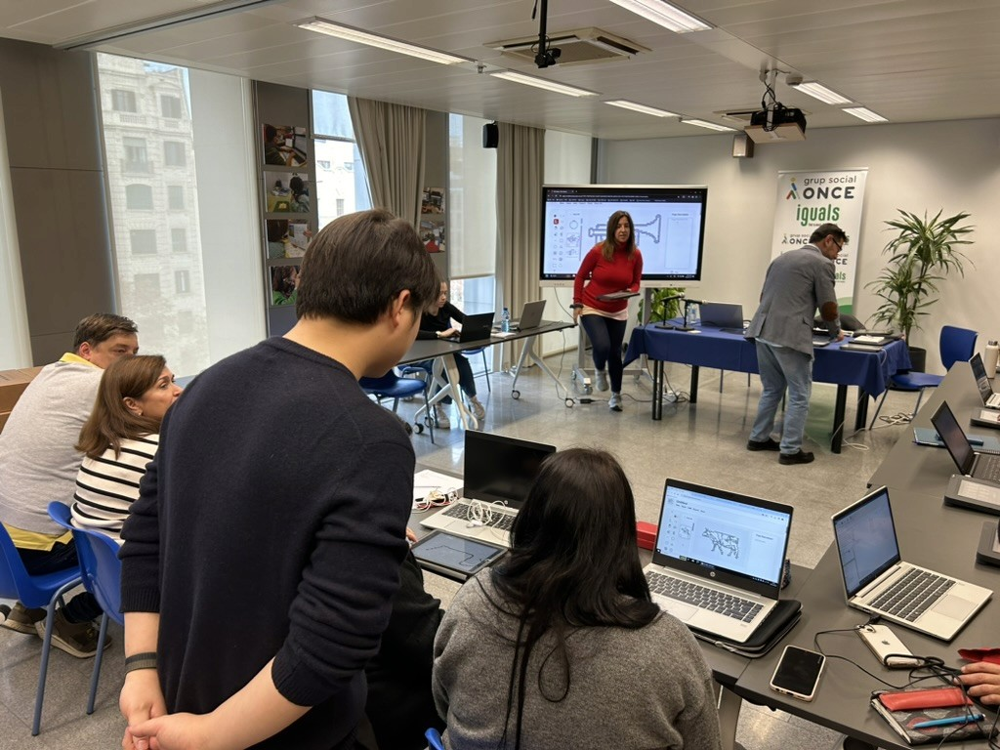

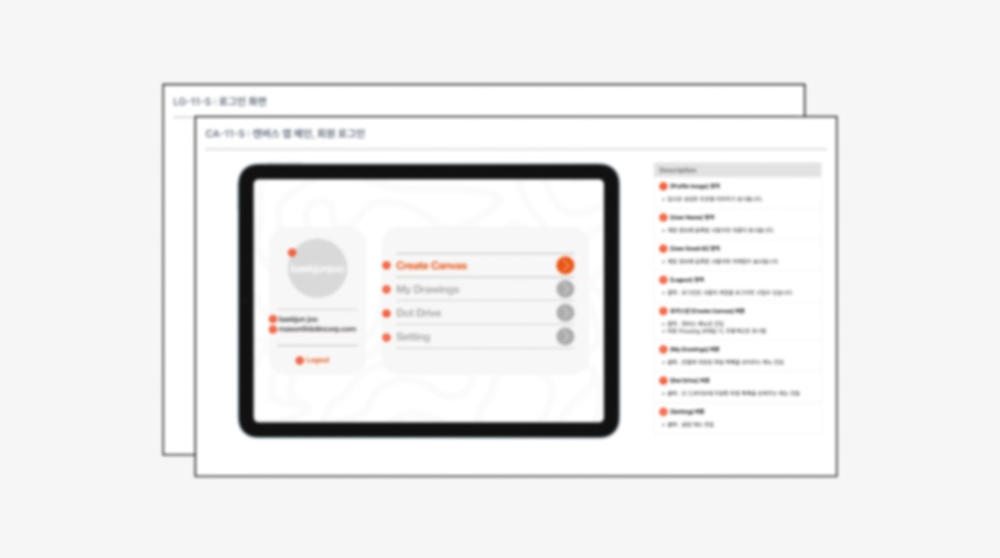 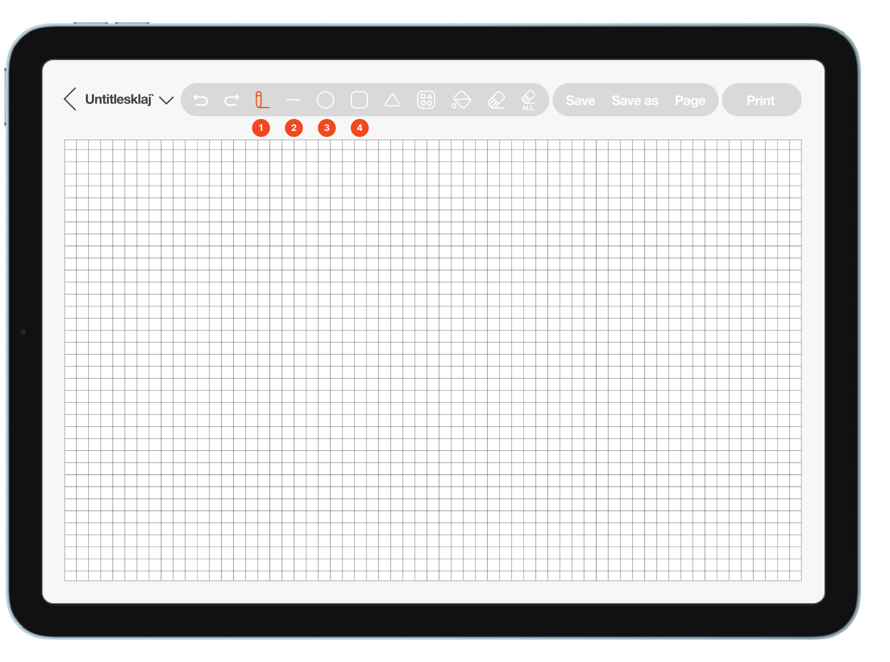

## IMPLEMENTATION

**Figma를 활용한 화면 설계 및 GUI 디자인 :** 사용자 리서치 결과를 기반으로, Figma를 활용해 닷 캔버스 웹 및 앱의 화면 설계와 GUI 디자인을 진행했습니다. 사용자가 직관적으로 접근할 수 있도록 UI 구조를 개선하고, 각 기능을 명확히 배치하여 교사와 시각장애 학생 모두가 쉽게 활용할 수 있는 인터페이스를 구현했습니다.

**다양한 UX 연구방법론을 통한 사용자 연구 :** 국내에서는 특수학교 교사 및 시각장애 학생을 대상으로 필드 스터디를, 해외 사용자는 설문 및 다이어리 스터디를 통해 실제 사용 환경과 페인포인트를 심층적으로 조사했습니다. 수집된 데이터는 초기 캔버스 버전의 문제점 파악과 개선 방향 수립에 핵심 근거가 되었습니다.

**개발자 협업 및 문서화 프로세스 강화 :** 화면 설계서 및 기능 명세서를 체계적으로 문서화하고, JIRA를 활용하여 프로젝트 이슈를 관리했습니다. 이를 통해 개발팀과의 긴밀한 소통을 유지하며 기술적 변경사항을 신속하게 반영할 수 있었고, 기능 개선 및 출시 일정을 성공적으로 맞출 수 있었습니다.

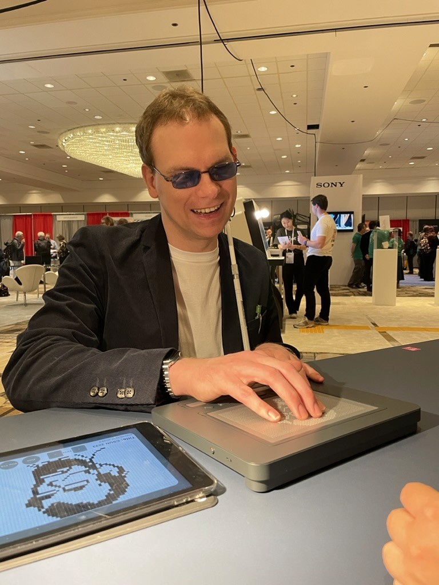

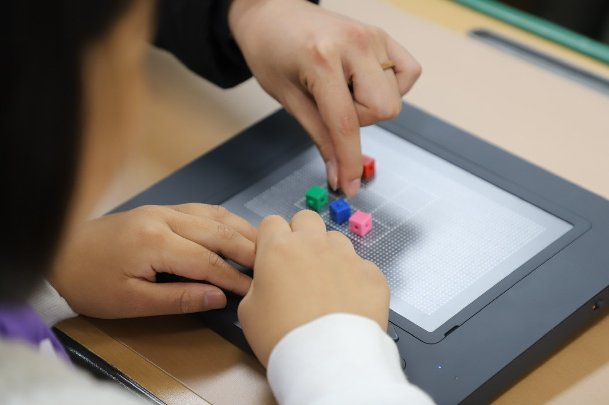

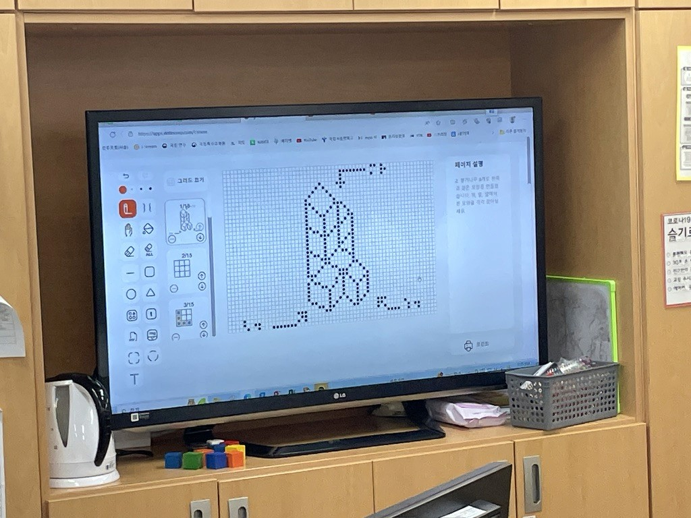

## IMPACT

<iframe src="https://www.youtube-nocookie.com/embed/AHK3VnjvA5Y?rel=0&modestbranding=1" title="YouTube video" loading="lazy" allow="accelerometer; autoplay; clipboard-write; encrypted-media; gyroscope; picture-in-picture" allowfullscreen></iframe>

**시각 장애 교육 환경 개선 :** 닷 캔버스는 학생들의 학습 접근성을 높이고, 교사들에게는 효율적인 자료 관리 및 학습 지원 도구를 제공했습니다.

**매출 성장 및 투자 유치 :** 닷 캔버스는 매출 성장과 신규 투자 유치에도 중요한 역할을 했습니다. 도입 이후, 시각 장애 교육 시장에서 수요가 증가하며 회사는 2023년과 2024년에 연매출 100억 원 이상을 달성했습니다. 이 성장을 바탕으로, 약 150억 원 규모의 추가 투자를 유치하는 데 성공했습니다.

**글로벌 시장 확장 및 협업 기회 창출 :** 닷 캔버스는 다양한 글로벌 전시회에 공개되며 닷패드의 활용성과 교육 시장에서의 잠재력을 보여주었습니다. 특히, 2024 CES에서 수상하며 기술력을 세계에 알렸고, CSUN 2024 등 국제 전시회에서 협업 제안을 받아 전 세계 교육 기관과의 협업 기회를 넓혔습니다. 이러한 활동은 글로벌 시장 진출의 발판이 되었습니다.

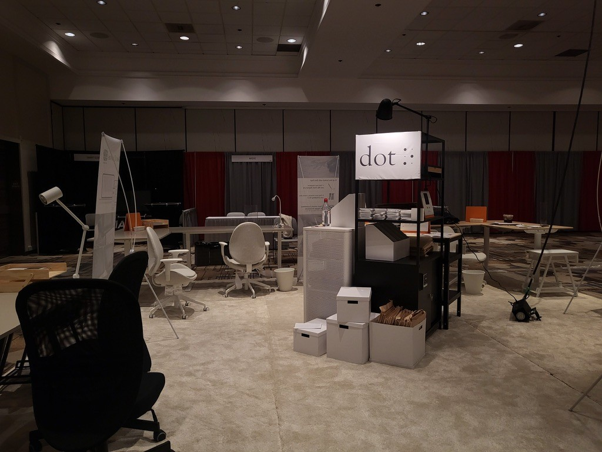

## REFLECTION

**빠른 실행과 장기적 완성도의 균형을 고민하다**

닷 캔버스 프로젝트는 짧은 기간 내에 웹과 앱의 데모 버전을 출시해야 하는 도전적인 목표를 가진 프로젝트였습니다. 당시 팀 내에 관련 경험이 풍부한 인력이 부족한 상황에서, 3개월 안에 사용 가능한 결과물을 만들어야 했습니다. 이를 위해 팀원들과 긴밀하게 협력하며 빠르게 프로토타입을 개발하고, 실행 중심의 접근 방식을 취했습니다. 이 과정에서 UX 설계뿐만 아니라 개발팀과의 협업, 일정 관리 등의 실무 역량을 키울 수 있었습니다.

그러나 빠른 실행이 가져오는 한계도 분명히 경험했습니다. 단기적인 목표를 달성하는 데는 성공했지만, 확장성을 충분히 고려하지 못한 디자인으로 인해 이후 유지보수 과정에서 많은 수정이 필요했습니다. 또한, 제품의 완성도가 부족해 사용자 경험이 만족스럽지 못한 부분도 있었습니다. 이러한 경험을 통해 속도와 완성도 사이에서 균형을 맞추는 것이 UX 디자인에서 얼마나 중요한지 깊이 깨달았습니다.

그럼에도 실제 사용자에게 가치를 전달했다는 점이 가장 기억에 남습니다. 사용자 스터디를 통해 직접 피드백을 받으며 UX 설계가 지속적으로 발전해야 한다는 것을 배웠습니다. 이 경험을 바탕으로, 앞으로는 단기적인 실행력뿐만 아니라 장기적인 확장성과 유지보수를 고려한 UX 설계를 더욱 신중하게 접근하고자 합니다.
