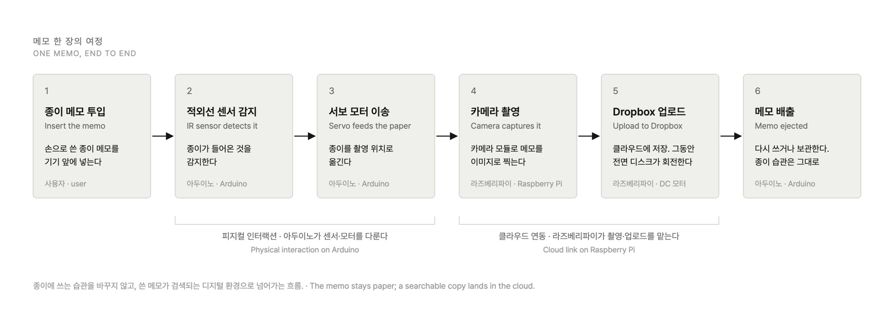
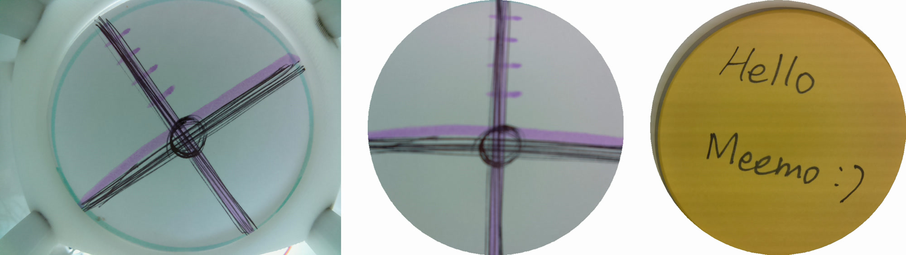
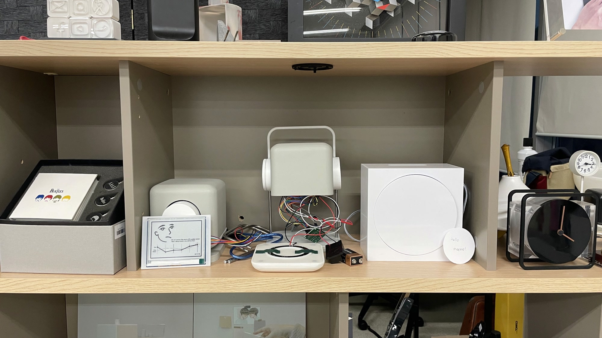

## PROBLEM

Analog notes are good for capturing ideas because you can write without being tied to a format, but they are hard to organize and to keep for the long term. Digital notes, on the other hand, give you storage and search but narrow the range of expression.

Many people use both at once, which weakens the consistency of how information is kept and makes search harder. What is needed is a way to have the freedom of analog notes and the order of digital ones together.

## APPROACH

To get past the limits of the analog system and the digital one, I designed an integrated system that joins the way analog notes are written to the storage and search of digital ones.

**Designing a system that links analog and digital:** Through user interviews and research, I analyzed how people use analog and digital notes. That confirmed the need for a medium to carry notes made in the physical world into the digital one, so I designed a way to connect the two environments without changing existing note-taking habits.

**Building Meemo:** On that design I built Meemo. Real-time conversion of paper notes into digital sits at the center, so the writing environment of paper stays as it is while the search and management convenience of digital notes comes with it.

## SOLUTION

  

 

<iframe src="https://www.youtube-nocookie.com/embed/nXMv4ztNLbA?rel=0&modestbranding=1" title="Film showing Meemo in operation" loading="lazy" allow="accelerometer; autoplay; clipboard-write; encrypted-media; gyroscope; picture-in-picture" allowfullscreen></iframe>

**Meemo**

**Instant cloud upload and digitization:** When a user puts a handwritten paper note into the device, Meemo converts it to a digital image and uploads it to the cloud (Dropbox) right away. Writing stays on paper, while the note becomes searchable in the digital environment and usable on other devices.

**Rotating-disc feedback:** While a note is being scanned, the disc on the front face turns slowly, and it stops when the scan is done. The movement lets the user know the scan is in progress, and adds a small pleasure to writing a note.

**Input and output that bridge analog and digital:** Insert a note and it is digitized; when the work is done the note comes back out to be used again or filed away. The process moves a note into the digital environment without breaking the analog workflow.

## IMPLEMENTATION

**Building the physical interaction:** To realize the physical interaction, I built the system on Arduino. When a user inserts paper, an infrared sensor detects it, a servo motor moves it inside, and a stepper motor turns the disc to show progress. For the capture, a 12-LED NeoPixel ring around the camera lights up white to brighten the dark interior. This physical interaction was what carried the analog experience into the digital environment.

**Cloud integration and application development:** To implement cloud storage, I built a data communication system linking a Raspberry Pi and Arduino. When the Arduino reports a detected sheet, the Raspberry Pi takes a 1024×768 photo, crops the center to a square, and applies a round mask in the shape of the memo. The file is named with the capture time and uploaded to Dropbox.

## PROTOTYPING

 

 

I modeled the exterior and the internal structure in Fusion 360. The shell was CNC-machined, and the internal parts that hold the camera, sensor, and gears were 3D-printed. The stepper motor drives the disc through two spur gears.

Paper took the most time. Paper that was too thin would not feed, and square corners caught inside the device. After trying different thicknesses, materials, and shapes, I settled on the round memo, and recessed the slot so paper slides in easily.

The camera didn’t work the first time either. I started by trying to find the four corners of the sheet, the way document-scanning examples do, but the wide-angle lens I needed for the cramped interior distorted the image too much to find them. The repository still has separate test code for the camera, cropping, the Dropbox upload, and serial communication. Along the way I burned a PCB and redid work after design mistakes.

## IMPACT

 

Meemo received the Excellence Award at the HCI Korea Creative Award.

It was presented at the HCI Korea 2021 conference and published in the proceedings. The paper covers physical computing techniques such as infrared sensors and motor systems, along with the design of a user-centered note management interface.

## REFLECTION

**Turning imagination into something real is as tangled and unpredictable as untangling a knot of string.**

Meemo was the first time I took an idea of my own all the way to a product. Wiring Arduino and Raspberry Pi together, designing the internal structure, 3D printing, and CNC machining were all new to me, and when I got stuck I asked specialists and fixed things one at a time.

I learned that an idea that looks easy in your head turns, once you build it for real, into a long run of complicated and unpredictable problem-solving — much like untangling a knot of string.
