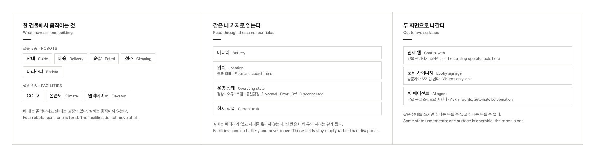
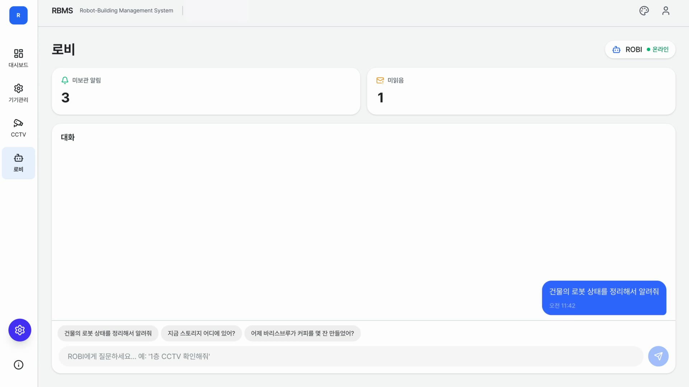

## PROBLEM

Inside one building a guide robot, a delivery robot, a patrol robot, a cleaning robot, and a barista robot all work at once. Alongside them run the CCTV cameras, the climate sensors, and the elevators. Each robot had its own control screen, and the facilities were watched somewhere else again. Whoever ran the building had nowhere to see, in one place, what state the building was in.

It was not only an operations problem. To anyone walking through the lobby, there was nothing to show that the building ran on robots.

## APPROACH

My part began with defining what would be managed, what state each thing reports, and what screens were needed. For five robots and three kinds of facility, I set down in a document what gets read, under what name, and where it appears.

**State was reduced to four fields.** To read eight different things side by side on one screen, the axes have to match: battery, location, operating state, and current task. Facilities have no battery and never move, but the fields stay in place rather than disappear. A list whose rows shift shape is harder to read, not easier.

**Silence was separated from being switched off.** If a robot has not refreshed its state for thirty seconds, the server moves it to disconnected. A robot someone turned off and a robot that stopped answering call for different actions.

**The screen was split in two.** Both surfaces sit on the same state, but the control web is where a building operator acts, and the lobby signage is one that visitors only look at.

## SOLUTION

### Control web

Robot positions sit on the building plan, and the status of robots and facilities collects in one panel. Selecting an item opens its battery, location, and current task; the robot detail hands off to that robot's own console. Anything abnormal is announced at one of three levels: information, warning, urgent. Registering and editing devices, and managing floor information and notices, happen on the same screen.

### Lobby signage

The same data, rearranged for visitors. A vertical section of the building carries a robot on each floor, so what is moving where reads from across the room. Beside it sit the facility status, the robot roster, and the building's notices.

### AI agent

A conversation panel sits next to the control view. You ask in plain words, and the answers and the robot event alerts stack up in one timeline. Rules that let the building act on its own are handled here too, written as a single line: at this time, in this place, on this event, do this.

## IMPLEMENTATION

**From document to screen.** I wrote the requirements, the information architecture, and the specs for eleven screens, and designed the dashboard and the signage. The engineering team built it, and I kept revising the screen definitions and display rules alongside.

**Runs without a server.** A simulation mode and a live-data mode share one interface, so the whole flow can be shown where there is no robot and no server to connect to.

## IMPACT

Control that had been scattered across individual robots is now held at the level of the building. The control web and the lobby signage are up at the Seongsu headquarters, showing five robots and the facilities together.
