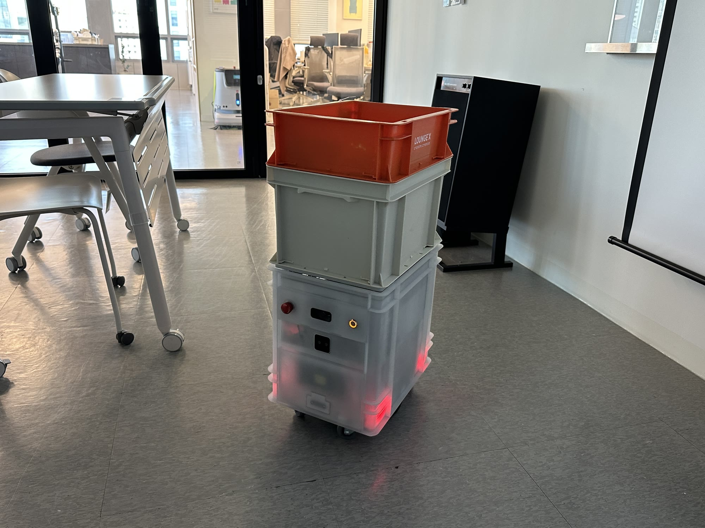
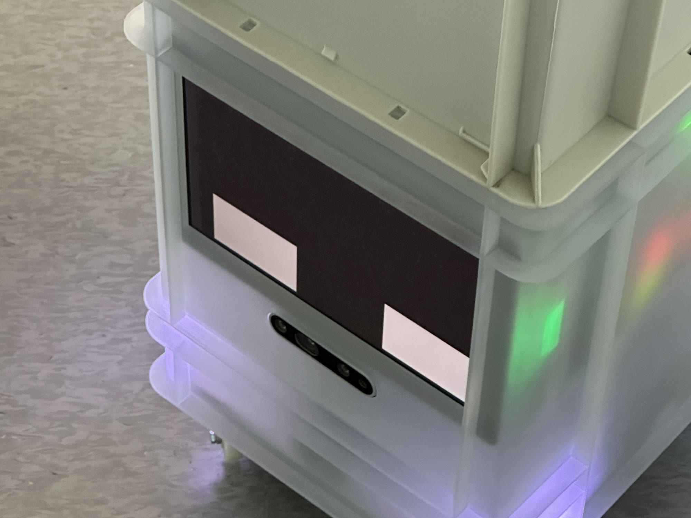

<iframe src="https://www.youtube-nocookie.com/embed/TPq3F_mAeP8?start=28&rel=0&modestbranding=1" title="YouTube video" loading="lazy" allow="accelerometer; autoplay; clipboard-write; encrypted-media; gyroscope; picture-in-picture" allowfullscreen></iframe>

## PROBLEM

실내 배송 로봇 STORAGY는 복도와 엘리베이터, 사무실을 사람과 같이 씁니다. 지금 대기 중인지, 이동 중인지, 앞에 장애물이 있어 멈춘 건지, 배송이 끝났는지를 말없이 알려야 사람이 길을 내주고 물건을 찾아갑니다. 처음에는 로봇의 상태를 정의한 목록도, 그것을 드러낼 표정과 빛의 규칙도 없었습니다.

## APPROACH

로봇 상태를 먼저 정의하고 채널을 나눴습니다. 시스템 상태는 LED와 사운드로, 주행 상태는 전면 디스플레이와 사운드로 알립니다. 디스플레이와 LED의 피드백 목록을 상태별로 매핑하고, 사운드는 그 뒤에 붙였습니다. 개발팀과 함께 실제 로봇에 올려 보며 고쳤습니다.

## SOLUTION

### 표정

부팅·대기·이동·장애물·충전·배송 완료 여섯 상태의 대표 표정과 애니메이션을 만들었습니다. 눈 두 개의 위치와 크기, 움직임만으로 상태를 구분합니다.

<video src="/media/works/storagy/faces.mp4" autoplay muted loop playsinline></video>

### LED와 디스플레이

전면 디스플레이가 표정을, 몸체 아래 LED가 시스템 상태를 보여 줍니다.

 

<video src="/media/works/storagy/led.mp4" autoplay muted loop playsinline></video>

### 다층 배송

바리스브루가 만든 음료를 STORAGY가 받아 엘리베이터로 층을 옮겨 자리까지 배송합니다. 이 다층 배송의 시나리오와 상태를 정의하고, 로봇을 원격으로 제어하는 운영 콘솔 MobileON의 기능과 화면을 기획했습니다.

<video src="/media/works/storagy/delivery.mp4" autoplay muted loop playsinline></video>

## IMPACT

서울 성수 XYZ 사옥의 로봇 빌딩 솔루션에서 바리스브루와 연동해 층간 배송을 운영 중입니다.

## REFLECTION

**이상적인 시나리오는 쉽다. 예외가 일이다.**

가장 어려웠던 건 로봇의 상태별 피드백을 정의하는 일이었습니다. 로봇이 어떻게 동작하는지를 먼저 이해해야 피드백을 붙일 수 있었고, 그것을 어떤 단위로 정의해 어떤 포맷으로 개발에 넘겨야 하는지를 이 프로젝트에서 배웠습니다.

이상적인 시나리오는 오히려 괜찮았습니다. 어려운 건 돌발 상황과 예외 케이스였고, 이건 지금도 진행 중입니다. 한 번에 끝나는 일이 아니라 계속 반복해서 고쳐야 하는 일이라고 봅니다. 다시 한다면 무엇을 다르게 할지는 아직 모르겠습니다.

커리어에서는 움직이는 로봇을 다루고, 실내 배송이라는 시나리오를 다뤄 봤다는 데 의미가 있습니다.
