## PROBLEM

**Which product concept fits an entry into the U.S. market?**

[**ZIBOT Inc.**](https://www.zhibankeji.com/) is a China-based startup that builds educational robots for children using natural language analysis. In 2018, having validated its product in the Chinese market, the company set up a Silicon Valley office to enter the U.S. market, but it had little data or insight about that market at the time. The U.S. product team's task was to gather data and insight on the U.S. market and find the opportunity areas that fit it.

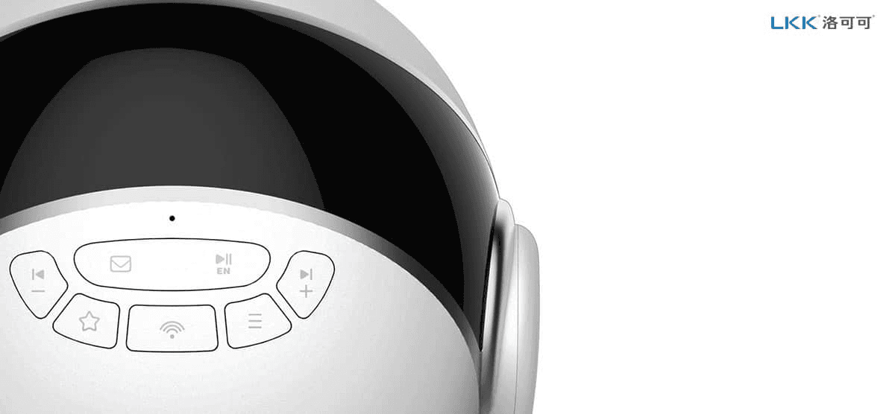

## APPROACH

**Researching the U.S. kids robot market and its products:** I compared more than 10 educational robots on the U.S. market by manufacturer, specs, features, and interactions. I bought and used the major products myself, and wrote a report laying out market trends, product characteristics, and opportunity areas.

**Idea workshop:** With the CEO and the PM, I ran a workshop that pulled key words out of the market and product analysis and combined them. From the results we drew early concepts reflecting the features and design elements U.S. customers were likely to prefer.

**Product concept design and development:** We picked one of those ideas and defined the final product's form and functions through early sketches, 3D modeling, and a physical prototype.

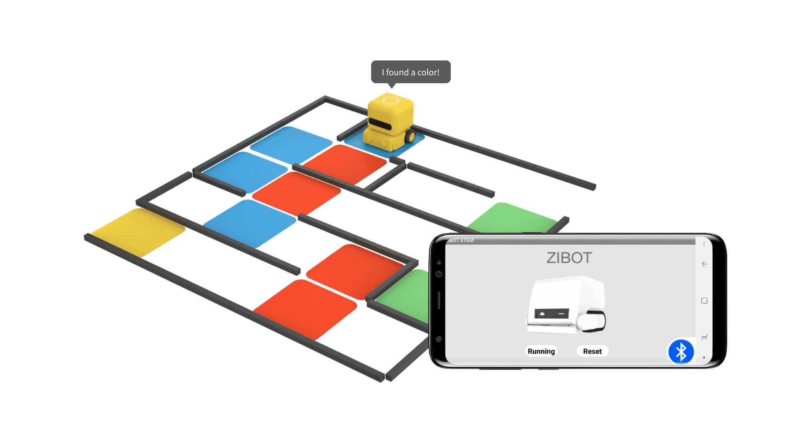

<iframe src="https://www.youtube-nocookie.com/embed/irJ2ge-0ZDw?rel=0&modestbranding=1" title="YouTube video" loading="lazy" allow="accelerometer; autoplay; clipboard-write; encrypted-media; gyroscope; picture-in-picture" allowfullscreen></iframe>

## SOLUTION

**ZIBOT KK**

**Color coding:** A learning feature in which the robot recognizes colors and performs the matching action. Children pick up coding principles by arranging color patterns.

**A modular handle:** The handle was designed as a module so that a variety of accessories can attach to it. That extends its use beyond education to play and exploration.

**Size:** We set the size so that a child can hold it in one hand, and used prototypes to confirm the smallest dimensions that were feasible.

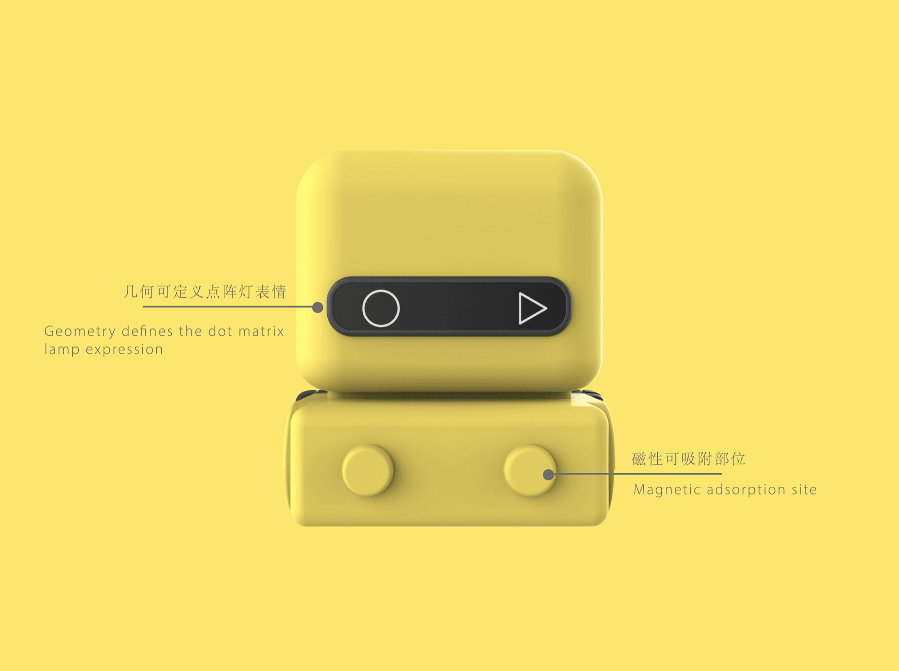

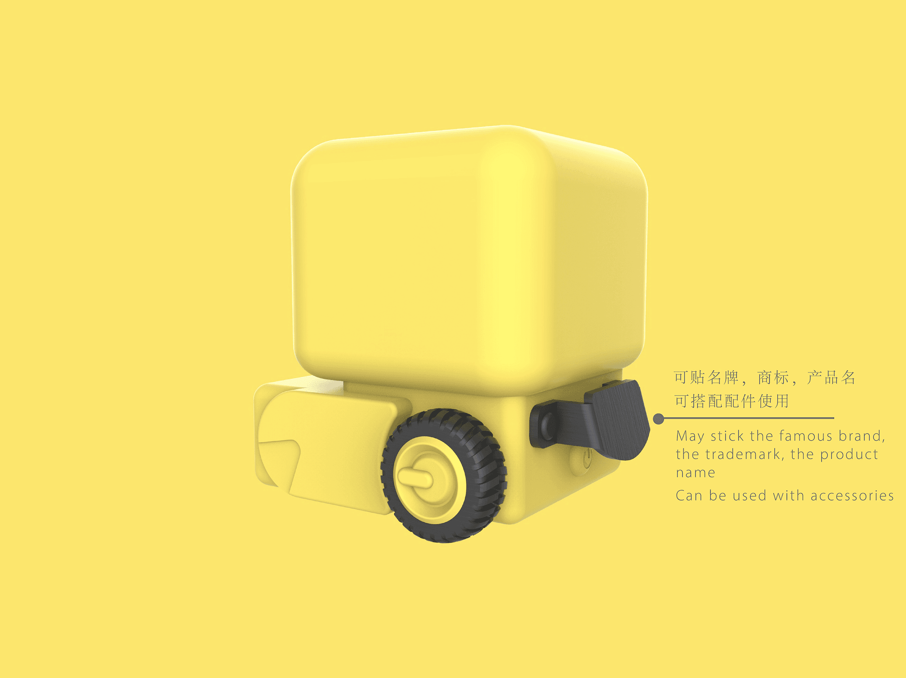

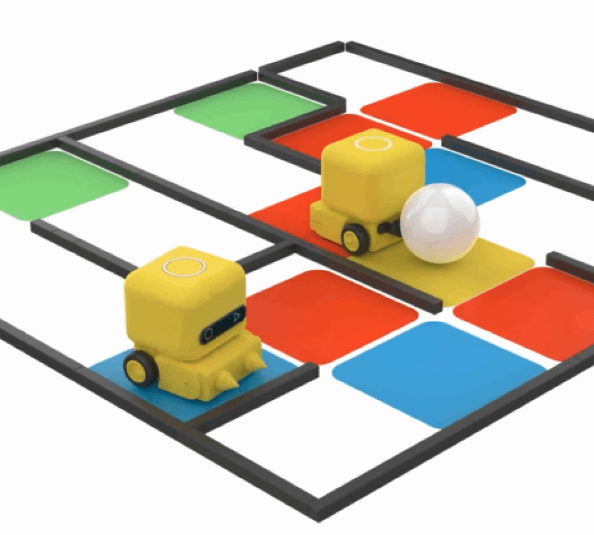 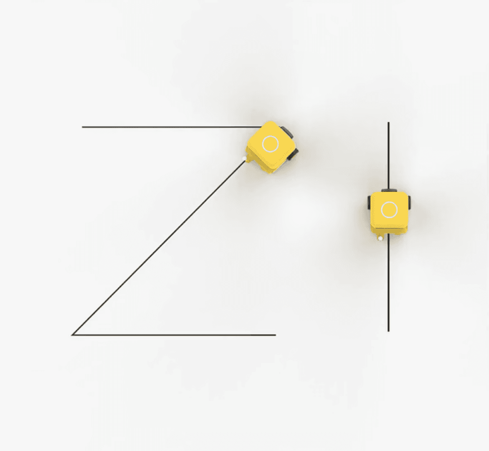

## IMPLEMENTATION

**Validating the design concept through prototyping:** Building a range of sizes and forms showed what product size was feasible and refined the design toward something close to a real product. The prototypes let me check function and usability together.

**Testing the feature with Arduino and MIT App Inventor:** To check whether color coding would actually work, I built and tested a prototype of the core function with Arduino and MIT App Inventor. The early tests identified functional constraints and room for improvement, and became reference material for later product development.

**Building the CES 2019 exhibition mockup:** Working from what prototyping and testing had shown, I collaborated with Frank, the design team lead at the Chinese headquarters, to settle the final product design concept. From that concept we produced a mockup for the CES 2019 exhibition.

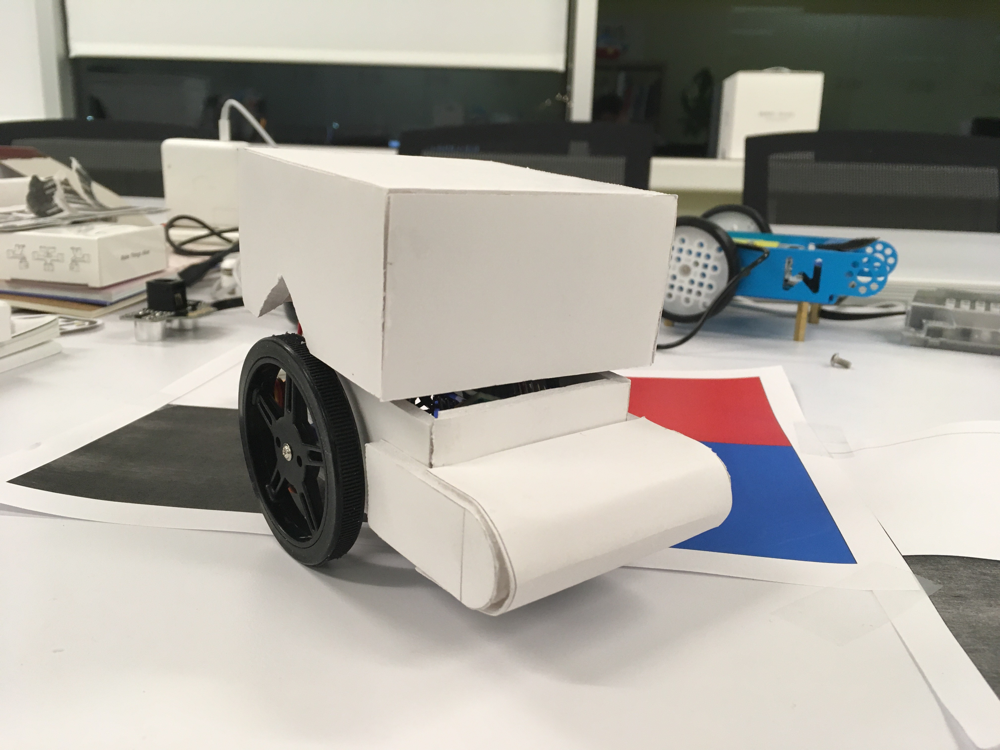

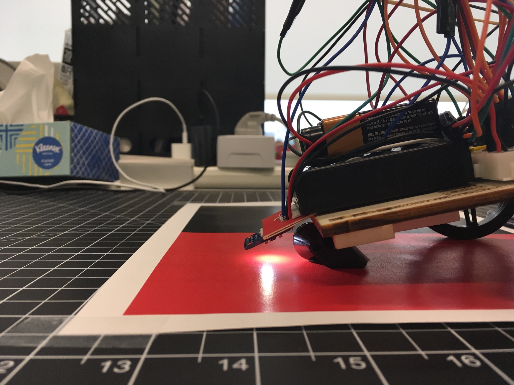 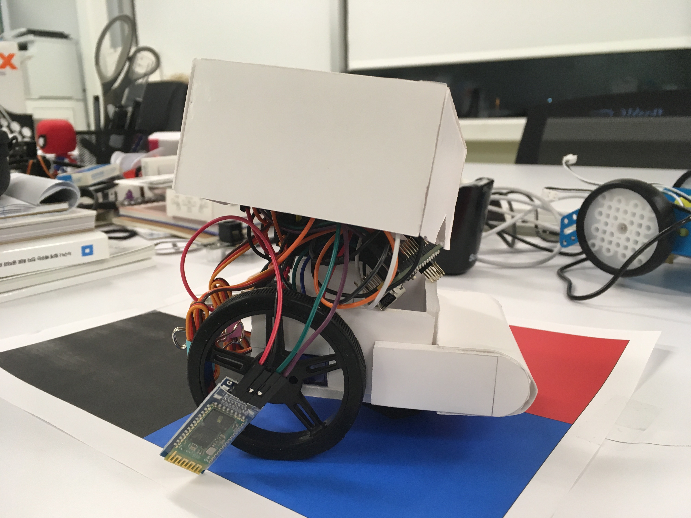

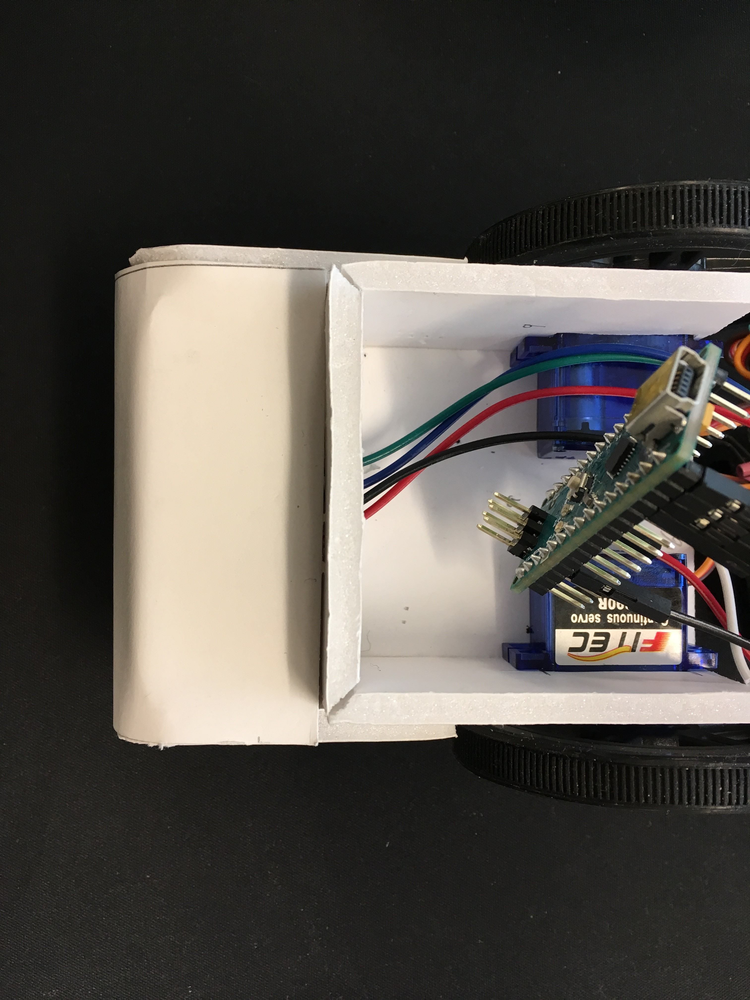

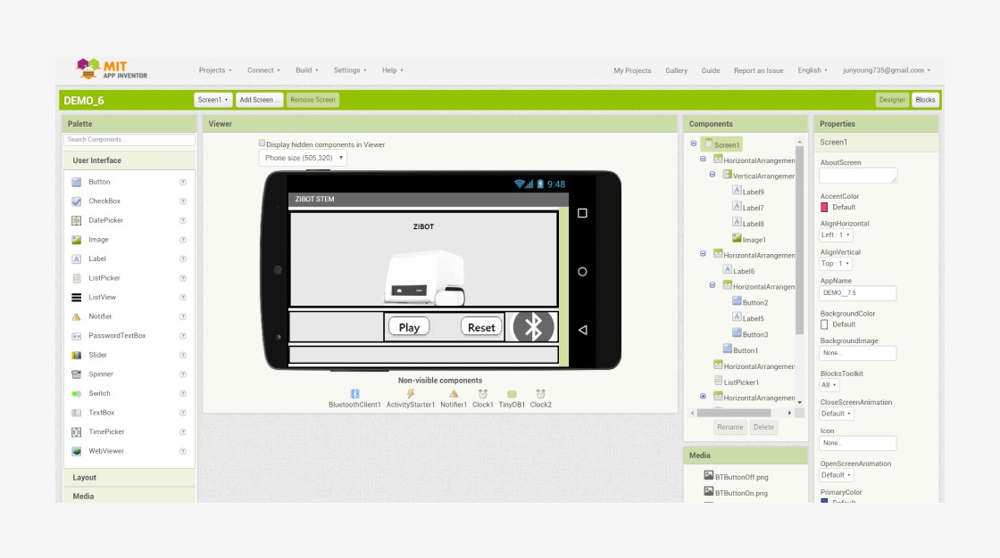

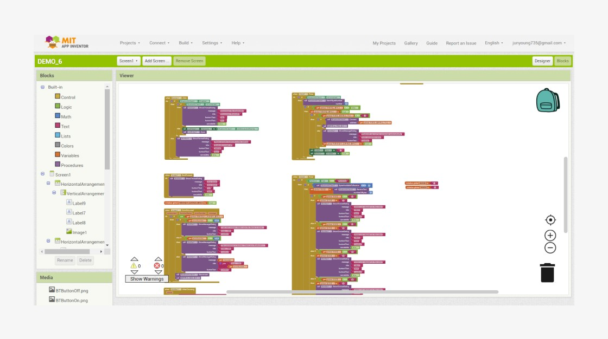

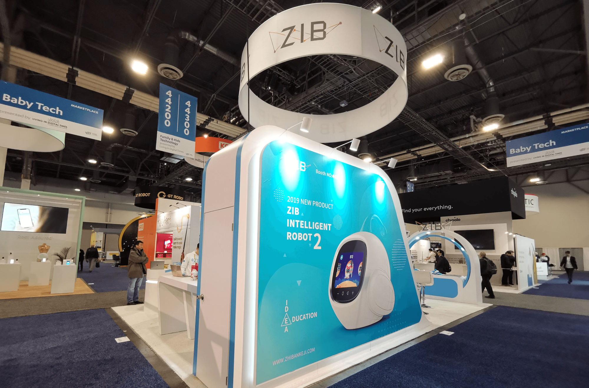

## IMPACT

The final ZIBOT KK mockup was shown at ZIBOT's booth at CES 2019. It was the first project the U.S. product team completed, and the starting point for the company's entry into the U.S. market.

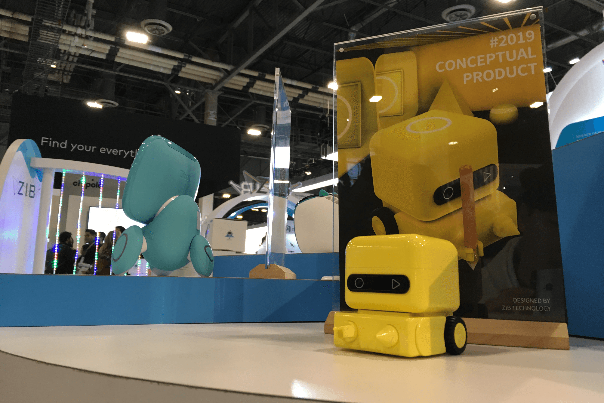

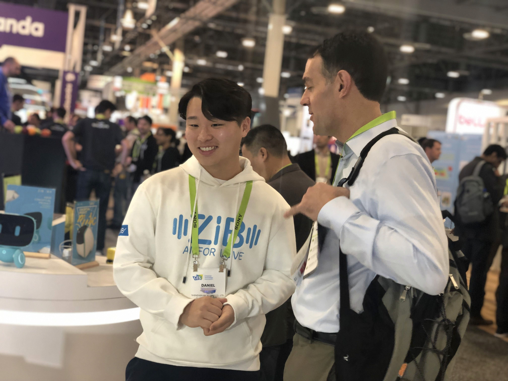

## REFLECTION

**A demanding environment can turn into a chance to learn, once you get through it.**

The internship in Silicon Valley in 2018 was nothing like what I had expected. I started at a small U.S. branch of a Chinese startup where the team was two people, a CTO and a PM, and team building and process were only just beginning. I used visuals and documentation to lower the communication barrier with the Chinese headquarters, and I fixed inefficient processes myself and put the team's workflow in order. The company then started a new project based on my work, and I took on product planning and design. From this I learned that a demanding environment brings bigger lessons, and that the difficulty in front of you can turn out to be an opportunity.
