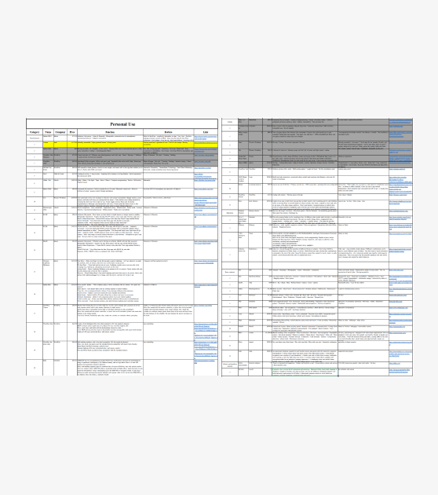
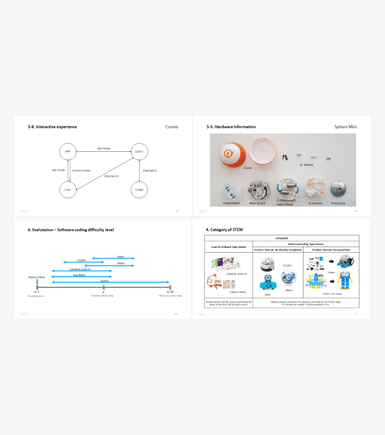
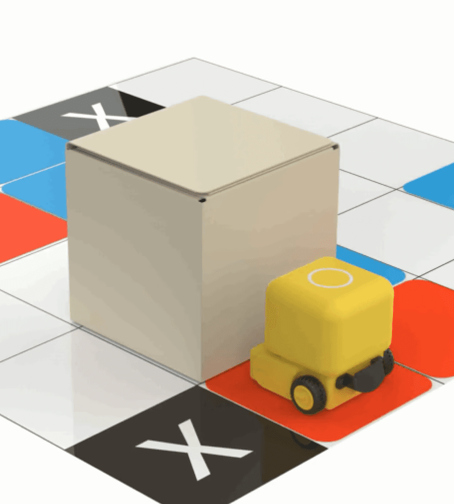
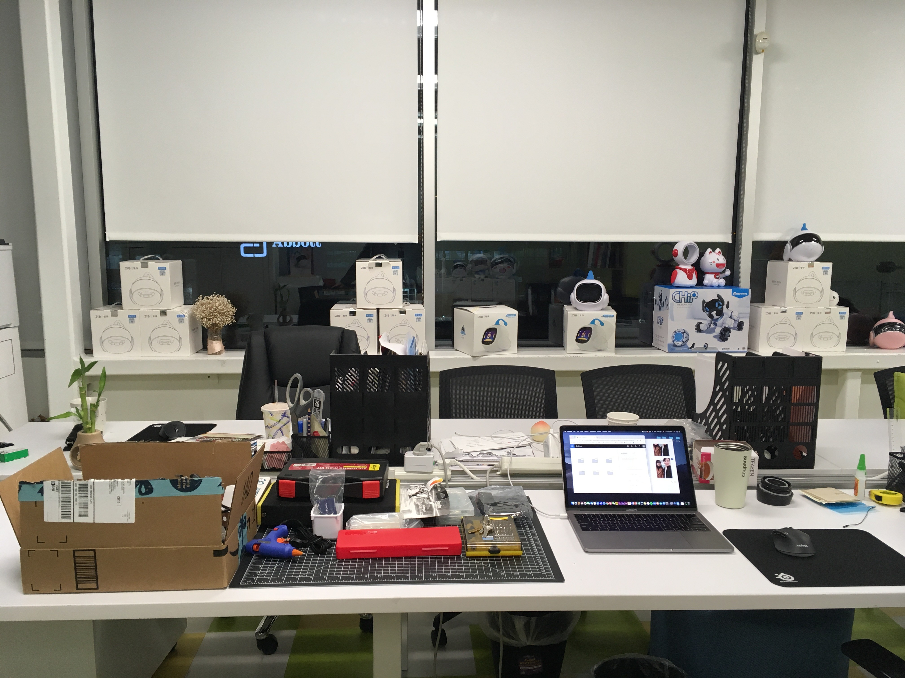

## CHALLENGE

**미국 시장 진출을 위해 어떤 제품 컨셉이 적합할까?**

[**ZIBOT Inc.**](https://www.zhibankeji.com/)은 자연어 분석 기술을 활용한 어린이 교육용 로봇을 개발하는 중국 기반의 스타트업입니다. 2018년, 중국 시장에서 제품을 검증한 후 미국 시장에 진출하기 위해 실리콘 밸리에 지사를 설립했으나, 당시 미국 시장에 대한 데이터나 인사이트가 부족한 상황이었습니다. 이에 미국 제품 팀의 주요 과제는 미국 시장에 대한 구체적인 데이터와 인사이트를 확보하고, 그에 맞는 기회 영역을 발굴하는 것이었습니다.

## APPROACH

**미국 키즈 로봇 시장 조사 및 제품 분석 :** 데스크 리서치를 통해 미국 시장에 있는 모든 키즈 로봇의 제조사, 제품 스펙, 주요 기능, 인터랙션, 장단점 등을 조사하여 스프레드시트에 정리하였습니다. 그리고 주요 제품들을 직접 구매하여 경험하고 분석하여 미국 시장의 트랜드와 제품의 특징, 기회 영역 등을 분석한 보고서를 작성하였습니다.

**아이디어 워크숍 (브레인 스토밍) :** CEO, PM와 함께 시장 및 제품 분석 데이터를 기반으로 핵심 키워드를 도출하고, 이를 다양하게 조합하는 아이디어 워크숍을 진행하였습니다. 이 결과를 바탕으로 미국 소비자들이 선호할 만한 기능과 디자인 요소를 반영하여 여러 가지 초기 컨셉을 도출했습니다.

**제품 컨셉 디자인 및 개발 :** 도출된 아이디어 중 가장 유망한 컨셉을 선정하여 시각적 디자인을 포함한 제품 프로토타입을 개발했습니다. 초기 스케치부터 3D 모델링, 물리적 프로토타입 제작까지 다양한 디자인 과정을 거쳐 최종 제품의 형태와 기능을 정의했습니다.

 

  

<iframe src="https://www.youtube-nocookie.com/embed/irJ2ge-0ZDw?rel=0&modestbranding=1" title="YouTube video" loading="lazy" allow="accelerometer; autoplay; clipboard-write; encrypted-media; gyroscope; picture-in-picture" allowfullscreen></iframe>

## ZIBOT KK

**컬러 인식을 활용한 코딩 학습 (컬러 코딩) :** 어린이들이 색상 패턴을 통해 손쉽게 코딩 원리를 배울 수 있도록, 로봇이 색깔을 인식하고 이에 따라 동작을 수행하는 학습 기능을 제공합니다. 직관적이고 재미있는 방식으로 어린이들의 흥미를 끌어내며, 자연스럽게 코딩 개념에 대한 이해를 높입니다.

**모듈형 핸들 구조로 확장성 강화 :** 로봇의 핸들은 모듈형으로 설계되어 다양한 액세서리를 부착할 수 있습니다. 이를 통해 교육적인 목적뿐만 아니라 놀이와 탐구 활동 등 여러 가지 용도로 활용할 수 있는 확장성을 제공합니다.

**작고 귀여운 디자인 :** 작고 귀여운 디자인은 어린이들이 로봇을 더 친숙하게 느낄 수 있게 돕습니다. 감각적인 디자인과 매력적인 외형을 통해 시각적인 즐거움을 제공하면서도, 동시에 기능적인 유용성을 잃지 않았습니다.

  

 

## IMPLEMENTATION

**프로토타이핑을 통한 디자인 컨셉 검증 :** 제품의 디자인 컨셉이 요구하는 ‘작고 귀여운’ 이미지를 충족하기 위해 반복적인 프로토타입 제작을 진행했습니다. 다양한 크기와 형태를 실험하여 실현 가능한 제품 크기를 확인하고, 실제 제품에 가까운 형태로 디자인을 다듬었습니다. 또한 프로토타이핑을 통해 디자인의 기능성과 사용성을 검증하며, 최적화된 제품 형태를 도출할 수 있었습니다.

**아두이노와 MIT 앱 인벤터를 활용한 실현 가능성 검증 :** 컬러 코딩 기능이 실제로 유효하게 작동하는지를 확인하기 위해 아두이노와 MIT 앱 인벤터를 활용해 핵심 기능 프로토타입을 개발하고 테스트를 진행했습니다. 초기 테스트를 통해 기능적 제약과 개선 가능성을 파악하고, 이후 제품 개발을 위한 검토 자료를 마련했습니다. 이 과정을 통해 컬러 인식 기반 인터랙션의 기술적 실현 가능성을 초기에 확인할 수 있었습니다.

**디자인 팀과의 협업을 통한 CES 2019 전시용 목업 제작:** 반복적인 프로토타이핑과 테스트를 통해 얻은 인사이트를 바탕으로, 중국 본사 디자인 팀 리드인 Frank와 긴밀히 협력하여 최종 제품 디자인 컨셉을 확정했습니다. 이 컨셉을 기반으로 CES 2019 전시를 위한 목업을 제작하여, 현장에서 제품의 외관과 기능을 실제로 경험할 수 있도록 구현했습니다. 이 과정을 통해 제품의 세부 디자인을 최종적으로 마무리하고, 전시를 통해 실물 제품을 업계 관계자들에게 선보일 수 있었습니다.

## IMPACT

**CES 2019 참가 및 전시:** ZIBOT KK의 최종 목업은 CES 2019의 ZIBOT 부스에 전시되었습니다. ZIBOT 미국 제품 팀이 처음으로 완수한 프로젝트로, 회사의 미국 시장 진출 시작점이 되었습니다.

## REFLECTION

**도전적인 환경은 극복을 통해 배움의 기회로 바뀔 수 있다.**

2018년, 실리콘밸리에서의 인턴십 경험은 기대와 전혀 달랐습니다. 중국 스타트업의 작은 미국 지사에서 인턴십을 시작했고, 팀은 CTO와 PM 단 두 명뿐이었으며, 팀 빌딩과 프로세스 정립이 이제 막 시작된 단계였습니다. 당시 대학생이었던 제게 매우 도전적인 상황이었고, 솔직히 큰 실망감을 느꼈습니다. 꿈꾸던 실리콘밸리의 모습은 어디에도 없었습니다. 하지만 누구보다 이 기회를 갈망했기에, 이렇게 시간을 보내고 싶지 않다는 마음으로 하나 둘 도전 과제를 풀어갔습니다.

우선, 중국 본사와의 커뮤니케이션 장벽을 극복하기 위해 시각 자료와 문서화를 적극 활용했습니다. 그리고 비효율적인 프로세스를 직접 개선하며 팀의 업무 흐름을 정리해 나갔습니다. 또한, 개인의 커리어 목표보다 팀의 목표를 우선시하며 주어진 업무를 적극적으로 수행했습니다. 이러한 노력은 좋은 성과로 이어졌고, 무급 인턴에서 유급 계약직으로 전환되며 1년간 더 함께할 기회를 얻었습니다. 이후, 회사는 제 업무 결과물을 기반으로 신규 프로젝트를 시작했고, 저는 제품 기획 및 디자인에 본격적으로 참여하며 실질적인 책임을 맡게 되었습니다.

이 경험을 통해 도전적인 환경에서 더 큰 배움이 따른다는 것, 그리고 눈앞의 어려움이 곧 기회가 될 수도 있다는 것을 배웠습니다.
