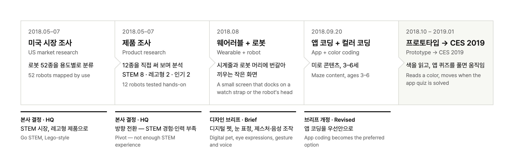
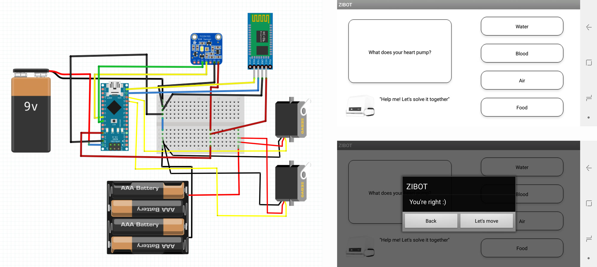
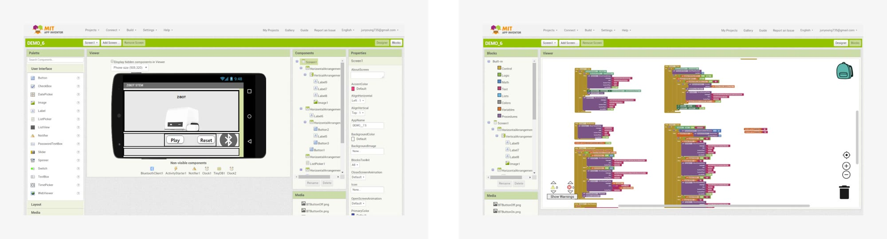

## PROBLEM

**미국 시장 진출을 위해 어떤 제품 컨셉이 적합할까?**

[**ZIBOT Inc.**](https://www.zhibankeji.com/)은 자연어 분석 기술을 활용한 어린이 교육용 로봇을 개발하는 중국 기반의 스타트업입니다. 2018년 중국 시장에서 제품을 검증한 뒤 미국 시장에 진출하기 위해 실리콘밸리에 지사를 세웠지만, 당시 미국 시장에 대한 데이터나 인사이트가 부족했습니다. 미국 제품 팀의 과제는 미국 시장의 데이터와 인사이트를 확보하고, 그에 맞는 기회 영역을 찾는 것이었습니다.

## APPROACH

**미국 키즈 로봇 시장 조사 및 제품 분석:** 미국 시장의 로봇 52종을 용도별로 분류하고, 그중 12종(STEM 8·레고형 2·인기 제품 2)은 직접 써 보며 하드웨어와 소프트웨어를 비교했습니다. 미국 시장의 트렌드와 제품 특징, 기회 영역을 정리한 보고서를 작성했습니다.

**본사 피드백으로 세 번 바뀐 방향:** 조사를 본 본사는 STEM 시장의 레고형 제품으로 방향을 잡았다가, STEM 경험과 인력이 부족하다는 이유로 접었습니다. 8월 디자인 브리프는 시계줄과 로봇 머리에 번갈아 끼우는 작은 화면에 디지털 펫, 눈 표정, 제스처·음성 조작을 담았습니다. 9월 20일에 개정한 브리프에서 앱 코딩과 미로 콘텐츠, 컬러 인식 코딩으로 정리됐고, 대상 연령은 3–6세로 잡았습니다.

**아이디어 워크숍:** CEO, PM과 함께 시장·제품 분석 데이터에서 핵심 키워드를 뽑고 조합하는 워크숍을 진행했습니다. 그 결과를 바탕으로 미국 소비자가 선호할 만한 기능과 디자인 요소를 반영한 초기 컨셉을 도출했습니다.

**제품 컨셉 디자인 및 개발:** 도출한 아이디어 중 하나를 골라 초기 스케치, 3D 모델링, 물리 프로토타입 제작을 거쳐 최종 제품의 형태와 기능을 정의했습니다.

## SOLUTION

<iframe src="https://www.youtube-nocookie.com/embed/irJ2ge-0ZDw?rel=0&modestbranding=1" title="ZIBOT KK 컨셉 영상" loading="lazy" allow="accelerometer; autoplay; clipboard-write; encrypted-media; gyroscope; picture-in-picture" allowfullscreen></iframe>

**ZIBOT KK**

 

**컬러 코딩:** 로봇이 색을 인식해 그에 맞는 동작을 수행하는 학습 기능입니다. 어린이가 색상 패턴을 배열하며 코딩 원리를 익힐 수 있습니다.

 

**모듈형 핸들 구조:** 핸들을 모듈형으로 설계해 여러 액세서리를 붙일 수 있게 했습니다. 교육뿐 아니라 놀이와 탐구 활동으로도 쓸 수 있습니다.

**크기:** 아이가 한 손으로 들 수 있는 크기로 잡고, 프로토타입으로 실현 가능한 최소 치수를 확인했습니다.

## IMPLEMENTATION

 

**프로토타이핑을 통한 디자인 컨셉 검증:** 여러 크기와 형태를 만들어 실현 가능한 제품 크기를 확인하고, 실제 제품에 가까운 형태로 디자인을 다듬었습니다. 프로토타입으로 기능성과 사용성을 함께 확인했습니다.

<video src="/media/works/zibot/proto.mp4" autoplay muted loop playsinline aria-label="기능 프로토타입 시연. 앱이 로봇이 읽은 색을 받고, 퀴즈를 풀자 로봇이 색 타일 위로 움직인다"></video>

 

**아두이노와 MIT 앱 인벤터를 활용한 기능 검증:** 컬러 코딩이 실제로 되는지 확인하려고 핵심 기능 프로토타입을 만들었습니다. 사무실에 쓸 부품이 없어 주문부터 다섯 차례 했고, 아두이노 나노에 컬러 센서, 블루투스 모듈, 연속 회전 서보 두 개를 달았습니다. 앱은 MIT 앱 인벤터로 만들었습니다. 로봇이 바닥 색을 읽어 앱에 보내고, 앱에서 퀴즈를 풀고 move를 누르면 흰색은 직진, 빨간색은 우회전, 파란색은 좌회전합니다. 초기 테스트로 기능적 제약과 개선 지점을 파악해 이후 제품 개발의 검토 자료를 만들었습니다.

**CES 2019 준비:** 최종 디자인은 중국 본사 디자인 팀(리드 Frank)이 확정했습니다. 받은 디자인 파일을 3D 프린팅해 제 부품을 넣어 봤지만, 일정과 출력 품질 때문에 최종 프로토타입으로는 쓰지 못했습니다. CES 2019 부스용으로는 본사 팀의 애니메이션을 받아 제품 컨셉 영상을 만들었습니다.

## IMPACT

  

ZIBOT KK의 최종 목업은 CES 2019의 ZIBOT 부스에 전시됐습니다. ZIBOT 미국 제품 팀이 처음으로 완수한 프로젝트로, 회사의 미국 시장 진출 시작점이 되었습니다.

## REFLECTION

**도전적인 환경은 극복을 통해 배움의 기회로 바뀔 수 있다.**

2018년 실리콘밸리에서의 인턴십은 기대와 달랐습니다. 중국 스타트업의 작은 미국 지사에서 시작했고, 팀은 CTO와 PM 두 명뿐이었으며 팀 빌딩과 프로세스 정립이 이제 막 시작된 단계였습니다. 중국 본사와의 커뮤니케이션 장벽은 시각 자료와 문서화로 줄였고, 비효율적인 프로세스를 직접 개선하며 팀의 업무 흐름을 정리했습니다. 이후 회사는 제 업무 결과물을 기반으로 신규 프로젝트를 시작했고, 저는 제품 기획과 디자인을 맡았습니다. 이 경험을 통해 도전적인 환경에서 더 큰 배움이 따른다는 것, 눈앞의 어려움이 곧 기회가 될 수도 있다는 것을 배웠습니다.
